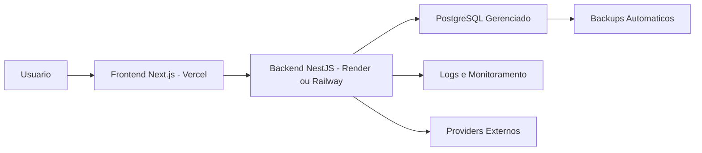

# Deploy, DevOps e Go Live - iNest Phone

## Objetivo

Este documento define o processo operacional para publicar a plataforma iNest Phone em producao.

O deploy deve preservar a arquitetura definida no PRD, BRD, SAD, UXS e DMS.

## Arquitetura de Producao



## Ambientes

### Desenvolvimento

- Arquivo base: `.env.development`.
- Uso local com Docker Compose ou processos separados.
- Banco local ou container PostgreSQL.
- Swagger habilitado.
- Logs detalhados.

### Homologacao

- Arquivo base: `.env.staging`.
- Ambiente para validacao antes da publicacao.
- Banco separado da producao.
- Swagger pode permanecer habilitado com acesso restrito.
- Dados reais devem ser mascarados quando copiados de producao.

### Producao

- Arquivo base: `.env.production`.
- Segredos devem ser cadastrados no provedor, nunca versionados com valores reais.
- Swagger desabilitado.
- HTTPS obrigatorio.
- Logs controlados e monitoramento ativo.

## Frontend - Vercel

Configuracao recomendada:

- Projeto: `apps/web`.
- Framework: Next.js.
- Build command: `pnpm --filter @inest/web build`.
- Start command: gerenciado pela Vercel.
- Variavel obrigatoria:
  - `NEXT_PUBLIC_API_URL`.

Headers de seguranca configurados em `apps/web/next.config.ts`:

- `X-Frame-Options`.
- `X-Content-Type-Options`.
- `Referrer-Policy`.
- `Permissions-Policy`.

## Backend - Render ou Railway

Configuracao recomendada:

- Dockerfile: `apps/api/Dockerfile`.
- Porta: `3333`.
- Health check: `/api/v1/health`.
- Start command dentro do container: `pnpm --filter @inest/api start`.

Variaveis obrigatorias:

- `NODE_ENV`.
- `API_PORT`.
- `API_PREFIX`.
- `API_VERSION`.
- `CORS_ORIGIN`.
- `DATABASE_URL`.
- `JWT_SECRET`.
- `JWT_REFRESH_SECRET`.
- `JWT_EXPIRES_IN`.
- `JWT_REFRESH_EXPIRES_IN`.
- `SWAGGER_ENABLED`.

## Banco de Dados

Recomendacao:

- PostgreSQL gerenciado.
- Ambiente separado para desenvolvimento, homologacao e producao.
- Backups automaticos habilitados pelo provedor.
- Pool de conexoes configurado conforme limite do plano.

Antes do Go Live:

1. Criar banco de producao.
2. Definir `DATABASE_URL`.
3. Executar migrations.
4. Executar seed apenas quando necessario.
5. Validar `/api/v1/health`.
6. Validar login inicial.

## CI/CD

Workflows criados:

- `.github/workflows/pull-request.yml`.
- `.github/workflows/main.yml`.
- `.github/workflows/production.yml`.

### Pull Request

Executa:

- instalacao;
- Prisma generate;
- Prisma validate;
- lint;
- typecheck;
- testes;
- build.

### Main

Executa a validacao completa para a branch principal.

### Producao

Deploy manual via `workflow_dispatch`.

Para iniciar, digitar:

```text
GO-LIVE
```

Secrets esperados:

- `PRODUCTION_DATABASE_URL`.
- `VERCEL_DEPLOY_HOOK_URL`.
- `BACKEND_DEPLOY_HOOK_URL`.

O deploy final nao deve ser automatico sem aprovacao.

## Migrations

Procedimento recomendado:

1. Rodar backup antes de qualquer migration em producao.
2. Executar migration em homologacao.
3. Validar aplicacao em homologacao.
4. Executar migration em producao.
5. Validar health check, login e rotas principais.

Comando:

```bash
pnpm prisma migrate deploy
```

## Seeds

Executar seed em producao apenas quando necessario.

Comando:

```bash
pnpm prisma:seed
```

Antes de executar:

- Confirmar que senhas padrao foram substituidas.
- Confirmar que dados sensiveis nao estao hardcoded.
- Confirmar backup recente.

## Backup e Restore

Politica recomendada:

- Backup diario automatico.
- Retencao minima de 7 dias.
- Backup manual antes de migrations.
- Teste de restore mensal em ambiente isolado.

Checklist de restore:

1. Selecionar backup.
2. Restaurar em banco temporario.
3. Validar integridade.
4. Promover restore para producao apenas com aprovacao.
5. Registrar auditoria operacional.

## Monitoramento

Ferramentas recomendadas:

- Sentry para erros.
- UptimeRobot para disponibilidade.
- Better Stack ou equivalente para logs.

Eventos a monitorar:

- falhas de login;
- erros 5xx;
- lentidao em APIs;
- falhas de integracoes;
- indisponibilidade do banco;
- falhas de migrations;
- consumo de memoria e CPU.

## Logs

Logs devem ser separados por ambiente.

Categorias:

- autenticacao;
- erros;
- auditoria;
- integracoes;
- performance;
- inicializacao;
- health check.

## Seguranca

Checklist:

- HTTPS ativo.
- `JWT_SECRET` e `JWT_REFRESH_SECRET` fortes.
- `CORS_ORIGIN` restrito ao dominio oficial.
- Swagger desabilitado em producao.
- Variaveis sensiveis somente em secrets do provedor.
- Banco sem acesso publico amplo.
- Backups protegidos.
- Headers de seguranca ativos no frontend.

## Rollback

Plano recomendado:

1. Pausar novas publicacoes.
2. Identificar versao anterior estavel.
3. Reverter deploy no provedor.
4. Validar health check.
5. Validar login.
6. Validar fluxos criticos.
7. Se houve migration destrutiva, restaurar backup aprovado.
8. Registrar incidente e acao tomada.

## Checklist de Go Live

- Frontend publicado.
- Backend publicado.
- Banco PostgreSQL conectado.
- Migrations aplicadas.
- Seeds executadas quando necessario.
- Health check aprovado.
- Login validado.
- APIs principais respondendo.
- CORS restrito ao dominio correto.
- Swagger desabilitado em producao.
- Logs ativos.
- Monitoramento ativo.
- Backups ativos.
- Plano de rollback validado.
- Responsavel aprovou Go Live.

## Pendencias Antes da Publicacao Definitiva

- Configurar banco real de producao.
- Cadastrar secrets nos provedores.
- Configurar hooks de deploy.
- Ativar monitoramento externo.
- Executar migration em homologacao.
- Executar teste de restore.
- Executar checklist manual de Go Live.
