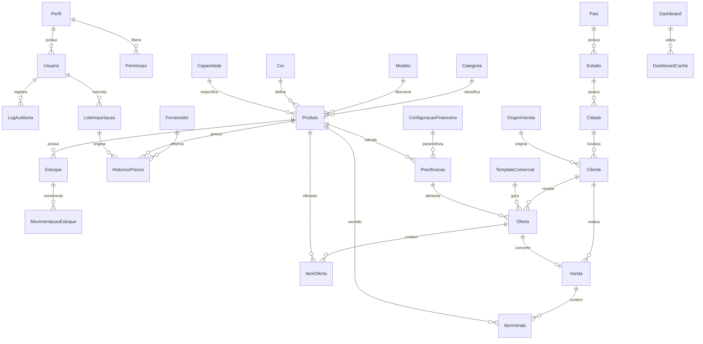
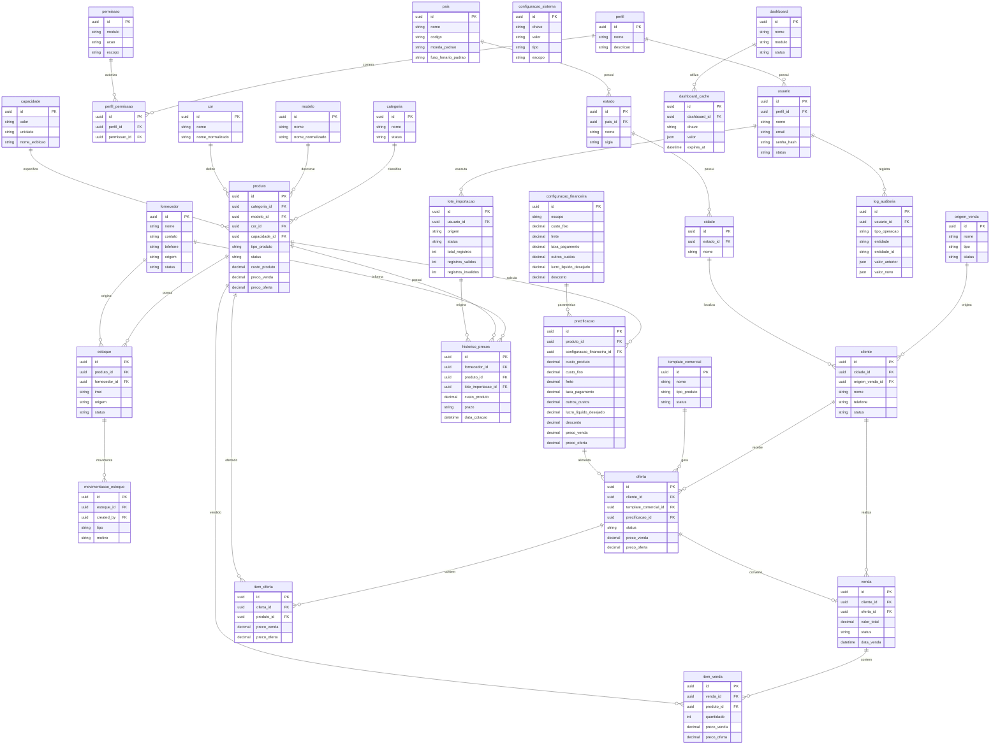
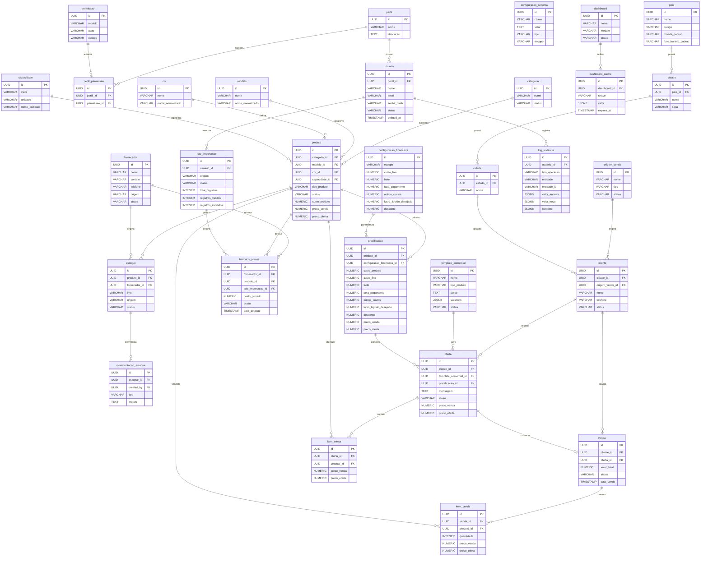

# DMS Consolidado - iNest Phone

## Fase 1 - Modelagem Conceitual

## Objetivo

Este documento define a modelagem oficial de dados do sistema iNest Phone - Sistema de Gestao Comercial.

Esta fase identifica as entidades do dominio e seus relacionamentos em nivel conceitual, sem detalhar implementacao fisica, tipos de dados, constraints especificas ou Prisma Schema.

O DMS deve permanecer compativel com PRD, BRD, SAD e UXS, sem alterar regras de negocio, arquitetura ou nomes de modulos ja documentados.

## 1. Objetivo da modelagem

A modelagem conceitual tem como finalidade representar as principais informacoes do negocio, seus limites, relacionamentos e responsabilidades.

Principios adotados:

- Normalizacao das entidades para evitar duplicidade desnecessaria.
- Integridade dos dados entre modulos.
- Separacao entre dados operacionais, configuracoes, auditoria e analiticos.
- Reutilizacao de entidades compartilhadas, como Cidade, Estado, Pais, Categoria, Modelo, Cor e Capacidade.
- Preparacao para crescimento futuro sem grandes refatoracoes.
- Compatibilidade com nomenclatura financeira oficial definida no BRD.
- Respeito aos limites modulares definidos no SAD.

A modelagem deve permitir evolucao gradual, contemplando MVP, versoes futuras, integracoes e expansao da plataforma.

## 2. Identificacao das entidades

Entidades conceituais iniciais:

- Usuario.
- Perfil.
- Permissao.
- Cliente.
- Fornecedor.
- Produto.
- Categoria.
- Modelo.
- Cor.
- Capacidade.
- Estoque.
- Movimentacao de Estoque.
- Venda.
- Item da Venda.
- Oferta.
- Item da Oferta.
- Historico de Precos.
- Precificacao.
- Configuracao Financeira.
- Configuracao Sistema.
- Dashboard.
- Dashboard Cache.
- Origem de Venda.
- Cidade.
- Estado.
- Pais.
- Log de Auditoria.
- Lote de Importacao.
- Template Comercial.

Entidades complementares justificadas:

- Item da Oferta: necessario para representar ofertas compostas por um ou mais produtos, sem duplicar informacoes do Produto.
- Configuracao Sistema: necessario para armazenar preferencias e parametros nao financeiros.
- Dashboard Cache: necessario para suportar otimizacoes analiticas previstas no SAD.
- Lote de Importacao: necessario para rastrear origem, status e inconsistencias das importacoes.
- Template Comercial: necessario porque o BRD determina que templates comerciais sejam armazenados como dados configuraveis e nao codificados.

## 3. Responsabilidade de cada entidade

### 3.1 Usuario

Objetivo:

- Representar usuarios internos do sistema.

Responsabilidade:

- Armazenar identidade, dados de acesso e status operacional.

Principais informacoes:

- Nome.
- Email.
- Senha protegida.
- Status.
- Perfil associado.

Relacionamento com modulos:

- Autenticacao.
- Usuarios.
- Auditoria.
- Configuracoes.

### 3.2 Perfil

Objetivo:

- Representar grupos de permissao.

Responsabilidade:

- Definir o papel do usuario no sistema.

Principais informacoes:

- Nome.
- Descricao.
- Permissoes associadas.

Relacionamento com modulos:

- Usuarios.
- Autorizacao.

### 3.3 Permissao

Objetivo:

- Representar acoes autorizadas por modulo.

Responsabilidade:

- Controlar acesso a funcionalidades.

Principais informacoes:

- Modulo.
- Acao.
- Escopo.

Relacionamento com modulos:

- Autenticacao.
- Usuarios.
- Todos os modulos protegidos.

### 3.4 Cliente

Objetivo:

- Representar clientes atendidos pela iNest Phone.

Responsabilidade:

- Armazenar dados comerciais, origem e historico de relacionamento.

Principais informacoes:

- Nome.
- Contato.
- Cidade.
- Origem de venda.
- Status.

Relacionamento com modulos:

- Clientes.
- Vendas.
- Ofertas.
- Dashboard.
- Business Intelligence.

### 3.5 Fornecedor

Objetivo:

- Representar fornecedores de produtos e cotacoes.

Responsabilidade:

- Armazenar dados de contato, origem e historico de cotacoes.

Principais informacoes:

- Nome.
- Contato.
- Telefone.
- Origem.
- Status.

Relacionamento com modulos:

- Fornecedores.
- Radar de Precos.
- Importacoes.
- Produtos.

### 3.6 Produto

Objetivo:

- Representar itens comercializados pela iNest Phone.

Responsabilidade:

- Centralizar dados de catalogo, classificacao e valores oficiais persistidos.

Principais informacoes:

- Categoria.
- Modelo.
- Cor.
- Capacidade.
- Tipo de produto.
- Status.
- Campos financeiros oficiais quando persistidos.

Relacionamento com modulos:

- Produtos.
- Radar de Precos.
- Precificacao.
- Ofertas.
- Estoque.
- Vendas.

### 3.7 Categoria

Objetivo:

- Classificar produtos por grupo comercial.

Responsabilidade:

- Permitir organizacao e filtros por familia de produto.

Principais informacoes:

- Nome.
- Status.

Relacionamento com modulos:

- Produtos.
- Radar de Precos.
- Precificacao.
- BI.

### 3.8 Modelo

Objetivo:

- Representar o modelo comercial do produto.

Responsabilidade:

- Padronizar nomes de modelos para normalizacao e consulta.

Principais informacoes:

- Nome.
- Nome normalizado.

Relacionamento com modulos:

- Produtos.
- Importacoes.
- Normalizacao.
- Radar de Precos.

### 3.9 Cor

Objetivo:

- Representar cores padronizadas de produtos.

Responsabilidade:

- Evitar duplicidade de variacoes de cor informadas por fornecedores.

Principais informacoes:

- Nome.
- Nome normalizado.

Relacionamento com modulos:

- Produtos.
- Importacoes.
- Normalizacao.

### 3.10 Capacidade

Objetivo:

- Representar capacidades de armazenamento ou configuracoes equivalentes.

Responsabilidade:

- Padronizar especificacoes de capacidade.

Principais informacoes:

- Valor.
- Unidade.
- Nome exibido.

Relacionamento com modulos:

- Produtos.
- Importacoes.
- Normalizacao.

### 3.11 Estoque

Objetivo:

- Representar disponibilidade fisica ou operacional de produtos.

Responsabilidade:

- Armazenar status, IMEI, origem e disponibilidade.

Principais informacoes:

- Produto.
- IMEI.
- Status.
- Origem.

Relacionamento com modulos:

- Estoque.
- Produtos.
- Vendas.

### 3.12 Movimentacao de Estoque

Objetivo:

- Registrar alteracoes no estoque.

Responsabilidade:

- Preservar historico de entradas, saidas, reservas e cancelamentos.

Principais informacoes:

- Estoque relacionado.
- Tipo de movimentacao.
- Motivo.
- Usuario responsavel.

Relacionamento com modulos:

- Estoque.
- Auditoria.
- Vendas.

### 3.13 Venda

Objetivo:

- Representar uma venda concluida ou em status operacional definido.

Responsabilidade:

- Armazenar dados comerciais da venda e associacoes com cliente, oferta e itens.

Principais informacoes:

- Cliente.
- Oferta.
- Valor total.
- Status.
- Data da venda.

Relacionamento com modulos:

- Financeiro.
- Clientes.
- Produtos.
- Estoque.
- Dashboard.
- BI.

### 3.14 Item da Venda

Objetivo:

- Representar produtos associados a uma venda.

Responsabilidade:

- Permitir vendas com um ou mais produtos sem duplicar a entidade Venda.

Principais informacoes:

- Venda.
- Produto.
- Valores persistidos.
- Quantidade.

Relacionamento com modulos:

- Vendas.
- Produtos.
- Financeiro.
- BI.

### 3.15 Oferta

Objetivo:

- Representar proposta comercial gerada pelo sistema.

Responsabilidade:

- Armazenar mensagem, status e valores resultantes da precificacao.

Principais informacoes:

- Cliente.
- Template.
- Status.
- Mensagem.
- `preco_venda`.
- `preco_oferta`.

Relacionamento com modulos:

- Gerador de Ofertas.
- Precificacao.
- Clientes.
- Produtos.

### 3.16 Item da Oferta

Objetivo:

- Representar produtos contidos em uma oferta.

Responsabilidade:

- Permitir agrupamento de produtos e ofertas com multiplos itens.

Principais informacoes:

- Oferta.
- Produto.
- Valores apresentados.

Relacionamento com modulos:

- Ofertas.
- Produtos.
- Precificacao.

### 3.17 Historico de Precos

Objetivo:

- Representar variacoes de custo e cotacoes ao longo do tempo.

Responsabilidade:

- Preservar historico de precos recebidos de fornecedores.

Principais informacoes:

- Produto.
- Fornecedor.
- `custo_produto`.
- Prazo.
- Data da cotacao.
- Origem.

Relacionamento com modulos:

- Radar de Precos.
- Fornecedores.
- Produtos.
- Importacoes.

### 3.18 Precificacao

Objetivo:

- Representar simulacoes e resultados de precificacao.

Responsabilidade:

- Armazenar valores oficiais utilizados para calculo e resultado final, respeitando o BRD.

Principais informacoes:

- Produto.
- `custo_produto`.
- `custo_fixo`.
- `frete`.
- `taxa_pagamento`.
- `outros_custos`.
- `lucro_liquido_desejado`.
- `desconto`.
- `preco_venda`.
- `preco_oferta`.

Relacionamento com modulos:

- Precificacao.
- Produtos.
- Ofertas.
- Configuracao Financeira.

### 3.19 Configuracao Financeira

Objetivo:

- Representar parametros financeiros configuraveis.

Responsabilidade:

- Armazenar valores usados pela precificacao conforme BRD.

Principais informacoes:

- `custo_fixo`.
- `frete`.
- `taxa_pagamento`.
- `outros_custos`.
- `lucro_liquido_desejado`.
- `desconto`.

Relacionamento com modulos:

- Configuracoes.
- Precificacao.

### 3.20 Configuracao Sistema

Objetivo:

- Representar preferencias e parametros gerais da plataforma.

Responsabilidade:

- Armazenar configuracoes nao financeiras.

Principais informacoes:

- Chave.
- Valor.
- Tipo.
- Escopo.

Relacionamento com modulos:

- Configuracoes.
- Sistema.
- Integracoes futuras.

### 3.21 Dashboard

Objetivo:

- Representar visoes agregadas de indicadores.

Responsabilidade:

- Organizar informacoes consolidadas para exibicao.

Principais informacoes:

- Indicador.
- Periodo.
- Filtros.
- Resultado consolidado.

Relacionamento com modulos:

- Dashboard.
- BI.
- Financeiro.
- Produtos.
- Clientes.

### 3.22 Dashboard Cache

Objetivo:

- Representar dados analiticos temporarios ou agregados para performance.

Responsabilidade:

- Evitar recalculo desnecessario de indicadores.

Principais informacoes:

- Chave.
- Valor.
- Data de expiracao.

Relacionamento com modulos:

- Dashboard.
- BI.
- Performance.

### 3.23 Origem de Venda

Objetivo:

- Representar origem comercial de clientes e vendas.

Responsabilidade:

- Permitir analises de marketing e canais.

Principais informacoes:

- Nome.
- Tipo.
- Status.

Relacionamento com modulos:

- Clientes.
- Vendas.
- Marketing.
- BI.

### 3.24 Cidade

Objetivo:

- Representar localidade municipal.

Responsabilidade:

- Apoiar cadastros, filtros e indicadores geograficos.

Principais informacoes:

- Nome.
- Estado.

Relacionamento com modulos:

- Clientes.
- Fornecedores.
- Vendas.
- BI.

### 3.25 Estado

Objetivo:

- Representar unidade federativa ou subdivisao geografica.

Responsabilidade:

- Organizar cidades e apoiar indicadores regionais.

Principais informacoes:

- Nome.
- Sigla.
- Pais.

Relacionamento com modulos:

- Cidade.
- BI.

### 3.26 Pais

Objetivo:

- Representar paises para expansao futura.

Responsabilidade:

- Apoiar internacionalizacao, moedas, fusos e localizacao.

Principais informacoes:

- Nome.
- Codigo.
- Moeda padrao.
- Fuso horario padrao.

Relacionamento com modulos:

- Estado.
- Expansao internacional.

### 3.27 Log de Auditoria

Objetivo:

- Registrar eventos relevantes do sistema.

Responsabilidade:

- Preservar rastreabilidade de acoes, alteracoes e acessos.

Principais informacoes:

- Usuario.
- Tipo de operacao.
- Entidade afetada.
- Valor anterior.
- Novo valor.
- Data e hora.

Relacionamento com modulos:

- Auditoria.
- Todos os modulos com operacoes relevantes.

### 3.28 Lote de Importacao

Objetivo:

- Representar uma execucao de importacao.

Responsabilidade:

- Rastrear origem, status, quantidade de registros e inconsistencias.

Principais informacoes:

- Origem.
- Usuario.
- Status.
- Totais.
- Mensagens de inconsistencia.

Relacionamento com modulos:

- Importacoes.
- Radar de Precos.
- Fornecedores.
- Auditoria.

### 3.29 Template Comercial

Objetivo:

- Representar modelos de mensagens comerciais.

Responsabilidade:

- Armazenar templates configuraveis conforme BRD.

Principais informacoes:

- Nome.
- Tipo de produto.
- Corpo do template.
- Variaveis.
- Status.

Relacionamento com modulos:

- Gerador de Ofertas.
- Configuracoes.

## 4. Relacionamentos

### 4.1 Relacionamentos 1:1

Relacionamentos 1:1 devem ser usados apenas quando houver separacao clara de responsabilidade.

Exemplos conceituais:

- Usuario pode possuir configuracoes pessoais futuras.
- Venda pode ser derivada de uma oferta especifica quando a operacao exigir associacao direta.

### 4.2 Relacionamentos 1:N

Relacionamentos 1:N sao predominantes no modelo.

Exemplos:

- Um Perfil possui varios Usuarios.
- Um Fornecedor possui varias cotacoes no Historico de Precos.
- Um Produto possui varios registros no Historico de Precos.
- Um Cliente possui varias Ofertas.
- Um Cliente possui varias Vendas.
- Um Produto possui varios registros de Estoque.
- Um Estoque possui varias Movimentacoes de Estoque.
- Uma Cidade possui varios Clientes.
- Um Estado possui varias Cidades.
- Um Pais possui varios Estados.
- Um Usuario possui varios Logs de Auditoria.
- Um Lote de Importacao possui varios registros importados.

### 4.3 Relacionamentos N:N

Relacionamentos N:N devem ser resolvidos por entidades intermediarias.

Exemplos:

- Perfil e Permissao por meio de uma associacao de permissoes do perfil.
- Oferta e Produto por meio de Item da Oferta.
- Venda e Produto por meio de Item da Venda.

## 5. Regras de integridade

### 5.1 Obrigatoriedade de registros

Entidades operacionais devem possuir dados minimos para garantir consistencia.

Exemplos:

- Produto deve possuir Categoria e Modelo.
- Cliente deve possuir identificacao basica.
- Cotacao deve possuir Fornecedor, Produto e `custo_produto`.
- Precificacao deve possuir os campos financeiros oficiais definidos no BRD.

### 5.2 Exclusao logica

Entidades com historico operacional devem utilizar exclusao logica quando necessario.

Exemplos:

- Usuario.
- Cliente.
- Produto.
- Fornecedor.

Registros historicos, auditorias e vendas nao devem ser apagados de forma que comprometa rastreabilidade.

### 5.3 Dependencias

Entidades dependentes nao devem existir sem sua entidade principal.

Exemplos:

- Item da Venda depende de Venda.
- Item da Oferta depende de Oferta.
- Movimentacao de Estoque depende de Estoque.
- Historico de Precos depende de Produto e Fornecedor.

### 5.4 Integridade referencial

Relacionamentos devem preservar consistencia entre entidades.

Nao devem existir registros orfaos em entidades dependentes.

### 5.5 Consistencia entre modulos

O modelo deve respeitar os limites modulares definidos no SAD.

Nenhum modulo deve gravar diretamente dados pertencentes a outro modulo sem passar pelos services oficiais.

## 6. Diagrama conceitual



## 7. Escalabilidade

O modelo conceitual deve suportar evolucao futura para:

- Novos modulos.
- Novos tipos de produtos.
- Multiplos fornecedores.
- Multiplas empresas.
- Novos paises.
- Novas integracoes.
- Aplicativo mobile.
- APIs publicas.
- Business Intelligence avancado.

Diretrizes:

- Entidades centrais devem ser reutilizaveis.
- Novas entidades devem preservar compatibilidade com dados existentes.
- Relacionamentos devem evitar acoplamento desnecessario.
- Configuracoes devem permitir extensao sem alterar regras fixas.
- Localizacao deve suportar expansao geografica.

## 8. Boas praticas

### 8.1 Normalizacao

O modelo deve evitar duplicidade de informacoes e separar conceitos distintos em entidades proprias.

### 8.2 Nomenclatura

A nomenclatura deve seguir os padroes definidos no SAD.

Tabelas futuras devem manter nomes claros, consistentes e alinhados ao dominio.

### 8.3 Organizacao

Entidades devem ser agrupadas conceitualmente por modulo e responsabilidade.

### 8.4 Reutilizacao

Entidades como Categoria, Modelo, Cor, Capacidade, Cidade, Estado e Pais devem ser reutilizadas para evitar dados inconsistentes.

### 8.5 Evolucao do modelo

Novas entidades devem ser adicionadas com justificativa tecnica e compatibilidade com PRD, BRD, SAD e UXS.

Mudancas estruturais futuras devem ser documentadas nas fases seguintes do DMS.

## 9. Criterios de aceitacao

A modelagem conceitual sera considerada concluida quando:

- As entidades principais estiverem identificadas.
- A responsabilidade de cada entidade estiver documentada.
- Os relacionamentos conceituais estiverem definidos.
- As regras de integridade estiverem descritas.
- O diagrama conceitual estiver disponivel.
- O modelo estiver compativel com PRD, BRD, SAD e UXS.
- A base estiver pronta para a modelagem logica da proxima fase.

---

## Fase 2 - Modelagem Logica do Banco de Dados

## Objetivo

Esta fase transforma o modelo conceitual da Fase 1 em um modelo logico completo.

O objetivo e documentar entidades, atributos, chaves, relacionamentos, cardinalidades, dependencias, regras de integridade e normalizacao, preparando a futura implementacao em PostgreSQL com Prisma ORM.

Esta fase nao altera o modelo conceitual, regras de negocio, arquitetura, modulos ou decisoes ja documentadas.

## 1. Estrutura logica das entidades

Todas as entidades devem seguir padrao logico consistente:

- Chave primaria: `id`.
- Tipo logico da chave primaria: identificador unico imutavel.
- Campos de auditoria quando aplicavel: `created_at`, `updated_at`, `deleted_at`, `created_by`, `updated_by`.
- Chaves estrangeiras nomeadas com o sufixo `_id`.
- Campos financeiros seguindo nomenclatura oficial do BRD.

## 2. Definicao das entidades e atributos

### 2.1 Usuario

Descricao:

- Representa usuarios internos do sistema.

Responsabilidade:

- Armazenar identidade, credenciais protegidas, perfil e status de acesso.

Chave primaria:

- `id`.

Chaves estrangeiras:

- `perfil_id` referencia Perfil.

Relacionamentos:

- Perfil 1:N Usuario.
- Usuario 1:N Log de Auditoria.
- Usuario 1:N Lote de Importacao.

| Nome | Tipo logico | Obrigatorio | Valor padrao | Descricao | Validacao |
| --- | --- | --- | --- | --- | --- |
| id | identificador | sim | gerado | Identificador unico | Imutavel |
| perfil_id | identificador | sim | nenhum | Perfil do usuario | Deve existir em Perfil |
| nome | texto | sim | nenhum | Nome do usuario | Nao vazio |
| email | texto | sim | nenhum | Email de acesso | Formato de email, unico |
| senha_hash | texto | sim | nenhum | Senha protegida | Nunca armazenar senha pura |
| status | texto | sim | ativo | Estado do usuario | Valores controlados |
| created_at | data_hora | sim | atual | Data de criacao | Gerado pelo sistema |
| updated_at | data_hora | sim | atual | Data de atualizacao | Atualizado pelo sistema |
| deleted_at | data_hora | nao | nulo | Exclusao logica | Nulo quando ativo |

### 2.2 Perfil

Descricao:

- Representa grupos de acesso.

Responsabilidade:

- Agrupar permissoes por papel operacional.

Chave primaria:

- `id`.

Chaves estrangeiras:

- Nenhuma.

Relacionamentos:

- Perfil 1:N Usuario.
- Perfil N:N Permissao por meio de PerfilPermissao.

| Nome | Tipo logico | Obrigatorio | Valor padrao | Descricao | Validacao |
| --- | --- | --- | --- | --- | --- |
| id | identificador | sim | gerado | Identificador unico | Imutavel |
| nome | texto | sim | nenhum | Nome do perfil | Unico |
| descricao | texto | nao | nulo | Descricao do perfil | Livre |
| created_at | data_hora | sim | atual | Data de criacao | Gerado pelo sistema |
| updated_at | data_hora | sim | atual | Data de atualizacao | Atualizado pelo sistema |

### 2.3 Permissao

Descricao:

- Representa acoes permitidas por modulo.

Responsabilidade:

- Controlar autorizacao granular.

Chave primaria:

- `id`.

Chaves estrangeiras:

- Nenhuma.

Relacionamentos:

- Permissao N:N Perfil por meio de PerfilPermissao.

| Nome | Tipo logico | Obrigatorio | Valor padrao | Descricao | Validacao |
| --- | --- | --- | --- | --- | --- |
| id | identificador | sim | gerado | Identificador unico | Imutavel |
| modulo | texto | sim | nenhum | Modulo da permissao | Deve corresponder a modulo oficial |
| acao | texto | sim | nenhum | Acao permitida | Valores controlados |
| escopo | texto | nao | nulo | Escopo complementar | Livre |
| created_at | data_hora | sim | atual | Data de criacao | Gerado pelo sistema |
| updated_at | data_hora | sim | atual | Data de atualizacao | Atualizado pelo sistema |

### 2.4 PerfilPermissao

Descricao:

- Entidade associativa entre Perfil e Permissao.

Responsabilidade:

- Resolver relacionamento N:N entre perfis e permissoes.

Chave primaria:

- `id`.

Chaves estrangeiras:

- `perfil_id` referencia Perfil.
- `permissao_id` referencia Permissao.

Relacionamentos:

- Perfil 1:N PerfilPermissao.
- Permissao 1:N PerfilPermissao.

| Nome | Tipo logico | Obrigatorio | Valor padrao | Descricao | Validacao |
| --- | --- | --- | --- | --- | --- |
| id | identificador | sim | gerado | Identificador unico | Imutavel |
| perfil_id | identificador | sim | nenhum | Perfil associado | Deve existir em Perfil |
| permissao_id | identificador | sim | nenhum | Permissao associada | Deve existir em Permissao |
| created_at | data_hora | sim | atual | Data de criacao | Gerado pelo sistema |

### 2.5 Cliente

Descricao:

- Representa clientes da iNest Phone.

Responsabilidade:

- Armazenar cadastro, origem, localizacao e status comercial.

Chave primaria:

- `id`.

Chaves estrangeiras:

- `cidade_id` referencia Cidade.
- `origem_venda_id` referencia Origem de Venda.

Relacionamentos:

- Cidade 1:N Cliente.
- Origem de Venda 1:N Cliente.
- Cliente 1:N Oferta.
- Cliente 1:N Venda.

| Nome | Tipo logico | Obrigatorio | Valor padrao | Descricao | Validacao |
| --- | --- | --- | --- | --- | --- |
| id | identificador | sim | gerado | Identificador unico | Imutavel |
| cidade_id | identificador | nao | nulo | Cidade do cliente | Deve existir em Cidade quando informado |
| origem_venda_id | identificador | nao | nulo | Origem comercial | Deve existir em OrigemVenda quando informado |
| nome | texto | sim | nenhum | Nome do cliente | Nao vazio |
| telefone | texto | nao | nulo | Contato principal | Formato valido quando informado |
| status | texto | sim | ativo | Estado do cliente | Valores controlados |
| created_at | data_hora | sim | atual | Data de criacao | Gerado pelo sistema |
| updated_at | data_hora | sim | atual | Data de atualizacao | Atualizado pelo sistema |
| deleted_at | data_hora | nao | nulo | Exclusao logica | Nulo quando ativo |

### 2.6 Fornecedor

Descricao:

- Representa fornecedores de produtos e cotacoes.

Responsabilidade:

- Armazenar cadastro, contato e origem.

Chave primaria:

- `id`.

Chaves estrangeiras:

- Nenhuma obrigatoria nesta fase.

Relacionamentos:

- Fornecedor 1:N Historico de Precos.

| Nome | Tipo logico | Obrigatorio | Valor padrao | Descricao | Validacao |
| --- | --- | --- | --- | --- | --- |
| id | identificador | sim | gerado | Identificador unico | Imutavel |
| nome | texto | sim | nenhum | Nome do fornecedor | Nao vazio |
| contato | texto | nao | nulo | Pessoa ou canal de contato | Livre |
| telefone | texto | nao | nulo | Telefone de contato | Formato valido quando informado |
| origem | texto | nao | nulo | Origem do fornecedor | Livre |
| status | texto | sim | ativo | Estado do fornecedor | Valores controlados |
| created_at | data_hora | sim | atual | Data de criacao | Gerado pelo sistema |
| updated_at | data_hora | sim | atual | Data de atualizacao | Atualizado pelo sistema |
| deleted_at | data_hora | nao | nulo | Exclusao logica | Nulo quando ativo |

### 2.7 Produto

Descricao:

- Representa produtos comercializados.

Responsabilidade:

- Centralizar catalogo, classificacao e valores oficiais persistidos.

Chave primaria:

- `id`.

Chaves estrangeiras:

- `categoria_id` referencia Categoria.
- `modelo_id` referencia Modelo.
- `cor_id` referencia Cor.
- `capacidade_id` referencia Capacidade.

Relacionamentos:

- Categoria 1:N Produto.
- Modelo 1:N Produto.
- Cor 1:N Produto.
- Capacidade 1:N Produto.
- Produto 1:N Estoque.
- Produto 1:N Historico de Precos.
- Produto 1:N Precificacao.
- Produto N:N Oferta por Item da Oferta.
- Produto N:N Venda por Item da Venda.

| Nome | Tipo logico | Obrigatorio | Valor padrao | Descricao | Validacao |
| --- | --- | --- | --- | --- | --- |
| id | identificador | sim | gerado | Identificador unico | Imutavel |
| categoria_id | identificador | sim | nenhum | Categoria do produto | Deve existir em Categoria |
| modelo_id | identificador | sim | nenhum | Modelo do produto | Deve existir em Modelo |
| cor_id | identificador | nao | nulo | Cor do produto | Deve existir em Cor quando informado |
| capacidade_id | identificador | nao | nulo | Capacidade do produto | Deve existir em Capacidade quando informado |
| tipo_produto | texto | sim | nenhum | Tipo comercial | Valores definidos no BRD |
| status | texto | sim | pendente_revisao | Estado operacional | Valores controlados |
| custo_produto | monetario | nao | nulo | Custo persistido quando aplicavel | Valor >= 0 |
| preco_venda | monetario | nao | nulo | Preco de venda calculado | Valor >= 0 |
| preco_oferta | monetario | nao | nulo | Preco de oferta calculado | Valor >= 0 |
| created_at | data_hora | sim | atual | Data de criacao | Gerado pelo sistema |
| updated_at | data_hora | sim | atual | Data de atualizacao | Atualizado pelo sistema |
| deleted_at | data_hora | nao | nulo | Exclusao logica | Nulo quando ativo |

### 2.8 Categoria

Descricao:

- Representa grupos de produtos.

Responsabilidade:

- Classificar produtos e apoiar filtros, relatorios e configuracoes.

Chave primaria:

- `id`.

Chaves estrangeiras:

- Nenhuma.

Relacionamentos:

- Categoria 1:N Produto.

| Nome | Tipo logico | Obrigatorio | Valor padrao | Descricao | Validacao |
| --- | --- | --- | --- | --- | --- |
| id | identificador | sim | gerado | Identificador unico | Imutavel |
| nome | texto | sim | nenhum | Nome da categoria | Unico |
| status | texto | sim | ativo | Estado da categoria | Valores controlados |
| created_at | data_hora | sim | atual | Data de criacao | Gerado pelo sistema |
| updated_at | data_hora | sim | atual | Data de atualizacao | Atualizado pelo sistema |

### 2.9 Modelo

Descricao:

- Representa modelo padronizado de produto.

Responsabilidade:

- Apoiar normalizacao, pesquisa e catalogo.

Chave primaria:

- `id`.

Chaves estrangeiras:

- Nenhuma.

Relacionamentos:

- Modelo 1:N Produto.

| Nome | Tipo logico | Obrigatorio | Valor padrao | Descricao | Validacao |
| --- | --- | --- | --- | --- | --- |
| id | identificador | sim | gerado | Identificador unico | Imutavel |
| nome | texto | sim | nenhum | Nome do modelo | Nao vazio |
| nome_normalizado | texto | sim | nenhum | Nome padronizado | Unico quando aplicavel |
| created_at | data_hora | sim | atual | Data de criacao | Gerado pelo sistema |
| updated_at | data_hora | sim | atual | Data de atualizacao | Atualizado pelo sistema |

### 2.10 Cor

Descricao:

- Representa cor padronizada de produto.

Responsabilidade:

- Evitar variacoes duplicadas de cor.

Chave primaria:

- `id`.

Chaves estrangeiras:

- Nenhuma.

Relacionamentos:

- Cor 1:N Produto.

| Nome | Tipo logico | Obrigatorio | Valor padrao | Descricao | Validacao |
| --- | --- | --- | --- | --- | --- |
| id | identificador | sim | gerado | Identificador unico | Imutavel |
| nome | texto | sim | nenhum | Nome da cor | Nao vazio |
| nome_normalizado | texto | sim | nenhum | Nome padronizado | Unico quando aplicavel |
| created_at | data_hora | sim | atual | Data de criacao | Gerado pelo sistema |
| updated_at | data_hora | sim | atual | Data de atualizacao | Atualizado pelo sistema |

### 2.11 Capacidade

Descricao:

- Representa capacidade ou especificacao equivalente.

Responsabilidade:

- Padronizar capacidades para catalogo e importacao.

Chave primaria:

- `id`.

Chaves estrangeiras:

- Nenhuma.

Relacionamentos:

- Capacidade 1:N Produto.

| Nome | Tipo logico | Obrigatorio | Valor padrao | Descricao | Validacao |
| --- | --- | --- | --- | --- | --- |
| id | identificador | sim | gerado | Identificador unico | Imutavel |
| valor | texto | sim | nenhum | Valor da capacidade | Nao vazio |
| unidade | texto | nao | nulo | Unidade, quando aplicavel | Livre |
| nome_exibicao | texto | sim | nenhum | Texto exibido | Nao vazio |
| created_at | data_hora | sim | atual | Data de criacao | Gerado pelo sistema |
| updated_at | data_hora | sim | atual | Data de atualizacao | Atualizado pelo sistema |

### 2.12 Estoque

Descricao:

- Representa unidade ou disponibilidade de produto.

Responsabilidade:

- Controlar IMEI, origem e status operacional.

Chave primaria:

- `id`.

Chaves estrangeiras:

- `produto_id` referencia Produto.
- `fornecedor_id` referencia Fornecedor quando aplicavel.

Relacionamentos:

- Produto 1:N Estoque.
- Fornecedor 1:N Estoque.
- Estoque 1:N Movimentacao de Estoque.

| Nome | Tipo logico | Obrigatorio | Valor padrao | Descricao | Validacao |
| --- | --- | --- | --- | --- | --- |
| id | identificador | sim | gerado | Identificador unico | Imutavel |
| produto_id | identificador | sim | nenhum | Produto relacionado | Deve existir em Produto |
| fornecedor_id | identificador | nao | nulo | Fornecedor de origem | Deve existir em Fornecedor quando informado |
| imei | texto | nao | nulo | Identificador do aparelho | Unico quando informado |
| origem | texto | nao | nulo | Origem do item | Livre |
| status | texto | sim | disponivel | Status do estoque | Valores definidos no BRD |
| created_at | data_hora | sim | atual | Data de criacao | Gerado pelo sistema |
| updated_at | data_hora | sim | atual | Data de atualizacao | Atualizado pelo sistema |
| deleted_at | data_hora | nao | nulo | Exclusao logica | Nulo quando ativo |

### 2.13 Movimentacao de Estoque

Descricao:

- Representa alteracoes no estoque.

Responsabilidade:

- Registrar historico de entradas, saidas, reservas e cancelamentos.

Chave primaria:

- `id`.

Chaves estrangeiras:

- `estoque_id` referencia Estoque.
- `created_by` referencia Usuario.

Relacionamentos:

- Estoque 1:N Movimentacao de Estoque.
- Usuario 1:N Movimentacao de Estoque.

| Nome | Tipo logico | Obrigatorio | Valor padrao | Descricao | Validacao |
| --- | --- | --- | --- | --- | --- |
| id | identificador | sim | gerado | Identificador unico | Imutavel |
| estoque_id | identificador | sim | nenhum | Estoque movimentado | Deve existir em Estoque |
| tipo | texto | sim | nenhum | Tipo da movimentacao | Valores controlados |
| motivo | texto | nao | nulo | Motivo da movimentacao | Livre |
| created_by | identificador | nao | nulo | Usuario responsavel | Deve existir em Usuario quando informado |
| created_at | data_hora | sim | atual | Data de criacao | Gerado pelo sistema |

### 2.14 Venda

Descricao:

- Representa venda operacional.

Responsabilidade:

- Armazenar cliente, oferta, valor e status.

Chave primaria:

- `id`.

Chaves estrangeiras:

- `cliente_id` referencia Cliente.
- `oferta_id` referencia Oferta quando aplicavel.

Relacionamentos:

- Cliente 1:N Venda.
- Oferta 1:1 Venda quando convertida.
- Venda 1:N Item da Venda.

| Nome | Tipo logico | Obrigatorio | Valor padrao | Descricao | Validacao |
| --- | --- | --- | --- | --- | --- |
| id | identificador | sim | gerado | Identificador unico | Imutavel |
| cliente_id | identificador | nao | nulo | Cliente da venda | Deve existir em Cliente quando informado |
| oferta_id | identificador | nao | nulo | Oferta convertida | Deve existir em Oferta quando informado |
| valor_total | monetario | sim | 0 | Valor total da venda | Valor >= 0 |
| status | texto | sim | nenhum | Status da venda | Valores controlados |
| data_venda | data_hora | sim | atual | Data da venda | Data valida |
| created_at | data_hora | sim | atual | Data de criacao | Gerado pelo sistema |
| updated_at | data_hora | sim | atual | Data de atualizacao | Atualizado pelo sistema |

### 2.15 Item da Venda

Descricao:

- Representa produtos associados a uma venda.

Responsabilidade:

- Resolver relacionamento N:N entre Venda e Produto.

Chave primaria:

- `id`.

Chaves estrangeiras:

- `venda_id` referencia Venda.
- `produto_id` referencia Produto.

Relacionamentos:

- Venda 1:N Item da Venda.
- Produto 1:N Item da Venda.

| Nome | Tipo logico | Obrigatorio | Valor padrao | Descricao | Validacao |
| --- | --- | --- | --- | --- | --- |
| id | identificador | sim | gerado | Identificador unico | Imutavel |
| venda_id | identificador | sim | nenhum | Venda associada | Deve existir em Venda |
| produto_id | identificador | sim | nenhum | Produto vendido | Deve existir em Produto |
| quantidade | numero_inteiro | sim | 1 | Quantidade vendida | Maior que zero |
| preco_venda | monetario | sim | nenhum | Preco de venda persistido | Valor >= 0 |
| preco_oferta | monetario | sim | nenhum | Preco de oferta persistido | Valor >= 0 |
| created_at | data_hora | sim | atual | Data de criacao | Gerado pelo sistema |

### 2.16 Oferta

Descricao:

- Representa oferta comercial gerada.

Responsabilidade:

- Armazenar mensagem, valores e status.

Chave primaria:

- `id`.

Chaves estrangeiras:

- `cliente_id` referencia Cliente quando aplicavel.
- `template_comercial_id` referencia Template Comercial.
- `precificacao_id` referencia Precificacao quando aplicavel.

Relacionamentos:

- Cliente 1:N Oferta.
- Template Comercial 1:N Oferta.
- Precificacao 1:N Oferta.
- Oferta 1:N Item da Oferta.
- Oferta 1:1 Venda quando convertida.

| Nome | Tipo logico | Obrigatorio | Valor padrao | Descricao | Validacao |
| --- | --- | --- | --- | --- | --- |
| id | identificador | sim | gerado | Identificador unico | Imutavel |
| cliente_id | identificador | nao | nulo | Cliente associado | Deve existir em Cliente quando informado |
| template_comercial_id | identificador | sim | nenhum | Template utilizado | Deve existir em Template Comercial |
| precificacao_id | identificador | nao | nulo | Precificacao utilizada | Deve existir em Precificacao quando informado |
| mensagem | texto_longo | sim | nenhum | Mensagem gerada | Nao vazia |
| status | texto | sim | gerada | Status da oferta | Valores controlados |
| preco_venda | monetario | sim | nenhum | Preco de venda usado | Valor >= 0 |
| preco_oferta | monetario | sim | nenhum | Preco de oferta usado | Valor >= 0 |
| created_at | data_hora | sim | atual | Data de criacao | Gerado pelo sistema |
| updated_at | data_hora | sim | atual | Data de atualizacao | Atualizado pelo sistema |

### 2.17 Item da Oferta

Descricao:

- Representa produtos contidos em uma oferta.

Responsabilidade:

- Resolver relacionamento N:N entre Oferta e Produto.

Chave primaria:

- `id`.

Chaves estrangeiras:

- `oferta_id` referencia Oferta.
- `produto_id` referencia Produto.

Relacionamentos:

- Oferta 1:N Item da Oferta.
- Produto 1:N Item da Oferta.

| Nome | Tipo logico | Obrigatorio | Valor padrao | Descricao | Validacao |
| --- | --- | --- | --- | --- | --- |
| id | identificador | sim | gerado | Identificador unico | Imutavel |
| oferta_id | identificador | sim | nenhum | Oferta associada | Deve existir em Oferta |
| produto_id | identificador | sim | nenhum | Produto ofertado | Deve existir em Produto |
| preco_venda | monetario | sim | nenhum | Preco de venda persistido | Valor >= 0 |
| preco_oferta | monetario | sim | nenhum | Preco de oferta persistido | Valor >= 0 |
| created_at | data_hora | sim | atual | Data de criacao | Gerado pelo sistema |

### 2.18 Historico de Precos

Descricao:

- Representa cotacoes e variacoes de custo.

Responsabilidade:

- Preservar historico de `custo_produto` por fornecedor e produto.

Chave primaria:

- `id`.

Chaves estrangeiras:

- `fornecedor_id` referencia Fornecedor.
- `produto_id` referencia Produto.
- `lote_importacao_id` referencia Lote de Importacao quando aplicavel.

Relacionamentos:

- Fornecedor 1:N Historico de Precos.
- Produto 1:N Historico de Precos.
- Lote de Importacao 1:N Historico de Precos.

| Nome | Tipo logico | Obrigatorio | Valor padrao | Descricao | Validacao |
| --- | --- | --- | --- | --- | --- |
| id | identificador | sim | gerado | Identificador unico | Imutavel |
| fornecedor_id | identificador | sim | nenhum | Fornecedor da cotacao | Deve existir em Fornecedor |
| produto_id | identificador | sim | nenhum | Produto cotado | Deve existir em Produto |
| lote_importacao_id | identificador | nao | nulo | Lote de origem | Deve existir em LoteImportacao quando informado |
| custo_produto | monetario | sim | nenhum | Custo informado | Valor >= 0 |
| prazo | texto | nao | nulo | Prazo de entrega | Livre |
| cidade | texto | nao | nulo | Cidade informada na cotacao | Livre |
| contato | texto | nao | nulo | Contato informado | Livre |
| observacoes | texto_longo | nao | nulo | Observacoes do fornecedor | Livre |
| data_cotacao | data_hora | sim | atual | Data da cotacao | Data valida |
| created_at | data_hora | sim | atual | Data de criacao | Gerado pelo sistema |

### 2.19 Precificacao

Descricao:

- Representa simulacao ou calculo de precificacao.

Responsabilidade:

- Persistir componentes financeiros e resultados oficiais conforme BRD.

Chave primaria:

- `id`.

Chaves estrangeiras:

- `produto_id` referencia Produto.
- `configuracao_financeira_id` referencia Configuracao Financeira quando aplicavel.

Relacionamentos:

- Produto 1:N Precificacao.
- Configuracao Financeira 1:N Precificacao.
- Precificacao 1:N Oferta.

| Nome | Tipo logico | Obrigatorio | Valor padrao | Descricao | Validacao |
| --- | --- | --- | --- | --- | --- |
| id | identificador | sim | gerado | Identificador unico | Imutavel |
| produto_id | identificador | sim | nenhum | Produto precificado | Deve existir em Produto |
| configuracao_financeira_id | identificador | nao | nulo | Configuracao aplicada | Deve existir em Configuracao Financeira quando informado |
| custo_produto | monetario | sim | nenhum | Custo do produto | Valor >= 0 |
| custo_fixo | monetario | sim | 0 | Custo fixo aplicado | Valor >= 0 |
| frete | monetario | sim | 0 | Frete aplicado | Valor >= 0 |
| taxa_pagamento | monetario | sim | 0 | Taxa de pagamento | Valor >= 0 |
| outros_custos | monetario | sim | 0 | Outros custos | Valor >= 0 |
| lucro_liquido_desejado | monetario | sim | nenhum | Lucro desejado | Valor >= 0 |
| desconto | monetario | sim | 0 | Desconto aplicado | Valor >= 0 |
| preco_venda | monetario | sim | nenhum | Preco de venda calculado | Valor >= 0 |
| preco_oferta | monetario | sim | nenhum | Preco de oferta calculado | Valor >= 0 |
| created_at | data_hora | sim | atual | Data de criacao | Gerado pelo sistema |

### 2.20 Configuracao Financeira

Descricao:

- Representa parametros financeiros configuraveis.

Responsabilidade:

- Centralizar valores usados pela Precificacao.

Chave primaria:

- `id`.

Chaves estrangeiras:

- Nenhuma obrigatoria nesta fase.

Relacionamentos:

- Configuracao Financeira 1:N Precificacao.

| Nome | Tipo logico | Obrigatorio | Valor padrao | Descricao | Validacao |
| --- | --- | --- | --- | --- | --- |
| id | identificador | sim | gerado | Identificador unico | Imutavel |
| escopo | texto | sim | global | Escopo da configuracao | Valores controlados |
| custo_fixo | monetario | sim | 0 | Custo fixo padrao | Valor >= 0 |
| frete | monetario | sim | 0 | Frete padrao | Valor >= 0 |
| taxa_pagamento | monetario | sim | 0 | Taxa padrao | Valor >= 0 |
| outros_custos | monetario | sim | 0 | Outros custos padrao | Valor >= 0 |
| lucro_liquido_desejado | monetario | sim | 0 | Lucro padrao | Valor >= 0 |
| desconto | monetario | sim | 0 | Desconto padrao | Valor >= 0 |
| created_at | data_hora | sim | atual | Data de criacao | Gerado pelo sistema |
| updated_at | data_hora | sim | atual | Data de atualizacao | Atualizado pelo sistema |

### 2.21 Configuracao Sistema

Descricao:

- Representa configuracoes gerais nao financeiras.

Responsabilidade:

- Armazenar parametros flexiveis do sistema.

Chave primaria:

- `id`.

Chaves estrangeiras:

- Nenhuma obrigatoria nesta fase.

Relacionamentos:

- Pode ser consumida por modulos autorizados via services.

| Nome | Tipo logico | Obrigatorio | Valor padrao | Descricao | Validacao |
| --- | --- | --- | --- | --- | --- |
| id | identificador | sim | gerado | Identificador unico | Imutavel |
| chave | texto | sim | nenhum | Chave da configuracao | Unica |
| valor | texto_longo | sim | nenhum | Valor armazenado | Conforme tipo |
| tipo | texto | sim | texto | Tipo do valor | Valores controlados |
| escopo | texto | nao | nulo | Escopo da configuracao | Livre |
| created_at | data_hora | sim | atual | Data de criacao | Gerado pelo sistema |
| updated_at | data_hora | sim | atual | Data de atualizacao | Atualizado pelo sistema |

### 2.22 Dashboard

Descricao:

- Representa definicoes conceituais de paineis e indicadores.

Responsabilidade:

- Organizar visoes analiticas e indicadores.

Chave primaria:

- `id`.

Chaves estrangeiras:

- Nenhuma obrigatoria nesta fase.

Relacionamentos:

- Dashboard 1:N Dashboard Cache.

| Nome | Tipo logico | Obrigatorio | Valor padrao | Descricao | Validacao |
| --- | --- | --- | --- | --- | --- |
| id | identificador | sim | gerado | Identificador unico | Imutavel |
| nome | texto | sim | nenhum | Nome do dashboard | Nao vazio |
| descricao | texto | nao | nulo | Descricao | Livre |
| modulo | texto | sim | nenhum | Modulo relacionado | Modulo oficial |
| status | texto | sim | ativo | Estado do dashboard | Valores controlados |
| created_at | data_hora | sim | atual | Data de criacao | Gerado pelo sistema |
| updated_at | data_hora | sim | atual | Data de atualizacao | Atualizado pelo sistema |

### 2.23 Dashboard Cache

Descricao:

- Representa cache analitico.

Responsabilidade:

- Armazenar resultados temporarios de indicadores.

Chave primaria:

- `id`.

Chaves estrangeiras:

- `dashboard_id` referencia Dashboard quando aplicavel.

Relacionamentos:

- Dashboard 1:N Dashboard Cache.

| Nome | Tipo logico | Obrigatorio | Valor padrao | Descricao | Validacao |
| --- | --- | --- | --- | --- | --- |
| id | identificador | sim | gerado | Identificador unico | Imutavel |
| dashboard_id | identificador | nao | nulo | Dashboard relacionado | Deve existir em Dashboard quando informado |
| chave | texto | sim | nenhum | Chave do cache | Unica por contexto |
| valor | objeto | sim | nenhum | Valor agregado | JSON valido |
| expires_at | data_hora | sim | nenhum | Expiracao | Data valida |
| created_at | data_hora | sim | atual | Data de criacao | Gerado pelo sistema |
| updated_at | data_hora | sim | atual | Data de atualizacao | Atualizado pelo sistema |

### 2.24 Origem de Venda

Descricao:

- Representa canais de origem comercial.

Responsabilidade:

- Apoiar analises de marketing e cadastro de clientes.

Chave primaria:

- `id`.

Chaves estrangeiras:

- Nenhuma.

Relacionamentos:

- Origem de Venda 1:N Cliente.

| Nome | Tipo logico | Obrigatorio | Valor padrao | Descricao | Validacao |
| --- | --- | --- | --- | --- | --- |
| id | identificador | sim | gerado | Identificador unico | Imutavel |
| nome | texto | sim | nenhum | Nome da origem | Unico |
| tipo | texto | nao | nulo | Tipo de canal | Livre |
| status | texto | sim | ativo | Estado | Valores controlados |
| created_at | data_hora | sim | atual | Data de criacao | Gerado pelo sistema |
| updated_at | data_hora | sim | atual | Data de atualizacao | Atualizado pelo sistema |

### 2.25 Cidade

Descricao:

- Representa cidade.

Responsabilidade:

- Apoiar localizacao e indicadores geograficos.

Chave primaria:

- `id`.

Chaves estrangeiras:

- `estado_id` referencia Estado.

Relacionamentos:

- Estado 1:N Cidade.
- Cidade 1:N Cliente.

| Nome | Tipo logico | Obrigatorio | Valor padrao | Descricao | Validacao |
| --- | --- | --- | --- | --- | --- |
| id | identificador | sim | gerado | Identificador unico | Imutavel |
| estado_id | identificador | sim | nenhum | Estado da cidade | Deve existir em Estado |
| nome | texto | sim | nenhum | Nome da cidade | Nao vazio |
| created_at | data_hora | sim | atual | Data de criacao | Gerado pelo sistema |
| updated_at | data_hora | sim | atual | Data de atualizacao | Atualizado pelo sistema |

### 2.26 Estado

Descricao:

- Representa estado ou subdivisao geografica.

Responsabilidade:

- Agrupar cidades.

Chave primaria:

- `id`.

Chaves estrangeiras:

- `pais_id` referencia Pais.

Relacionamentos:

- Pais 1:N Estado.
- Estado 1:N Cidade.

| Nome | Tipo logico | Obrigatorio | Valor padrao | Descricao | Validacao |
| --- | --- | --- | --- | --- | --- |
| id | identificador | sim | gerado | Identificador unico | Imutavel |
| pais_id | identificador | sim | nenhum | Pais do estado | Deve existir em Pais |
| nome | texto | sim | nenhum | Nome do estado | Nao vazio |
| sigla | texto | nao | nulo | Sigla | Tamanho controlado quando informado |
| created_at | data_hora | sim | atual | Data de criacao | Gerado pelo sistema |
| updated_at | data_hora | sim | atual | Data de atualizacao | Atualizado pelo sistema |

### 2.27 Pais

Descricao:

- Representa pais.

Responsabilidade:

- Apoiar expansao internacional e localizacao.

Chave primaria:

- `id`.

Chaves estrangeiras:

- Nenhuma.

Relacionamentos:

- Pais 1:N Estado.

| Nome | Tipo logico | Obrigatorio | Valor padrao | Descricao | Validacao |
| --- | --- | --- | --- | --- | --- |
| id | identificador | sim | gerado | Identificador unico | Imutavel |
| nome | texto | sim | nenhum | Nome do pais | Unico |
| codigo | texto | nao | nulo | Codigo internacional | Unico quando informado |
| moeda_padrao | texto | nao | nulo | Moeda padrao | Codigo valido quando informado |
| fuso_horario_padrao | texto | nao | nulo | Fuso horario padrao | Valor valido quando informado |
| created_at | data_hora | sim | atual | Data de criacao | Gerado pelo sistema |
| updated_at | data_hora | sim | atual | Data de atualizacao | Atualizado pelo sistema |

### 2.28 Log de Auditoria

Descricao:

- Representa registro de eventos relevantes.

Responsabilidade:

- Preservar rastreabilidade.

Chave primaria:

- `id`.

Chaves estrangeiras:

- `usuario_id` referencia Usuario quando aplicavel.

Relacionamentos:

- Usuario 1:N Log de Auditoria.

| Nome | Tipo logico | Obrigatorio | Valor padrao | Descricao | Validacao |
| --- | --- | --- | --- | --- | --- |
| id | identificador | sim | gerado | Identificador unico | Imutavel |
| usuario_id | identificador | nao | nulo | Usuario responsavel | Deve existir em Usuario quando informado |
| tipo_operacao | texto | sim | nenhum | Tipo do evento | Valores controlados |
| entidade | texto | sim | nenhum | Entidade afetada | Nao vazio |
| entidade_id | texto | nao | nulo | Identificador da entidade afetada | Livre |
| valor_anterior | objeto | nao | nulo | Estado anterior | JSON valido |
| valor_novo | objeto | nao | nulo | Estado novo | JSON valido |
| contexto | objeto | nao | nulo | Metadados | JSON valido |
| created_at | data_hora | sim | atual | Data do evento | Gerado pelo sistema |

### 2.29 Lote de Importacao

Descricao:

- Representa execucao de importacao.

Responsabilidade:

- Rastrear origem, status, totais e inconsistencias.

Chave primaria:

- `id`.

Chaves estrangeiras:

- `usuario_id` referencia Usuario quando aplicavel.

Relacionamentos:

- Usuario 1:N Lote de Importacao.
- Lote de Importacao 1:N Historico de Precos.

| Nome | Tipo logico | Obrigatorio | Valor padrao | Descricao | Validacao |
| --- | --- | --- | --- | --- | --- |
| id | identificador | sim | gerado | Identificador unico | Imutavel |
| usuario_id | identificador | nao | nulo | Usuario responsavel | Deve existir em Usuario quando informado |
| origem | texto | sim | nenhum | Origem da importacao | Valores controlados |
| status | texto | sim | iniciado | Status da importacao | Valores controlados |
| total_registros | numero_inteiro | sim | 0 | Total processado | >= 0 |
| registros_validos | numero_inteiro | sim | 0 | Registros validos | >= 0 |
| registros_invalidos | numero_inteiro | sim | 0 | Registros invalidos | >= 0 |
| mensagens_inconsistencia | texto_longo | nao | nulo | Mensagens registradas | Livre |
| data_importacao | data_hora | sim | atual | Data da importacao | Data valida |
| created_at | data_hora | sim | atual | Data de criacao | Gerado pelo sistema |

### 2.30 Template Comercial

Descricao:

- Representa modelo de mensagem comercial.

Responsabilidade:

- Armazenar templates definidos pelo BRD.

Chave primaria:

- `id`.

Chaves estrangeiras:

- Nenhuma obrigatoria nesta fase.

Relacionamentos:

- Template Comercial 1:N Oferta.

| Nome | Tipo logico | Obrigatorio | Valor padrao | Descricao | Validacao |
| --- | --- | --- | --- | --- | --- |
| id | identificador | sim | gerado | Identificador unico | Imutavel |
| nome | texto | sim | nenhum | Nome do template | Unico |
| tipo_produto | texto | sim | nenhum | Tipo de produto associado | Valores definidos no BRD |
| corpo | texto_longo | sim | nenhum | Conteudo do template | Deve conter variaveis validas |
| variaveis | objeto | nao | nulo | Variaveis aceitas | JSON valido quando informado |
| status | texto | sim | ativo | Estado do template | Valores controlados |
| created_at | data_hora | sim | atual | Data de criacao | Gerado pelo sistema |
| updated_at | data_hora | sim | atual | Data de atualizacao | Atualizado pelo sistema |

## 3. Chaves primarias

Todas as entidades persistentes utilizam `id` como Primary Key.

Estrategia de identificacao:

- Chaves imutaveis.
- Identificadores gerados pelo sistema.
- Nao utilizar dados comerciais como chave primaria.
- Nao reutilizar chaves removidas.

Tipo de chave:

- Identificador unico logico, preparado para mapeamento futuro em PostgreSQL e Prisma ORM.

Padronizacao:

- Nome da chave primaria sempre `id`.
- Chave primaria obrigatoria em todas as entidades persistentes.

## 4. Chaves estrangeiras

Todas as Foreign Keys devem preservar integridade referencial.

| Origem | Destino | Objetivo | Integridade |
| --- | --- | --- | --- |
| usuario.perfil_id | perfil.id | Vincular usuario ao perfil | Obrigatoria |
| perfil_permissao.perfil_id | perfil.id | Associar perfil a permissoes | Obrigatoria |
| perfil_permissao.permissao_id | permissao.id | Associar permissao ao perfil | Obrigatoria |
| cliente.cidade_id | cidade.id | Localizar cliente | Opcional |
| cliente.origem_venda_id | origem_venda.id | Indicar origem comercial | Opcional |
| produto.categoria_id | categoria.id | Classificar produto | Obrigatoria |
| produto.modelo_id | modelo.id | Definir modelo | Obrigatoria |
| produto.cor_id | cor.id | Definir cor | Opcional |
| produto.capacidade_id | capacidade.id | Definir capacidade | Opcional |
| estoque.produto_id | produto.id | Vincular estoque ao produto | Obrigatoria |
| estoque.fornecedor_id | fornecedor.id | Registrar origem | Opcional |
| movimentacao_estoque.estoque_id | estoque.id | Registrar movimentacao | Obrigatoria |
| movimentacao_estoque.created_by | usuario.id | Rastrear autoria | Opcional |
| venda.cliente_id | cliente.id | Vincular venda ao cliente | Opcional |
| venda.oferta_id | oferta.id | Registrar conversao | Opcional |
| item_venda.venda_id | venda.id | Compor venda | Obrigatoria |
| item_venda.produto_id | produto.id | Produto vendido | Obrigatoria |
| oferta.cliente_id | cliente.id | Vincular oferta ao cliente | Opcional |
| oferta.template_comercial_id | template_comercial.id | Definir template | Obrigatoria |
| oferta.precificacao_id | precificacao.id | Definir base calculada | Opcional |
| item_oferta.oferta_id | oferta.id | Compor oferta | Obrigatoria |
| item_oferta.produto_id | produto.id | Produto ofertado | Obrigatoria |
| historico_precos.fornecedor_id | fornecedor.id | Registrar fornecedor | Obrigatoria |
| historico_precos.produto_id | produto.id | Registrar produto | Obrigatoria |
| historico_precos.lote_importacao_id | lote_importacao.id | Rastrear importacao | Opcional |
| precificacao.produto_id | produto.id | Produto calculado | Obrigatoria |
| precificacao.configuracao_financeira_id | configuracao_financeira.id | Parametros aplicados | Opcional |
| dashboard_cache.dashboard_id | dashboard.id | Cache por painel | Opcional |
| cidade.estado_id | estado.id | Cidade pertence ao estado | Obrigatoria |
| estado.pais_id | pais.id | Estado pertence ao pais | Obrigatoria |
| log_auditoria.usuario_id | usuario.id | Usuario do evento | Opcional |
| lote_importacao.usuario_id | usuario.id | Usuario da importacao | Opcional |

## 5. Cardinalidade

### 5.1 Relacionamentos 1:1

- Oferta pode converter em uma Venda especifica.
- Relacionamentos 1:1 futuros devem ser usados apenas quando houver separacao clara de responsabilidade.

### 5.2 Relacionamentos 1:N

- Perfil -> Usuarios.
- Usuario -> Logs de Auditoria.
- Usuario -> Lotes de Importacao.
- Categoria -> Produtos.
- Modelo -> Produtos.
- Cor -> Produtos.
- Capacidade -> Produtos.
- Fornecedor -> Historico de Precos.
- Produto -> Historico de Precos.
- Produto -> Estoque.
- Estoque -> Movimentacoes de Estoque.
- Cliente -> Ofertas.
- Cliente -> Vendas.
- Template Comercial -> Ofertas.
- Configuracao Financeira -> Precificacoes.
- Produto -> Precificacoes.
- Pais -> Estados.
- Estado -> Cidades.
- Cidade -> Clientes.
- Dashboard -> Dashboard Cache.

### 5.3 Relacionamentos N:N

Relacionamentos N:N sao resolvidos por entidades intermediarias:

- Perfil N:N Permissao por PerfilPermissao.
- Oferta N:N Produto por Item da Oferta.
- Venda N:N Produto por Item da Venda.

## 6. Dependencias entre entidades

Entidades dependentes:

- Usuario depende de Perfil.
- PerfilPermissao depende de Perfil e Permissao.
- Produto depende de Categoria e Modelo.
- Estoque depende de Produto.
- Movimentacao de Estoque depende de Estoque.
- Item da Oferta depende de Oferta e Produto.
- Item da Venda depende de Venda e Produto.
- Historico de Precos depende de Fornecedor e Produto.
- Precificacao depende de Produto.
- Cidade depende de Estado.
- Estado depende de Pais.

Impactos:

- Criacao deve validar existencia das entidades obrigatorias.
- Atualizacao deve preservar integridade e historico quando aplicavel.
- Exclusao deve evitar perda de rastreabilidade operacional.

## 7. Regras de exclusao

Politicas logicas recomendadas:

| Relacionamento | Regra | Justificativa |
| --- | --- | --- |
| Perfil -> Usuario | RESTRICT | Evitar usuarios sem perfil |
| Perfil -> PerfilPermissao | CASCADE | Remover associacoes do perfil removido |
| Permissao -> PerfilPermissao | RESTRICT | Evitar perda silenciosa de controle de acesso |
| Categoria -> Produto | RESTRICT | Produtos historicos dependem da categoria |
| Modelo -> Produto | RESTRICT | Produtos historicos dependem do modelo |
| Cor -> Produto | SET NULL | Cor pode ser opcional |
| Capacidade -> Produto | SET NULL | Capacidade pode ser opcional |
| Produto -> Estoque | RESTRICT | Estoque historico deve ser preservado |
| Estoque -> MovimentacaoEstoque | RESTRICT | Movimentacoes devem preservar historico |
| Cliente -> Venda | RESTRICT | Vendas historicas devem ser preservadas |
| Cliente -> Oferta | SET NULL | Oferta pode permanecer sem cliente associado |
| Oferta -> ItemOferta | CASCADE | Itens dependem da oferta |
| Venda -> ItemVenda | CASCADE | Itens dependem da venda |
| Fornecedor -> HistoricoPrecos | RESTRICT | Cotacoes historicas devem ser preservadas |
| Produto -> HistoricoPrecos | RESTRICT | Historico de precos deve ser preservado |
| LoteImportacao -> HistoricoPrecos | SET NULL | Historico pode permanecer sem lote |
| Pais -> Estado | RESTRICT | Evitar localidades orfas |
| Estado -> Cidade | RESTRICT | Evitar cidades orfas |
| Dashboard -> DashboardCache | CASCADE | Cache e derivado do dashboard |
| Usuario -> LogAuditoria | SET NULL | Auditoria deve permanecer mesmo sem usuario ativo |

Entidades operacionais com historico devem priorizar exclusao logica.

## 8. Regras de atualizacao

### 8.1 Atualizacao em cascata

Atualizacoes em cascata devem ser evitadas para chaves primarias, pois chaves sao imutaveis.

### 8.2 Atualizacao manual

Atualizacoes de dados operacionais devem ocorrer por services oficiais.

### 8.3 Versionamento

Mudancas em dados sensiveis, configuracoes e regras que afetem historico devem preservar rastreabilidade.

### 8.4 Historico

Alteracoes relevantes devem gerar Log de Auditoria.

Dados historicos de vendas, ofertas, precificacao, estoque e cotacoes nao devem ser sobrescritos de forma que comprometa analises futuras.

## 9. Normalizacao

### 9.1 Primeira Forma Normal

Todas as entidades devem possuir atributos atomicos e sem grupos repetitivos.

Listas e agrupamentos devem ser representados por entidades proprias, como Item da Venda e Item da Oferta.

### 9.2 Segunda Forma Normal

Entidades associativas devem separar dependencias de seus relacionamentos.

Campos que dependem de uma combinacao devem permanecer nas entidades intermediarias correspondentes.

### 9.3 Terceira Forma Normal

Dados derivados ou classificatorios devem ser separados em entidades proprias.

Exemplos:

- Categoria.
- Modelo.
- Cor.
- Capacidade.
- Cidade.
- Estado.
- Pais.
- Origem de Venda.

### 9.4 Desnormalizacao

Desnormalizacao nao e adotada nesta fase como regra geral.

Quando necessaria por performance, deve ser documentada e justificada nas fases fisicas ou de performance do DMS.

Exemplo permitido futuramente:

- Dashboard Cache para agregacoes analiticas derivadas.

## 10. Entidades de auditoria

Entidades persistentes devem armazenar campos de auditoria quando aplicavel:

- `created_at`.
- `updated_at`.
- `deleted_at`.
- `created_by`.
- `updated_by`.

Log de Auditoria deve registrar eventos relevantes com:

- Usuario.
- Data e hora.
- Entidade.
- Tipo de operacao.
- Valor anterior.
- Valor novo.
- Contexto.

Exclusao logica deve ser usada em entidades onde remocao fisica comprometa historico ou rastreabilidade.

## 11. Entidades compartilhadas

Entidades reutilizaveis por varios modulos:

- Usuario.
- Perfil.
- Permissao.
- Cliente.
- Produto.
- Fornecedor.
- Categoria.
- Modelo.
- Cor.
- Capacidade.
- Cidade.
- Estado.
- Pais.
- Configuracao Financeira.
- Configuracao Sistema.
- Log de Auditoria.
- Origem de Venda.

Essas entidades devem ser acessadas por services oficiais e nao por repositories externos entre modulos.

## 12. Diagrama logico



## 13. Compatibilidade

A modelagem logica esta alinhada com:

- PRD: contempla modulos e entidades necessarias para o produto.
- BRD: preserva nomenclatura financeira oficial, regras de precificacao e entidades de auditoria, importacao e templates.
- SAD: respeita modularidade, integridade, camadas, APIs, auditoria e modelo de dados.
- UXS: suporta os fluxos de navegacao, consulta, cadastro, oferta, dashboard e configuracoes.
- DMS Fase 1: mantem entidades e relacionamentos conceituais definidos.

Inconsistencias identificadas:

- Nenhuma inconsistencia documentada nesta fase.

## 14. Preparacao para a modelagem fisica

Decisoes prontas para implementacao fisica:

- Uso de `id` como chave primaria padrao.
- Uso de chaves estrangeiras com sufixo `_id`.
- Entidades associativas para relacionamentos N:N.
- Campos financeiros oficiais definidos.
- Entidades de auditoria e importacao previstas.
- Exclusao logica em entidades operacionais selecionadas.
- Relacionamentos e cardinalidades documentados.
- Regras de exclusao e atualizacao orientadas.
- Normalizacao ate a Terceira Forma Normal como diretriz.

A proxima fase deve detalhar tipos fisicos, constraints, indices, estrutura SQL e decisoes especificas para PostgreSQL.

## 15. Criterios de aceitacao

A modelagem logica sera considerada concluida quando:

- Todas as entidades possuirem estrutura logica documentada.
- Todos os atributos principais estiverem definidos.
- Chaves primarias estiverem padronizadas.
- Chaves estrangeiras estiverem documentadas.
- Cardinalidades estiverem descritas.
- Dependencias entre entidades estiverem claras.
- Regras de exclusao e atualizacao estiverem definidas.
- Normalizacao estiver justificada.
- Entidades de auditoria e compartilhadas estiverem documentadas.
- Diagrama logico estiver disponivel.
- A estrutura estiver pronta para a modelagem fisica.

---

## Fase 3 - Modelagem Fisica do Banco de Dados

## Objetivo

Esta fase transforma o modelo logico em um modelo fisico pronto para implementacao utilizando PostgreSQL.

O objetivo e documentar tabelas, colunas, tipos fisicos, constraints, indices, regras referenciais, auditoria e convencoes de implementacao.

Toda a modelagem fisica deve permanecer compativel com Prisma ORM e preparada para crescimento futuro.

Esta fase nao altera entidades, relacionamentos, regras de negocio, nomes de modulos ou decisoes ja documentadas.

## 1. Padroes de modelagem fisica

### 1.1 Convencao para nomes de tabelas

Tabelas devem utilizar nomes em `snake_case`, no singular e alinhados ao dominio.

Exemplos:

- `usuario`
- `produto`
- `fornecedor`
- `historico_precos`
- `configuracao_financeira`

### 1.2 Convencao para nomes de colunas

Colunas devem utilizar `snake_case`.

Chaves estrangeiras devem utilizar o padrao:

- `entidade_id`

Campos financeiros devem respeitar exatamente a nomenclatura oficial do BRD:

- `custo_produto`
- `custo_fixo`
- `frete`
- `taxa_pagamento`
- `outros_custos`
- `lucro_liquido_desejado`
- `desconto`
- `preco_venda`
- `preco_oferta`

### 1.3 Convencao para indices

Indices devem seguir o padrao:

```txt
idx_<tabela>_<coluna>
idx_<tabela>_<coluna_1>_<coluna_2>
```

Indices unicos devem seguir:

```txt
uq_<tabela>_<coluna>
```

### 1.4 Convencao para constraints

Constraints devem seguir o padrao:

```txt
pk_<tabela>
fk_<tabela>_<tabela_referenciada>
uq_<tabela>_<coluna>
ck_<tabela>_<regra>
```

### 1.5 Convencao para Foreign Keys

Foreign Keys devem utilizar colunas terminadas em `_id`.

Toda FK deve declarar comportamento de `ON DELETE` e `ON UPDATE`.

### 1.6 Convencao para Primary Keys

Toda tabela persistente deve utilizar:

- coluna: `id`
- tipo: `UUID`
- constraint: `PRIMARY KEY`

### 1.7 Convencao para tabelas de relacionamento

Tabelas que resolvem relacionamentos N:N devem possuir nome descritivo.

Exemplos:

- `perfil_permissao`
- `item_oferta`
- `item_venda`

## 2. Tipos de dados

Tipos fisicos oficiais:

| Tipo | Uso | Justificativa |
| --- | --- | --- |
| UUID | Identificadores primarios e estrangeiros | Chaves imutaveis, seguras e preparadas para crescimento |
| VARCHAR | Textos curtos com limite conhecido | Melhor controle de tamanho |
| TEXT | Textos longos | Mensagens, observacoes e descricoes extensas |
| INTEGER | Contadores e quantidades | Valores inteiros comuns |
| BIGINT | Contadores de grande volume, quando necessario | Preparacao para alto volume |
| NUMERIC | Valores monetarios | Precisao fixa, sem ponto flutuante |
| DECIMAL | Alternativa equivalente para valores precisos | Compatibilidade conceitual com valores financeiros |
| BOOLEAN | Estados binarios | Flags simples |
| DATE | Datas sem horario | Uso futuro quando horario nao for necessario |
| TIMESTAMP | Datas e horarios | Auditoria, eventos e rastreabilidade |
| JSONB | Dados estruturados flexiveis | Auditoria, cache, metadados e variaveis |

Valores monetarios devem utilizar `NUMERIC(12,2)` inicialmente, podendo ser ajustados por migracao futura se o volume financeiro exigir.

## 3. Campos obrigatorios padrao

Campos padrao aplicaveis:

| Campo | Tipo | Finalidade |
| --- | --- | --- |
| id | UUID | Identificador primario imutavel |
| created_at | TIMESTAMP | Data e hora de criacao |
| updated_at | TIMESTAMP | Data e hora da ultima atualizacao |
| deleted_at | TIMESTAMP | Exclusao logica |
| created_by | UUID | Usuario criador, quando aplicavel |
| updated_by | UUID | Usuario responsavel pela ultima alteracao, quando aplicavel |

Nem todas as tabelas precisam de todos os campos.

Entidades historicas, associativas ou de evento podem possuir apenas `created_at` quando atualizacao ou exclusao logica nao fizer sentido.

## 4. Estrutura fisica das tabelas

### 4.1 Tabela `usuario`

Finalidade:

- Armazenar usuarios internos.

Chave primaria:

- `id UUID`.

Chaves estrangeiras:

- `perfil_id` referencia `perfil.id`.

Constraints:

- `email` unico.
- `nome`, `email`, `senha_hash`, `status` obrigatorios.

Indices:

- `uq_usuario_email`.
- `idx_usuario_perfil_id`.
- `idx_usuario_status`.

### 4.2 Tabela `perfil`

Finalidade:

- Armazenar perfis de acesso.

Chave primaria:

- `id UUID`.

Constraints:

- `nome` unico e obrigatorio.

Indices:

- `uq_perfil_nome`.

### 4.3 Tabela `permissao`

Finalidade:

- Armazenar permissoes por modulo e acao.

Chave primaria:

- `id UUID`.

Constraints:

- Combinacao `modulo` + `acao` unica.

Indices:

- `uq_permissao_modulo_acao`.

### 4.4 Tabela `perfil_permissao`

Finalidade:

- Associar perfis e permissoes.

Chave primaria:

- `id UUID`.

Chaves estrangeiras:

- `perfil_id` referencia `perfil.id`.
- `permissao_id` referencia `permissao.id`.

Constraints:

- Combinacao `perfil_id` + `permissao_id` unica.

Indices:

- `idx_perfil_permissao_perfil_id`.
- `idx_perfil_permissao_permissao_id`.
- `uq_perfil_permissao_perfil_id_permissao_id`.

### 4.5 Tabela `cliente`

Finalidade:

- Armazenar clientes.

Chave primaria:

- `id UUID`.

Chaves estrangeiras:

- `cidade_id` referencia `cidade.id`.
- `origem_venda_id` referencia `origem_venda.id`.

Constraints:

- `nome` obrigatorio.
- `status` obrigatorio.

Indices:

- `idx_cliente_nome`.
- `idx_cliente_cidade_id`.
- `idx_cliente_origem_venda_id`.
- `idx_cliente_status`.

### 4.6 Tabela `fornecedor`

Finalidade:

- Armazenar fornecedores.

Chave primaria:

- `id UUID`.

Constraints:

- `nome` obrigatorio.
- `status` obrigatorio.

Indices:

- `idx_fornecedor_nome`.
- `idx_fornecedor_status`.

### 4.7 Tabela `categoria`

Finalidade:

- Armazenar categorias de produtos.

Chave primaria:

- `id UUID`.

Constraints:

- `nome` unico e obrigatorio.

Indices:

- `uq_categoria_nome`.

### 4.8 Tabela `modelo`

Finalidade:

- Armazenar modelos padronizados.

Chave primaria:

- `id UUID`.

Constraints:

- `nome` obrigatorio.
- `nome_normalizado` obrigatorio.

Indices:

- `idx_modelo_nome`.
- `uq_modelo_nome_normalizado`.

### 4.9 Tabela `cor`

Finalidade:

- Armazenar cores padronizadas.

Chave primaria:

- `id UUID`.

Constraints:

- `nome` obrigatorio.
- `nome_normalizado` obrigatorio.

Indices:

- `idx_cor_nome`.
- `uq_cor_nome_normalizado`.

### 4.10 Tabela `capacidade`

Finalidade:

- Armazenar capacidades padronizadas.

Chave primaria:

- `id UUID`.

Constraints:

- `valor` obrigatorio.
- `nome_exibicao` obrigatorio.

Indices:

- `idx_capacidade_valor`.

### 4.11 Tabela `produto`

Finalidade:

- Armazenar catalogo de produtos.

Chave primaria:

- `id UUID`.

Chaves estrangeiras:

- `categoria_id` referencia `categoria.id`.
- `modelo_id` referencia `modelo.id`.
- `cor_id` referencia `cor.id`.
- `capacidade_id` referencia `capacidade.id`.

Constraints:

- `categoria_id`, `modelo_id`, `tipo_produto` e `status` obrigatorios.
- Campos monetarios, quando informados, devem ser maiores ou iguais a zero.

Indices:

- `idx_produto_categoria_id`.
- `idx_produto_modelo_id`.
- `idx_produto_cor_id`.
- `idx_produto_capacidade_id`.
- `idx_produto_status`.
- `idx_produto_tipo_produto`.
- `idx_produto_modelo_id_capacidade_id_cor_id`.

### 4.12 Tabela `estoque`

Finalidade:

- Armazenar disponibilidade e identificacao de unidades.

Chave primaria:

- `id UUID`.

Chaves estrangeiras:

- `produto_id` referencia `produto.id`.
- `fornecedor_id` referencia `fornecedor.id`.

Constraints:

- `produto_id` obrigatorio.
- `status` obrigatorio.
- `imei` unico quando informado.

Indices:

- `idx_estoque_produto_id`.
- `idx_estoque_fornecedor_id`.
- `idx_estoque_status`.
- `uq_estoque_imei`.

### 4.13 Tabela `movimentacao_estoque`

Finalidade:

- Armazenar historico de movimentacoes do estoque.

Chave primaria:

- `id UUID`.

Chaves estrangeiras:

- `estoque_id` referencia `estoque.id`.
- `created_by` referencia `usuario.id`.

Constraints:

- `estoque_id` e `tipo` obrigatorios.

Indices:

- `idx_movimentacao_estoque_estoque_id`.
- `idx_movimentacao_estoque_created_by`.
- `idx_movimentacao_estoque_tipo`.
- `idx_movimentacao_estoque_created_at`.

### 4.14 Tabela `venda`

Finalidade:

- Armazenar vendas.

Chave primaria:

- `id UUID`.

Chaves estrangeiras:

- `cliente_id` referencia `cliente.id`.
- `oferta_id` referencia `oferta.id`.

Constraints:

- `valor_total` obrigatorio e maior ou igual a zero.
- `status` obrigatorio.
- `data_venda` obrigatorio.

Indices:

- `idx_venda_cliente_id`.
- `idx_venda_oferta_id`.
- `idx_venda_status`.
- `idx_venda_data_venda`.

### 4.15 Tabela `item_venda`

Finalidade:

- Armazenar produtos de uma venda.

Chave primaria:

- `id UUID`.

Chaves estrangeiras:

- `venda_id` referencia `venda.id`.
- `produto_id` referencia `produto.id`.

Constraints:

- `venda_id`, `produto_id`, `quantidade`, `preco_venda` e `preco_oferta` obrigatorios.
- `quantidade` maior que zero.
- Valores monetarios maiores ou iguais a zero.

Indices:

- `idx_item_venda_venda_id`.
- `idx_item_venda_produto_id`.

### 4.16 Tabela `oferta`

Finalidade:

- Armazenar ofertas comerciais geradas.

Chave primaria:

- `id UUID`.

Chaves estrangeiras:

- `cliente_id` referencia `cliente.id`.
- `template_comercial_id` referencia `template_comercial.id`.
- `precificacao_id` referencia `precificacao.id`.

Constraints:

- `template_comercial_id`, `mensagem`, `status`, `preco_venda` e `preco_oferta` obrigatorios.
- Valores monetarios maiores ou iguais a zero.

Indices:

- `idx_oferta_cliente_id`.
- `idx_oferta_template_comercial_id`.
- `idx_oferta_precificacao_id`.
- `idx_oferta_status`.
- `idx_oferta_created_at`.

### 4.17 Tabela `item_oferta`

Finalidade:

- Armazenar produtos de uma oferta.

Chave primaria:

- `id UUID`.

Chaves estrangeiras:

- `oferta_id` referencia `oferta.id`.
- `produto_id` referencia `produto.id`.

Constraints:

- `oferta_id`, `produto_id`, `preco_venda` e `preco_oferta` obrigatorios.
- Valores monetarios maiores ou iguais a zero.

Indices:

- `idx_item_oferta_oferta_id`.
- `idx_item_oferta_produto_id`.

### 4.18 Tabela `historico_precos`

Finalidade:

- Armazenar cotacoes e historico de custos.

Chave primaria:

- `id UUID`.

Chaves estrangeiras:

- `fornecedor_id` referencia `fornecedor.id`.
- `produto_id` referencia `produto.id`.
- `lote_importacao_id` referencia `lote_importacao.id`.

Constraints:

- `fornecedor_id`, `produto_id`, `custo_produto` e `data_cotacao` obrigatorios.
- `custo_produto` maior ou igual a zero.

Indices:

- `idx_historico_precos_fornecedor_id`.
- `idx_historico_precos_produto_id`.
- `idx_historico_precos_lote_importacao_id`.
- `idx_historico_precos_data_cotacao`.
- `idx_historico_precos_produto_id_data_cotacao`.
- `idx_historico_precos_fornecedor_id_data_cotacao`.

### 4.19 Tabela `precificacao`

Finalidade:

- Armazenar simulacoes e resultados de precificacao.

Chave primaria:

- `id UUID`.

Chaves estrangeiras:

- `produto_id` referencia `produto.id`.
- `configuracao_financeira_id` referencia `configuracao_financeira.id`.

Constraints:

- `produto_id` obrigatorio.
- Todos os campos financeiros oficiais obrigatorios.
- Valores monetarios maiores ou iguais a zero.

Indices:

- `idx_precificacao_produto_id`.
- `idx_precificacao_configuracao_financeira_id`.
- `idx_precificacao_created_at`.

### 4.20 Tabela `configuracao_financeira`

Finalidade:

- Armazenar parametros financeiros.

Chave primaria:

- `id UUID`.

Constraints:

- `escopo` obrigatorio.
- Campos financeiros obrigatorios.
- Valores monetarios maiores ou iguais a zero.

Indices:

- `idx_configuracao_financeira_escopo`.

### 4.21 Tabela `configuracao_sistema`

Finalidade:

- Armazenar configuracoes gerais.

Chave primaria:

- `id UUID`.

Constraints:

- `chave`, `valor` e `tipo` obrigatorios.
- `chave` unica por escopo quando aplicavel.

Indices:

- `idx_configuracao_sistema_chave`.
- `uq_configuracao_sistema_chave_escopo`.

### 4.22 Tabela `dashboard`

Finalidade:

- Armazenar definicoes de dashboards.

Chave primaria:

- `id UUID`.

Constraints:

- `nome`, `modulo` e `status` obrigatorios.

Indices:

- `idx_dashboard_modulo`.
- `idx_dashboard_status`.

### 4.23 Tabela `dashboard_cache`

Finalidade:

- Armazenar cache analitico.

Chave primaria:

- `id UUID`.

Chaves estrangeiras:

- `dashboard_id` referencia `dashboard.id`.

Constraints:

- `chave`, `valor` e `expires_at` obrigatorios.

Indices:

- `idx_dashboard_cache_dashboard_id`.
- `idx_dashboard_cache_chave`.
- `idx_dashboard_cache_expires_at`.

### 4.24 Tabela `origem_venda`

Finalidade:

- Armazenar origens comerciais.

Chave primaria:

- `id UUID`.

Constraints:

- `nome` unico e obrigatorio.
- `status` obrigatorio.

Indices:

- `uq_origem_venda_nome`.
- `idx_origem_venda_status`.

### 4.25 Tabela `cidade`

Finalidade:

- Armazenar cidades.

Chave primaria:

- `id UUID`.

Chaves estrangeiras:

- `estado_id` referencia `estado.id`.

Constraints:

- `estado_id` e `nome` obrigatorios.

Indices:

- `idx_cidade_estado_id`.
- `idx_cidade_nome`.

### 4.26 Tabela `estado`

Finalidade:

- Armazenar estados ou subdivisoes geograficas.

Chave primaria:

- `id UUID`.

Chaves estrangeiras:

- `pais_id` referencia `pais.id`.

Constraints:

- `pais_id` e `nome` obrigatorios.

Indices:

- `idx_estado_pais_id`.
- `idx_estado_nome`.

### 4.27 Tabela `pais`

Finalidade:

- Armazenar paises.

Chave primaria:

- `id UUID`.

Constraints:

- `nome` unico e obrigatorio.
- `codigo` unico quando informado.

Indices:

- `uq_pais_nome`.
- `uq_pais_codigo`.

### 4.28 Tabela `log_auditoria`

Finalidade:

- Armazenar eventos de auditoria.

Chave primaria:

- `id UUID`.

Chaves estrangeiras:

- `usuario_id` referencia `usuario.id`.

Constraints:

- `tipo_operacao`, `entidade` e `created_at` obrigatorios.

Indices:

- `idx_log_auditoria_usuario_id`.
- `idx_log_auditoria_entidade`.
- `idx_log_auditoria_tipo_operacao`.
- `idx_log_auditoria_created_at`.

### 4.29 Tabela `lote_importacao`

Finalidade:

- Armazenar execucoes de importacao.

Chave primaria:

- `id UUID`.

Chaves estrangeiras:

- `usuario_id` referencia `usuario.id`.

Constraints:

- `origem`, `status`, `total_registros`, `registros_validos`, `registros_invalidos` e `data_importacao` obrigatorios.
- Totais maiores ou iguais a zero.

Indices:

- `idx_lote_importacao_usuario_id`.
- `idx_lote_importacao_origem`.
- `idx_lote_importacao_status`.
- `idx_lote_importacao_data_importacao`.

### 4.30 Tabela `template_comercial`

Finalidade:

- Armazenar templates comerciais.

Chave primaria:

- `id UUID`.

Constraints:

- `nome`, `tipo_produto`, `corpo` e `status` obrigatorios.
- `nome` unico.

Indices:

- `uq_template_comercial_nome`.
- `idx_template_comercial_tipo_produto`.
- `idx_template_comercial_status`.

## 5. Constraints

Constraints fisicas devem garantir integridade estrutural sem substituir validacoes de negocio da camada de services.

### 5.1 PRIMARY KEY

Toda tabela possui `id` como `PRIMARY KEY`.

Justificativa:

- Garante identificacao unica e imutavel.

### 5.2 FOREIGN KEY

Foreign Keys garantem integridade entre entidades relacionadas.

Justificativa:

- Evitam registros orfaos.
- Preservam consistencia entre modulos.

### 5.3 UNIQUE

Usar UNIQUE para atributos que nao podem se repetir.

Exemplos:

- `usuario.email`.
- `perfil.nome`.
- `categoria.nome`.
- `origem_venda.nome`.
- `template_comercial.nome`.
- `estoque.imei` quando informado.

### 5.4 NOT NULL

Usar NOT NULL para campos obrigatorios definidos no modelo logico.

### 5.5 CHECK

Usar CHECK para validacoes estruturais simples.

Exemplos:

- Valores monetarios maiores ou iguais a zero.
- Quantidades maiores que zero.
- Totais de importacao maiores ou iguais a zero.

### 5.6 DEFAULT

Usar DEFAULT para valores previsiveis.

Exemplos:

- `created_at` com data atual.
- `updated_at` com data atual.
- `status` inicial quando definido.
- Valores monetarios padrao igual a zero quando aplicavel.

## 6. Soft Delete

Soft Delete e a estrategia oficial para entidades operacionais em que a remocao fisica possa comprometer historico ou rastreabilidade.

Campo utilizado:

- `deleted_at TIMESTAMP NULL`.

Funcionamento:

- Registro ativo possui `deleted_at` nulo.
- Registro removido logicamente possui `deleted_at` preenchido.

Impacto nas consultas:

- Consultas operacionais devem filtrar `deleted_at IS NULL`.
- Consultas historicas podem incluir registros removidos quando autorizado.

Boas praticas:

- Nao usar Soft Delete como substituto de auditoria.
- Nao apagar vendas, auditorias ou historicos relevantes.
- Documentar entidades com exclusao logica.

Entidades previstas com Soft Delete:

- `usuario`.
- `cliente`.
- `fornecedor`.
- `produto`.
- `estoque`.

## 7. Indices

A estrategia inicial de indexacao considera filtros, joins e consultas frequentes.

### 7.1 Indices simples

Usar para colunas frequentemente filtradas ou relacionadas:

- FKs.
- `status`.
- Datas de operacao.
- Nomes pesquisaveis.

### 7.2 Indices compostos

Usar para filtros combinados recorrentes:

- `produto(modelo_id, capacidade_id, cor_id)`.
- `historico_precos(produto_id, data_cotacao)`.
- `historico_precos(fornecedor_id, data_cotacao)`.

### 7.3 Indices unicos

Usar para regras de unicidade:

- `usuario.email`.
- `perfil.nome`.
- `categoria.nome`.
- `origem_venda.nome`.
- `template_comercial.nome`.

### 7.4 Criterios para novos indices

Novos indices devem ser criados quando:

- Existir consulta frequente comprovada.
- Houver filtro recorrente com alto volume.
- Houver necessidade de garantir unicidade.
- Houver justificativa tecnica documentada.

Evitar indices redundantes ou de baixo uso.

## 8. Performance

Decisoes de performance:

- Usar paginacao em listas.
- Evitar consultas sem limite.
- Criar indices em FKs.
- Criar indices em datas usadas para historico.
- Evitar joins desnecessarios.
- Buscar apenas colunas necessarias.
- Usar cache para dashboards quando aplicavel.

Consultas frequentes previstas:

- Produtos por modelo, categoria, capacidade, cor e status.
- Cotacoes por produto, fornecedor e data.
- Ofertas por status e data.
- Vendas por periodo e cliente.
- Estoque por produto e status.
- Logs por entidade, tipo e data.

## 9. Integridade referencial

Regras fisicas de `ON DELETE` e `ON UPDATE`:

| Relacionamento | ON DELETE | ON UPDATE | Justificativa |
| --- | --- | --- | --- |
| usuario.perfil_id -> perfil.id | RESTRICT | NO ACTION | Usuario nao deve ficar sem perfil |
| perfil_permissao.perfil_id -> perfil.id | CASCADE | NO ACTION | Associacao depende do perfil |
| perfil_permissao.permissao_id -> permissao.id | RESTRICT | NO ACTION | Evita perda silenciosa de permissao |
| cliente.cidade_id -> cidade.id | SET NULL | NO ACTION | Cliente pode permanecer sem cidade |
| cliente.origem_venda_id -> origem_venda.id | SET NULL | NO ACTION | Cliente pode permanecer sem origem |
| produto.categoria_id -> categoria.id | RESTRICT | NO ACTION | Produto depende da categoria |
| produto.modelo_id -> modelo.id | RESTRICT | NO ACTION | Produto depende do modelo |
| produto.cor_id -> cor.id | SET NULL | NO ACTION | Cor e opcional |
| produto.capacidade_id -> capacidade.id | SET NULL | NO ACTION | Capacidade e opcional |
| estoque.produto_id -> produto.id | RESTRICT | NO ACTION | Preserva estoque historico |
| estoque.fornecedor_id -> fornecedor.id | SET NULL | NO ACTION | Origem pode ficar nula |
| movimentacao_estoque.estoque_id -> estoque.id | RESTRICT | NO ACTION | Preserva historico |
| movimentacao_estoque.created_by -> usuario.id | SET NULL | NO ACTION | Preserva registro sem usuario ativo |
| venda.cliente_id -> cliente.id | SET NULL | NO ACTION | Preserva venda historica |
| venda.oferta_id -> oferta.id | SET NULL | NO ACTION | Preserva venda mesmo sem oferta associada |
| item_venda.venda_id -> venda.id | CASCADE | NO ACTION | Item depende da venda |
| item_venda.produto_id -> produto.id | RESTRICT | NO ACTION | Produto historico deve existir |
| oferta.cliente_id -> cliente.id | SET NULL | NO ACTION | Oferta pode ficar sem cliente |
| oferta.template_comercial_id -> template_comercial.id | RESTRICT | NO ACTION | Template usado deve ser preservado |
| oferta.precificacao_id -> precificacao.id | SET NULL | NO ACTION | Oferta pode preservar valores persistidos |
| item_oferta.oferta_id -> oferta.id | CASCADE | NO ACTION | Item depende da oferta |
| item_oferta.produto_id -> produto.id | RESTRICT | NO ACTION | Produto historico deve existir |
| historico_precos.fornecedor_id -> fornecedor.id | RESTRICT | NO ACTION | Cotacao depende do fornecedor |
| historico_precos.produto_id -> produto.id | RESTRICT | NO ACTION | Cotacao depende do produto |
| historico_precos.lote_importacao_id -> lote_importacao.id | SET NULL | NO ACTION | Historico pode sobreviver ao lote |
| precificacao.produto_id -> produto.id | RESTRICT | NO ACTION | Precificacao depende do produto |
| precificacao.configuracao_financeira_id -> configuracao_financeira.id | SET NULL | NO ACTION | Valores persistidos preservam contexto |
| dashboard_cache.dashboard_id -> dashboard.id | CASCADE | NO ACTION | Cache depende do dashboard |
| cidade.estado_id -> estado.id | RESTRICT | NO ACTION | Cidade depende do estado |
| estado.pais_id -> pais.id | RESTRICT | NO ACTION | Estado depende do pais |
| log_auditoria.usuario_id -> usuario.id | SET NULL | NO ACTION | Auditoria deve ser preservada |
| lote_importacao.usuario_id -> usuario.id | SET NULL | NO ACTION | Historico de importacao deve ser preservado |

## 10. Estrutura para auditoria

Auditoria deve ser suportada por:

- Campos `created_at` e `updated_at`.
- Campos `created_by` e `updated_by` quando aplicavel.
- Campo `deleted_at` para exclusao logica.
- Tabela `log_auditoria` para eventos relevantes.

A tabela `log_auditoria` deve armazenar:

- Usuario responsavel.
- Tipo de operacao.
- Entidade afetada.
- Identificador da entidade.
- Valor anterior.
- Valor novo.
- Contexto.
- Data e hora.

Historico operacional nao deve ser sobrescrito de forma irreversivel.

## 11. Estrutura para escalabilidade

A modelagem fisica deve permitir:

- Novos modulos por novas tabelas relacionadas.
- Novos tipos de produtos por expansao de catalogo e configuracoes.
- APIs publicas sem exposicao direta do banco.
- Aplicativo mobile consumindo APIs existentes.
- Inteligencia Artificial consumindo dados por services e camadas analiticas.
- Multiempresa em fase futura por extensao planejada de escopo.

Recomendacoes:

- Preservar UUID como chave global.
- Manter entidades normalizadas.
- Evitar campos rigidos para integracoes futuras.
- Usar `JSONB` apenas para metadados, auditoria, cache e variaveis flexiveis.

## 12. Dicionario de dados

Este dicionario resume as colunas fisicas oficiais.

### 12.1 `usuario`

| Coluna | Tipo | Obrigatorio | Padrao | Descricao | Observacoes |
| --- | --- | --- | --- | --- | --- |
| id | UUID | sim | gerado | Identificador | PK |
| perfil_id | UUID | sim | nenhum | Perfil | FK |
| nome | VARCHAR(160) | sim | nenhum | Nome |  |
| email | VARCHAR(180) | sim | nenhum | Email | UNIQUE |
| senha_hash | VARCHAR(255) | sim | nenhum | Senha protegida |  |
| status | VARCHAR(40) | sim | ativo | Status |  |
| created_at | TIMESTAMP | sim | now | Criacao |  |
| updated_at | TIMESTAMP | sim | now | Atualizacao |  |
| deleted_at | TIMESTAMP | nao | null | Exclusao logica |  |

### 12.2 Tabelas de acesso

| Tabela | Colunas principais | Observacoes |
| --- | --- | --- |
| perfil | id UUID PK, nome VARCHAR(80), descricao TEXT, created_at TIMESTAMP, updated_at TIMESTAMP | `nome` unico |
| permissao | id UUID PK, modulo VARCHAR(80), acao VARCHAR(80), escopo VARCHAR(80), created_at TIMESTAMP, updated_at TIMESTAMP | `modulo + acao` unico |
| perfil_permissao | id UUID PK, perfil_id UUID FK, permissao_id UUID FK, created_at TIMESTAMP | Associativa N:N |

### 12.3 Tabelas comerciais

| Tabela | Colunas principais | Observacoes |
| --- | --- | --- |
| cliente | id, cidade_id, origem_venda_id, nome, telefone, status, created_at, updated_at, deleted_at | Cadastro comercial |
| fornecedor | id, nome, contato, telefone, origem, status, created_at, updated_at, deleted_at | Cadastro de fornecedores |
| produto | id, categoria_id, modelo_id, cor_id, capacidade_id, tipo_produto, status, custo_produto, preco_venda, preco_oferta, created_at, updated_at, deleted_at | Catalogo |
| categoria | id, nome, status, created_at, updated_at | Classificacao |
| modelo | id, nome, nome_normalizado, created_at, updated_at | Normalizacao |
| cor | id, nome, nome_normalizado, created_at, updated_at | Normalizacao |
| capacidade | id, valor, unidade, nome_exibicao, created_at, updated_at | Especificacao |

### 12.4 Tabelas de estoque e vendas

| Tabela | Colunas principais | Observacoes |
| --- | --- | --- |
| estoque | id, produto_id, fornecedor_id, imei, origem, status, created_at, updated_at, deleted_at | IMEI unico quando informado |
| movimentacao_estoque | id, estoque_id, tipo, motivo, created_by, created_at | Historico |
| venda | id, cliente_id, oferta_id, valor_total, status, data_venda, created_at, updated_at | Venda operacional |
| item_venda | id, venda_id, produto_id, quantidade, preco_venda, preco_oferta, created_at | Associativa |

### 12.5 Tabelas de oferta, precificacao e historico

| Tabela | Colunas principais | Observacoes |
| --- | --- | --- |
| oferta | id, cliente_id, template_comercial_id, precificacao_id, mensagem, status, preco_venda, preco_oferta, created_at, updated_at | Oferta gerada |
| item_oferta | id, oferta_id, produto_id, preco_venda, preco_oferta, created_at | Associativa |
| historico_precos | id, fornecedor_id, produto_id, lote_importacao_id, custo_produto, prazo, cidade, contato, observacoes, data_cotacao, created_at | Cotacoes |
| precificacao | id, produto_id, configuracao_financeira_id, custo_produto, custo_fixo, frete, taxa_pagamento, outros_custos, lucro_liquido_desejado, desconto, preco_venda, preco_oferta, created_at | Campos BRD |
| configuracao_financeira | id, escopo, custo_fixo, frete, taxa_pagamento, outros_custos, lucro_liquido_desejado, desconto, created_at, updated_at | Parametros |
| template_comercial | id, nome, tipo_produto, corpo, variaveis, status, created_at, updated_at | Templates BRD |

### 12.6 Tabelas de sistema, localizacao e auditoria

| Tabela | Colunas principais | Observacoes |
| --- | --- | --- |
| configuracao_sistema | id, chave, valor, tipo, escopo, created_at, updated_at | Configuracoes gerais |
| dashboard | id, nome, descricao, modulo, status, created_at, updated_at | Painel |
| dashboard_cache | id, dashboard_id, chave, valor JSONB, expires_at, created_at, updated_at | Cache |
| origem_venda | id, nome, tipo, status, created_at, updated_at | Marketing |
| cidade | id, estado_id, nome, created_at, updated_at | Localizacao |
| estado | id, pais_id, nome, sigla, created_at, updated_at | Localizacao |
| pais | id, nome, codigo, moeda_padrao, fuso_horario_padrao, created_at, updated_at | Localizacao |
| log_auditoria | id, usuario_id, tipo_operacao, entidade, entidade_id, valor_anterior JSONB, valor_novo JSONB, contexto JSONB, created_at | Auditoria |
| lote_importacao | id, usuario_id, origem, status, total_registros, registros_validos, registros_invalidos, mensagens_inconsistencia, data_importacao, created_at | Importacoes |

## 13. Diagrama fisico



## 14. Compatibilidade

A modelagem fisica permanece compativel com:

- PRD: suporta os modulos e requisitos do produto.
- BRD: preserva campos financeiros oficiais, templates, auditoria, importacoes e regras de historico.
- SAD: respeita PostgreSQL, Prisma ORM, modularidade, integridade e arquitetura em camadas.
- UXS: suporta fluxos de cadastro, pesquisa, precificacao, oferta, dashboard e configuracoes.
- DMS Fase 1: mantem entidades conceituais.
- DMS Fase 2: mantem atributos, chaves e relacionamentos logicos.

Inconsistencias identificadas:

- Nenhuma inconsistencia documentada nesta fase.

## 15. Preparacao para Prisma ORM

A modelagem esta preparada para Prisma ORM por meio de:

- Tabelas com chaves primarias UUID.
- Relacionamentos claros por Foreign Keys.
- Tabelas associativas explicitas.
- Campos monetarios padronizados.
- Tipos compativeis com PostgreSQL.
- Uso controlado de JSONB.
- Campos de auditoria consistentes.
- Nomes fisicos compatíveis com mapeamento Prisma.

Boas praticas para o Prisma Schema:

- Usar `@id` para `id`.
- Usar `@default(uuid())` para UUIDs.
- Usar `@map` ou `@@map` se houver necessidade de adequar nomes Prisma sem alterar tabelas.
- Declarar relacoes explicitamente.
- Definir `Decimal` para campos monetarios.
- Definir `Json` para campos JSONB.
- Definir indices com `@@index`.
- Definir unicidade com `@unique` ou `@@unique`.

Limitacoes e cuidados:

- Validacoes comerciais continuam nos services.
- Prisma Schema nao deve substituir regras do BRD.
- Migrations devem ser versionadas.
- Alteracoes destrutivas devem ser evitadas em ambientes controlados.

## 16. Criterios de aceitacao

A modelagem fisica sera considerada concluida quando:

- Tabelas estiverem documentadas.
- Tipos fisicos estiverem definidos.
- Constraints estiverem descritas.
- Indices iniciais estiverem planejados.
- Regras referenciais estiverem definidas.
- Estrategia de Soft Delete estiver documentada.
- Dicionario de dados estiver disponivel.
- Diagrama fisico estiver disponivel.
- Compatibilidade com PostgreSQL e Prisma ORM estiver documentada.
- A estrutura estiver pronta para a Fase 4 - Prisma Schema.

---

## Fase 4 - Prisma Schema

## Objetivo

Esta fase converte a modelagem fisica do banco em um `schema.prisma` completo, consistente e pronto para utilizacao futura no projeto.

O arquivo oficial criado nesta fase e:

```txt
prisma/schema.prisma
```

Tambem foi preparada a estrutura inicial:

```txt
prisma/
  schema.prisma
  seed.ts
  migrations/
```

Nenhuma migration foi gerada nesta fase.

Nenhum dado definitivo de seed foi implementado nesta fase.

## 1. Configuracao do Prisma

O schema utiliza `generator client` com Prisma Client:

```prisma
generator client {
  provider = "prisma-client-js"
}
```

O datasource utiliza PostgreSQL:

```prisma
datasource db {
  provider = "postgresql"
  url      = env("DATABASE_URL")
}
```

Convencoes utilizadas:

- Models em PascalCase para uso no TypeScript.
- Tabelas fisicas preservadas em `snake_case` por meio de `@@map`.
- Campos Prisma em camelCase quando apropriado.
- Colunas fisicas preservadas em `snake_case` por meio de `@map`.
- UUID como identificador padrao.
- Decimal para valores monetarios.
- Json para campos JSONB.
- Indices e unicidades declarados no schema.

## 2. Models

Todas as entidades documentadas nas fases anteriores foram convertidas para Models Prisma.

Models principais:

- `Usuario`
- `Perfil`
- `Permissao`
- `PerfilPermissao`
- `Cliente`
- `Fornecedor`
- `Produto`
- `Categoria`
- `Modelo`
- `Cor`
- `Capacidade`
- `Estoque`
- `MovimentacaoEstoque`
- `Venda`
- `ItemVenda`
- `Oferta`
- `ItemOferta`
- `HistoricoPrecos`
- `Precificacao`
- `ConfiguracaoFinanceira`
- `ConfiguracaoSistema`
- `Dashboard`
- `DashboardCache`
- `OrigemVenda`
- `Cidade`
- `Estado`
- `Pais`
- `LogAuditoria`
- `LoteImportacao`
- `TemplateComercial`

Cada model possui:

- Campos principais.
- Relacionamentos.
- Mapeamento para tabela fisica.
- Indices.
- Unicidades quando aplicavel.

## 3. Tipos dos campos

Tipos Prisma utilizados:

| Tipo Prisma | Uso |
| --- | --- |
| String | Textos, UUIDs e identificadores |
| Int | Quantidades e totais |
| Decimal | Valores monetarios |
| DateTime | Datas, horarios e auditoria |
| Json | Metadados, cache, auditoria e variaveis |
| Enum | Status, tipos e classificacoes controladas |

Tipos preparados para uso futuro quando necessario:

- BigInt.
- Boolean.
- Bytes.
- Float.

Diretrizes:

- `Float` nao deve ser utilizado para valores monetarios.
- `Decimal` deve ser utilizado para campos financeiros.
- `Json` deve ser utilizado apenas quando a estrutura flexivel for justificada.

## 4. IDs

Toda model persistente utiliza UUID:

```prisma
id String @id @default(uuid()) @db.Uuid
```

Estrategia:

- Geracao automatica pelo Prisma.
- Compatibilidade com PostgreSQL.
- Identificadores imutaveis.
- Preparacao para integracoes futuras e ambientes distribuidos.

## 5. Relacionamentos

Os relacionamentos foram implementados com a sintaxe oficial do Prisma.

### 5.1 One-to-One

Exemplo:

- `Oferta` pode converter em uma `Venda`.

Implementacao:

- FK opcional em `Venda`.
- Restricao unica em `ofertaId`.

### 5.2 One-to-Many

Exemplos:

- `Perfil` possui muitos `Usuario`.
- `Produto` possui muitos `Estoque`.
- `Cliente` possui muitas `Oferta`.
- `Fornecedor` possui muitos `HistoricoPrecos`.

### 5.3 Many-to-Many

Relacionamentos N:N foram implementados por models associativas explicitas:

- `PerfilPermissao`.
- `ItemOferta`.
- `ItemVenda`.

Essa decisao preserva rastreabilidade, extensibilidade e compatibilidade com o DMS.

## 6. Enums

Enums criados:

- `UserStatus`
- `GenericStatus`
- `ProductStatus`
- `ProductType`
- `InventoryStatus`
- `StockMovementType`
- `SaleStatus`
- `OfferStatus`
- `ImportStatus`
- `AuditOperationType`

Justificativa:

- Padronizar status e classificacoes recorrentes.
- Evitar valores livres em campos controlados.
- Melhorar seguranca de tipos no TypeScript.
- Manter compatibilidade com regras documentadas no BRD e no DMS.

## 7. Campos de auditoria

Campos padronizados quando aplicavel:

- `createdAt` mapeado para `created_at`.
- `updatedAt` mapeado para `updated_at`.
- `deletedAt` mapeado para `deleted_at`.
- `createdBy` mapeado para `created_by`, quando aplicavel.
- `updatedBy` mapeado para `updated_by`, quando aplicavel.

Diretrizes:

- `createdAt` usa `@default(now())`.
- `updatedAt` usa `@updatedAt`.
- `deletedAt` e opcional e representa Soft Delete.
- Logs historicos usam `LogAuditoria`.

## 8. Indices

O schema implementa:

- `@@index` para FKs, filtros, datas e status.
- `@unique` para unicidades simples.
- `@@unique` para unicidades compostas.

Exemplos:

- `usuario.email`.
- `perfil.nome`.
- `perfil_permissao(perfil_id, permissao_id)`.
- `produto(modelo_id, capacidade_id, cor_id)`.
- `historico_precos(produto_id, data_cotacao)`.
- `historico_precos(fornecedor_id, data_cotacao)`.

Justificativa:

- Melhorar desempenho de consultas frequentes.
- Proteger integridade de dados.
- Apoiar filtros e relacionamentos documentados no SAD e DMS.

## 9. Constraints

Constraints implementadas no schema:

- Primary Keys por `@id`.
- Foreign Keys por `@relation`.
- Unicidade por `@unique` e `@@unique`.
- Obrigatoriedade por campos nao opcionais.
- Defaults por `@default`.

Observacao:

- Regras de negocio complexas continuam na camada de services, conforme SAD e BRD.

## 10. Organizacao do schema

Ordem adotada:

1. Generator.
2. Datasource.
3. Enums.
4. Models de acesso.
5. Models comerciais.
6. Models operacionais.
7. Models financeiros.
8. Models de configuracao, BI, localizacao, auditoria e importacao.

Padroes:

- Models em PascalCase.
- Relações declaradas junto da entidade.
- Campos escalares antes dos relacionamentos.
- `@@map` ao final de cada model.
- Indices ao final de cada model.

## 11. Compatibilidade

O schema permanece compativel com:

- PostgreSQL.
- Prisma Client.
- NestJS.
- TypeScript.

Compatibilidade com documentos:

- PRD: suporta os modulos previstos.
- BRD: preserva nomenclatura financeira, templates, auditoria e precificacao.
- SAD: respeita arquitetura modular, repositories, services e PostgreSQL.
- UXS: suporta fluxos de usuario documentados.
- DMS Fases 1, 2 e 3: converte entidades, atributos, relacionamentos e modelagem fisica.

Inconsistencias identificadas:

- Nenhuma inconsistencia documentada nesta fase.

## 12. Estrategia de migracoes

Migracoes devem ser criadas futuramente com Prisma Migrate.

Diretrizes:

- Toda migration deve ser versionada.
- Nao alterar schema manualmente em ambientes controlados.
- Revisar migrations antes de aplicar em homologacao e producao.
- Evitar migrations destrutivas sem plano de rollback.
- Testar migrations em ambiente de desenvolvimento antes de promover.

Rollback:

- Deve considerar compatibilidade entre schema, codigo e dados.
- Alteracoes destrutivas devem ser evitadas ou acompanhadas de plano especifico.

Nenhuma migration foi executada nesta fase.

## 13. Seeds

Foi criado o arquivo:

```txt
prisma/seed.ts
```

Este arquivo esta reservado para a Fase 6 do DMS.

Seeds previstos futuramente:

- Usuarios padrao.
- Perfis.
- Permissoes.
- Configuracoes iniciais.
- Categorias.
- Origens de venda.
- Pais, estados e cidades iniciais quando aplicavel.

Nenhum dado definitivo foi implementado nesta fase.

## 14. Boas praticas

Diretrizes para manutencao do schema:

- Manter nomes coerentes com o DMS.
- Nao criar campos financeiros fora da nomenclatura oficial.
- Nao alterar enums sem avaliar impacto.
- Nao remover campos usados historicamente sem migration planejada.
- Documentar novas models antes de implementa-las.
- Usar indices com justificativa.
- Preservar relacoes explicitas.
- Manter regras comerciais fora do Prisma Schema.

## 15. Validacao final

O schema foi preparado para representar a implementacao oficial inicial da modelagem de dados.

Validacoes documentais:

- Compativel com PRD.
- Compativel com BRD.
- Compativel com SAD.
- Compativel com UXS.
- Compativel com DMS Fase 1.
- Compativel com DMS Fase 2.
- Compativel com DMS Fase 3.

## 16. Criterios de aceitacao

A Fase 4 sera considerada concluida quando:

- `prisma/schema.prisma` existir.
- Datasource PostgreSQL estiver configurado.
- Generator Prisma Client estiver configurado.
- Models representarem as entidades documentadas.
- Relacionamentos estiverem declarados.
- Enums estiverem definidos.
- Campos de auditoria estiverem padronizados.
- Indices e unicidades iniciais estiverem implementados.
- Estrutura inicial de seeds e migrations estiver preparada.
- Nenhuma migration definitiva tiver sido gerada nesta fase.

---

## Fase 5 - Performance, Indices, Constraints e Otimizacao do Banco de Dados

## Objetivo

Esta fase define a estrategia de otimizacao do banco de dados da plataforma iNest Phone.

Seu objetivo e garantir alta performance, integridade dos dados e escalabilidade da aplicacao, preservando compatibilidade com PostgreSQL, Prisma ORM, NestJS e toda a documentacao existente.

Esta fase nao altera entidades, relacionamentos, regras de negocio, modelagem fisica ou o schema Prisma existente.

## 1. Estrategia geral de performance

Objetivos:

- Manter consultas previsiveis e eficientes.
- Reduzir custo de leitura em telas operacionais.
- Proteger integridade dos dados.
- Suportar crescimento gradual da base.
- Evitar gargalos em dashboards, relatorios e importacoes.
- Preservar compatibilidade com Prisma ORM.

Principios adotados:

- Consultas paginadas por padrao.
- Filtros executados no banco.
- Indices criados com justificativa tecnica.
- Constraints para proteger integridade estrutural.
- Regras de negocio mantidas na camada de services.
- Dados historicos preservados.
- Otimizacao baseada em uso real e metricas.

Preparacao para crescimento:

- UUIDs como identificadores.
- Relacionamentos normalizados.
- Indices em chaves estrangeiras.
- Indices em campos de busca e datas.
- Cache analitico quando aplicavel.
- Possibilidade futura de particionamento, arquivamento e replicas de leitura.

## 2. Estrategia de indices

Indices devem ser criados para acelerar consultas frequentes sem prejudicar escritas desnecessariamente.

### 2.1 Indices simples

Uso:

- Chaves estrangeiras.
- Campos de status.
- Campos de data.
- Campos usados em filtros frequentes.

Exemplos e justificativas:

| Indice | Justificativa |
| --- | --- |
| `idx_usuario_perfil_id` | Consultar usuarios por perfil |
| `idx_usuario_status` | Filtrar usuarios ativos e inativos |
| `idx_cliente_nome` | Apoiar pesquisa por cliente |
| `idx_produto_status` | Filtrar produtos por situacao operacional |
| `idx_estoque_status` | Consultar disponibilidade |
| `idx_venda_data_venda` | Consultar vendas por periodo |
| `idx_log_auditoria_created_at` | Consultar eventos por data |

### 2.2 Indices compostos

Uso:

- Consultas com filtros combinados recorrentes.

Exemplos e justificativas:

| Indice | Justificativa |
| --- | --- |
| `idx_produto_modelo_id_capacidade_id_cor_id` | Localizar produto por composicao comercial |
| `idx_historico_precos_produto_id_data_cotacao` | Consultar evolucao de cotacoes por produto |
| `idx_historico_precos_fornecedor_id_data_cotacao` | Consultar historico por fornecedor e periodo |

### 2.3 Indices unicos

Uso:

- Garantir unicidade estrutural.

Exemplos:

- `uq_usuario_email`
- `uq_perfil_nome`
- `uq_categoria_nome`
- `uq_template_comercial_nome`
- `uq_origem_venda_nome`
- `uq_estoque_imei`

### 2.4 Indices parciais

Indices parciais podem ser considerados em fases futuras para cenarios especificos do PostgreSQL.

Exemplos possiveis:

- Registros ativos com `deleted_at IS NULL`.
- Ofertas com status aberto.
- Produtos aprovados.

Observacao:

- Prisma pode nao representar todos os recursos avancados de indices parciais diretamente no schema.
- Quando necessario, indices parciais devem ser criados por migration SQL documentada.

### 2.5 Indices para consultas frequentes

Consultas frequentes previstas:

- Produtos por modelo, capacidade, cor, categoria e status.
- Historico de precos por produto, fornecedor e periodo.
- Vendas por periodo, cliente e status.
- Ofertas por status e data.
- Estoque por produto e status.
- Auditoria por entidade, tipo e data.

## 3. Estrategia de constraints

Constraints devem proteger a integridade estrutural do banco.

### 3.1 PRIMARY KEY

Toda tabela persistente deve possuir `id` como chave primaria.

Contribuicao:

- Identificacao unica.
- Relacionamentos consistentes.
- Compatibilidade com Prisma ORM.

### 3.2 FOREIGN KEY

Foreign Keys devem preservar integridade referencial entre tabelas.

Contribuicao:

- Evitar registros orfaos.
- Proteger relacionamentos entre modulos.
- Garantir consistencia historica.

### 3.3 UNIQUE

Unicidade deve ser aplicada em campos que nao podem se repetir.

Contribuicao:

- Evitar duplicidades.
- Proteger cadastros e estruturas de permissao.

### 3.4 NOT NULL

Campos obrigatorios devem ser `NOT NULL`.

Contribuicao:

- Impedir registros incompletos.
- Reduzir validacoes corretivas posteriores.

### 3.5 CHECK

Checks devem ser usados para regras estruturais simples.

Exemplos:

- Valores monetarios maiores ou iguais a zero.
- Quantidades maiores que zero.
- Totais de importacao maiores ou iguais a zero.

Observacao:

- Regras comerciais complexas continuam nos services.

### 3.6 DEFAULT

Defaults devem ser utilizados para valores previsiveis.

Exemplos:

- Datas de criacao.
- Status inicial.
- Valores monetarios padrao zero quando aplicavel.

## 4. Otimizacao das consultas

### 4.1 Filtros

Filtros devem ser aplicados no backend e traduzidos para consultas eficientes no banco.

Evitar:

- Filtrar grandes listas em memoria.
- Consultas sem criterio em tabelas volumosas.

### 4.2 Ordenacoes

Ordenacoes devem utilizar campos indexados quando houver alto volume.

Ordenacoes por campos calculados devem ser avaliadas com cuidado.

### 4.3 Paginacao

Listas devem ser paginadas.

Evitar retorno integral de tabelas operacionais.

### 4.4 Joins

Joins devem carregar apenas relacionamentos necessarios para o caso de uso.

Evitar includes profundos sem necessidade.

### 4.5 Consultas agregadas

Consultas agregadas devem ser usadas para dashboards e relatorios.

Agregacoes recorrentes podem usar cache ou tabelas derivadas quando justificadas.

### 4.6 Dashboards

Dashboards devem priorizar:

- Dados agregados.
- Cache quando aplicavel.
- Atualizacao incremental.
- Consultas por periodo.

### 4.7 Relatorios

Relatorios extensos devem:

- Utilizar filtros obrigatorios quando necessario.
- Usar paginacao.
- Ser processados de forma assincrona quando o volume justificar.

## 5. Paginacao

A estrategia oficial deve considerar dois modelos.

### 5.1 Paginacao por offset

Uso recomendado:

- Listas administrativas simples.
- Baixo ou medio volume.
- Telas com navegacao por pagina numerica.

Impacto:

- Simples de implementar.
- Pode degradar em offsets muito altos.

### 5.2 Paginacao por cursor

Uso recomendado:

- Grandes volumes.
- Historicos.
- Logs.
- Cotacoes.
- Listas com rolagem incremental.

Impacto:

- Melhor desempenho em grandes volumes.
- Exige ordenacao estavel.

### 5.3 Diretriz de escolha

- Usar offset para cadastros simples.
- Usar cursor para historicos, auditoria, importacoes e dados com crescimento intenso.

## 6. Estrategia de Soft Delete

Soft Delete deve ser utilizado em entidades operacionais onde exclusao fisica comprometa historico.

Campo:

- `deleted_at`.

Comportamento das consultas:

- Consultas operacionais devem considerar apenas registros com `deleted_at` nulo.
- Consultas historicas podem incluir registros removidos logicamente quando autorizado.

Filtros automaticos:

- Repositories devem padronizar filtros de registros ativos.

Recuperacao de registros:

- Registros removidos logicamente podem ser recuperados quando a operacao for permitida.

Impacto nos indices:

- Em alto volume, considerar indices parciais para registros ativos em PostgreSQL.

## 7. Auditoria

Boas praticas:

- Registrar alteracoes relevantes em `log_auditoria`.
- Preservar valor anterior e novo valor quando aplicavel.
- Registrar usuario responsavel quando identificado.
- Registrar contexto operacional.
- Nao usar auditoria como substituto de regras transacionais.

Historico de alteracoes:

- Deve permitir rastreabilidade.
- Deve apoiar investigacao de incidentes.
- Deve preservar integridade de operacoes criticas.

Versionamento de registros:

- Pode ser adotado futuramente para entidades que exijam historico completo de versoes.

Logs de banco:

- Devem apoiar diagnostico tecnico, sem expor dados sensiveis.

## 8. Escalabilidade

O banco deve suportar crescimento de:

- Clientes.
- Produtos.
- Vendas.
- Fornecedores.
- Cotacoes.
- Ofertas.
- Auditoria.
- Dados analiticos.

### 8.1 Crescimento de clientes

Recomendacoes:

- Indices por nome, cidade e origem.
- Paginacao em listagens.
- Historico carregado sob demanda.

### 8.2 Crescimento de produtos

Recomendacoes:

- Indices por modelo, categoria, capacidade, cor e status.
- Normalizacao de entidades auxiliares.
- Evitar duplicidade de catalogo.

### 8.3 Crescimento de vendas

Recomendacoes:

- Indices por periodo e status.
- Agregacoes para dashboards.
- Arquivamento futuro quando necessario.

### 8.4 Multiplos fornecedores

Recomendacoes:

- Historico de precos indexado por fornecedor e data.
- Comparativos baseados em consultas otimizadas.

### 8.5 Expansao internacional

Recomendacoes:

- Uso de Pais, Estado e Cidade.
- Moeda e fuso horario previstos em Pais.
- Evitar valores localizados diretamente em regras estruturais.

### 8.6 Multiempresa

Multiempresa deve ser planejado antes da implementacao.

O modelo atual deve permitir extensao futura sem alterar dados existentes de forma destrutiva.

## 9. Estrategia para grandes volumes

### 9.1 Milhoes de registros

Para tabelas com crescimento intenso:

- Utilizar paginacao por cursor.
- Criar indices adequados.
- Avaliar particionamento futuro.
- Avaliar arquivamento de historico.

Tabelas candidatas:

- `historico_precos`.
- `log_auditoria`.
- `venda`.
- `oferta`.
- `lote_importacao`.

### 9.2 Consultas simultaneas

Recomendacoes:

- Evitar locks longos.
- Otimizar transacoes.
- Monitorar conexoes.
- Usar pool de conexoes conforme infraestrutura.

### 9.3 Dashboards complexos

Recomendacoes:

- Usar cache.
- Usar agregacoes.
- Atualizar incrementalmente.
- Evitar recalculo completo em cada acesso.

### 9.4 Relatorios extensos

Recomendacoes:

- Processar de forma assincrona quando necessario.
- Aplicar filtros obrigatorios.
- Gerar arquivos em background.
- Registrar status de processamento.

## 10. Integridade dos dados

Mecanismos para evitar problemas:

### 10.1 Registros duplicados

- Constraints UNIQUE.
- Normalizacao.
- Validacao nos services.

### 10.2 Inconsistencias

- NOT NULL em campos obrigatorios.
- CHECK para regras estruturais.
- Transacoes para operacoes multiplas.

### 10.3 Dados orfaos

- Foreign Keys.
- Regras de `ON DELETE`.
- Repositories respeitando integridade.

### 10.4 Relacionamentos invalidos

- Integridade referencial.
- Validacao previa nos services.

### 10.5 Exclusoes indevidas

- Soft Delete.
- RESTRICT em dados historicos.
- Auditoria.

## 11. Compatibilidade com Prisma

As estrategias documentadas permanecem compativeis com:

- Prisma ORM.
- PostgreSQL.
- NestJS.

### 11.1 Compatibilidades diretas

- `@@index`.
- `@@unique`.
- `@relation`.
- `@default`.
- `Decimal`.
- `Json`.
- Enums.

### 11.2 Limitacoes

Alguns recursos avancados do PostgreSQL podem exigir migration SQL manual.

Exemplos:

- Indices parciais.
- Recursos especificos de particionamento.
- Otimizacoes avancadas de storage.

Solução recomendada:

- Documentar a necessidade.
- Criar migration SQL versionada.
- Manter compatibilidade com Prisma Client.
- Nao alterar models sem justificativa.

## 12. Boas praticas

### 12.1 Criacao de novas tabelas

- Justificar a entidade.
- Definir responsabilidade.
- Definir PK, FKs e constraints.
- Documentar no DMS antes de implementar.

### 12.2 Criacao de novos indices

- Criar somente com justificativa.
- Verificar consultas reais.
- Evitar indices redundantes.
- Monitorar impacto em escrita.

### 12.3 Evolucao do schema

- Usar migrations versionadas.
- Evitar alteracoes destrutivas.
- Validar em desenvolvimento e homologacao.
- Documentar impactos.

### 12.4 Manutencao

- Revisar indices periodicamente.
- Monitorar queries lentas.
- Remover indices inutilizados apenas com evidencia.
- Preservar auditoria.

### 12.5 Otimizacao continua

- Medir antes de otimizar.
- Priorizar gargalos reais.
- Manter regras de negocio fora do banco.
- Preservar Clean Architecture.

## 13. Checklist de validacao

Antes de qualquer alteracao no banco, validar:

- A alteracao respeita PRD, BRD, SAD, UXS e DMS?
- A entidade ja existe ou precisa ser criada?
- Ha impacto em performance?
- Ha impacto em integridade?
- Ha necessidade de novo indice?
- O indice possui justificativa tecnica?
- Ha necessidade de migration?
- A migration e reversivel?
- A alteracao e compativel com Prisma ORM?
- A alteracao e compativel com PostgreSQL?
- Existe impacto em dados historicos?
- Existe impacto em auditoria?
- Existe impacto em Soft Delete?
- Existe impacto em APIs existentes?
- Existe risco de dados orfaos?
- Existe risco de duplicidade?
- A alteracao foi documentada?

## 14. Criterios de aceitacao

A Fase 5 sera considerada concluida quando:

- Estrategia geral de performance estiver documentada.
- Estrategia de indices estiver definida.
- Estrategia de constraints estiver documentada.
- Boas praticas de consulta estiverem descritas.
- Estrategia de paginacao estiver definida.
- Soft Delete estiver revisado.
- Auditoria estiver contemplada.
- Escalabilidade estiver documentada.
- Grandes volumes estiverem considerados.
- Integridade de dados estiver coberta.
- Compatibilidade com Prisma estiver validada.
- Checklist de validacao estiver disponivel.

---

# Fase 6 - Estrategia de Dados, Seeds, Migracoes e Evolucao do Banco de Dados

## Objetivo

Definir a estrategia oficial de inicializacao, migracao, versionamento e evolucao do banco de dados da plataforma iNest Phone.

Esta fase garante que o banco possa evoluir com seguranca ao longo do tempo, sem perda de dados, sem quebra de compatibilidade e mantendo integridade entre os ambientes de desenvolvimento, homologacao e producao.

Esta fase nao altera o schema Prisma existente, nao modifica entidades, nao renomeia tabelas e nao altera regras de negocio.

## 1. Estrategia geral de dados

### 1.1 Principios de governanca de dados

Toda evolucao do banco devera seguir os seguintes principios:

- integridade dos dados;
- rastreabilidade;
- seguranca por padrao;
- versionamento de mudancas;
- compatibilidade com Prisma ORM;
- compatibilidade com PostgreSQL;
- separacao entre dados reais e dados ficticios;
- revisao tecnica antes de alteracoes estruturais;
- preservacao de historico operacional;
- evolucao incremental do modelo.

Nenhuma alteracao estrutural devera ser aplicada diretamente em ambientes controlados sem migration versionada.

### 1.2 Consistencia entre ambientes

Os ambientes deverao possuir estruturas equivalentes de schema, mas dados independentes.

Regras:

- desenvolvimento podera utilizar dados ficticios;
- homologacao devera simular dados reais sem expor informacoes sensiveis;
- producao devera conter apenas dados oficiais;
- migrations deverao seguir a mesma ordem em todos os ambientes;
- seeds deverao ser idempotentes;
- configuracoes sensiveis deverao permanecer fora do codigo.

### 1.3 Seguranca dos dados

Toda informacao sensivel devera ser protegida por:

- controle de acesso;
- variaveis de ambiente;
- criptografia quando aplicavel;
- hashes seguros para senhas;
- mascaramento em ambientes nao produtivos;
- logs sem exposicao de dados sensiveis;
- backups protegidos.

### 1.4 Versionamento

O banco devera evoluir por meio de:

- migrations versionadas;
- revisao de schema;
- validacao em desenvolvimento;
- promocao para homologacao;
- aprovacao antes de producao;
- documentacao das alteracoes no DMS quando houver impacto estrutural.

### 1.5 Rastreabilidade

Toda alteracao relevante devera permitir identificar:

- quem solicitou;
- quem aprovou;
- quando foi aplicada;
- qual migration foi executada;
- qual ambiente foi afetado;
- quais entidades foram impactadas;
- se houve rollback ou correcao posterior.

## 2. Seeds iniciais

### 2.1 Objetivo dos seeds

Os seeds deverao inicializar apenas dados estruturais necessarios para funcionamento minimo do sistema.

Seeds nao deverao conter:

- dados reais de clientes;
- dados reais de fornecedores;
- precos reais;
- tokens;
- credenciais sensiveis;
- informacoes comerciais sigilosas.

### 2.2 Usuario administrador inicial

O sistema devera possuir um usuario administrador inicial apenas para bootstrap do ambiente.

Dados previstos:

- nome;
- e-mail;
- senha temporaria protegida por hash;
- perfil Administrador;
- status ativo.

Regras:

- a senha devera ser definida por variavel de ambiente;
- a senha nunca devera ficar fixa no arquivo seed;
- o usuario devera ser criado somente se ainda nao existir;
- em producao, a troca de senha devera ser obrigatoria no primeiro acesso, quando esta politica for implementada.

### 2.3 Perfis de acesso

Os perfis iniciais deverao refletir as regras ja documentadas:

- Administrador;
- Gestor;
- Operador.

Cada perfil devera possuir permissao compativel com sua responsabilidade operacional.

### 2.4 Permissoes

As permissoes iniciais deverao ser criadas por modulo e acao.

Exemplos de acoes:

- visualizar;
- criar;
- editar;
- excluir;
- importar;
- exportar;
- aprovar;
- configurar.

Exemplos de modulos:

- autenticacao;
- usuarios;
- dashboard;
- radar de precos;
- precificacao;
- ofertas;
- produtos;
- fornecedores;
- clientes;
- estoque;
- financeiro;
- configuracoes;
- auditoria.

### 2.5 Categorias de produtos

As categorias iniciais deverao contemplar os tipos previstos no BRD:

- iPhone Lacrado;
- iPhone Seminovo;
- Apple Certified Pre-Owned;
- MacBook;
- iPad;
- Apple Watch;
- AirPods;
- Acessorios.

Novas categorias poderao ser adicionadas futuramente sem alterar a arquitetura.

### 2.6 Tipos de produtos

Os tipos de produtos deverao ser mantidos coerentes com os enums e com a tabela mestre de produtos.

O seed devera evitar duplicidade entre categorias, tipos e modelos.

### 2.7 Status padroes

Os status iniciais deverao refletir os fluxos oficiais.

Exemplos:

- ativo;
- inativo;
- pendente de revisao;
- rejeitado;
- disponivel;
- reservado;
- vendido;
- cancelado;
- rascunho;
- gerada;
- enviada;
- convertida;
- expirada.

### 2.8 Origens de venda

As origens iniciais deverao permitir classificacao comercial e analitica.

Exemplos:

- Meta Ads;
- Google Ads;
- Indicacao;
- Organico;
- WhatsApp;
- Loja;
- Outros.

### 2.9 Configuracoes financeiras iniciais

As configuracoes financeiras iniciais deverao ser criadas com valores neutros ou administrativos.

Campos compatíveis:

- custo_produto;
- custo_fixo;
- frete;
- taxa_pagamento;
- outros_custos;
- lucro_liquido_desejado;
- desconto;
- preco_venda;
- preco_oferta.

Regras:

- valores sensiveis nao deverao ser fixados no seed;
- configuracoes reais deverao ser cadastradas por usuario autorizado;
- valores padrao deverao ser documentados e rastreaveis.

### 2.10 Templates padrao de oferta

Os templates comerciais deverao ser armazenados no banco, conforme BRD.

O seed podera preparar templates padrao sem codificar regras comerciais na aplicacao.

Os templates deverao utilizar variaveis dinamicas, como:

- {{modelo}};
- {{cor}};
- {{capacidade}};
- {{preco}};
- {{prazo}};
- {{garantia}}.

## 3. Estrutura do arquivo seed.ts

### 3.1 Organizacao geral

O arquivo `prisma/seed.ts` devera ser organizado por blocos funcionais.

Ordem recomendada:

1. Conexao com Prisma Client.
2. Validacao das variaveis obrigatorias.
3. Criacao de perfis.
4. Criacao de permissoes.
5. Vinculo entre perfis e permissoes.
6. Criacao do usuario administrador inicial.
7. Criacao de categorias.
8. Criacao de tipos e status padroes.
9. Criacao de origens de venda.
10. Criacao de configuracoes iniciais.
11. Criacao de templates padrao.
12. Encerramento da conexao.

### 3.2 Dependencias entre dados

O seed devera respeitar dependencias logicas.

Exemplos:

- permissoes devem existir antes de vincular perfis;
- perfil Administrador deve existir antes do usuario inicial;
- categorias devem existir antes de modelos;
- configuracoes globais devem existir antes de simulacoes;
- templates devem existir antes da geracao automatica de ofertas.

### 3.3 Prevencao de duplicidade

Toda insercao devera utilizar estrategia idempotente.

Praticas recomendadas:

- `upsert` quando houver chave unica;
- busca previa antes de criar registros;
- constraints unicas no banco;
- identificadores estaveis para dados estruturais;
- validacao de nomes normalizados.

### 3.4 Idempotencia

Executar o seed multiplas vezes nao podera:

- duplicar perfis;
- duplicar permissoes;
- duplicar categorias;
- recriar usuario administrador existente;
- sobrescrever configuracoes produtivas indevidamente;
- alterar dados operacionais.

### 3.5 Validacoes antes da insercao

Antes de inserir dados, o seed devera validar:

- existencia de variaveis obrigatorias;
- formato de e-mail do administrador;
- existencia de hash ou senha temporaria segura;
- consistencia dos nomes de perfis;
- consistencia dos codigos de permissoes;
- compatibilidade com enums do Prisma;
- ausencia de valores sensiveis fixos no codigo.

## 4. Migracoes

### 4.1 Estrategia oficial

Toda alteracao estrutural devera ser realizada por migrations versionadas.

E proibido alterar manualmente o schema em desenvolvimento, homologacao ou producao sem registrar a mudanca no controle de versao.

### 4.2 Criacao de migrations

Uma migration devera ser criada quando houver:

- nova tabela;
- nova coluna;
- remocao de coluna;
- alteracao de tipo;
- nova constraint;
- novo indice;
- alteracao de relacionamento;
- alteracao de enum;
- ajuste estrutural do banco.

### 4.3 Nomeacao

As migrations deverao possuir nomes claros e descritivos.

Padrao recomendado:

`YYYYMMDDHHMMSS_descricao_curta`

Exemplos:

- `20260707120000_create_product_tables`;
- `20260707123000_add_pricing_indexes`;
- `20260707130000_create_audit_log`.

### 4.4 Versionamento

Toda migration devera:

- estar versionada no repositorio;
- ser revisada antes da aplicacao;
- possuir objetivo claro;
- evitar alteracoes misturadas sem relacao;
- ser compativel com Prisma ORM;
- ser testada antes de producao.

### 4.5 Revisao antes de aplicar

Antes de aplicar uma migration, validar:

- impacto em dados existentes;
- necessidade de backup;
- impacto em APIs;
- impacto no frontend;
- compatibilidade com Prisma Client;
- tempo estimado de execucao;
- risco de lock em tabelas grandes;
- plano de rollback.

### 4.6 Aplicacao em desenvolvimento

No ambiente de desenvolvimento:

- migrations podem ser testadas com dados ficticios;
- inconsistencias devem ser corrigidas antes de homologacao;
- alteracoes destrutivas podem ser avaliadas com menor risco;
- o schema Prisma deve ser validado apos cada alteracao.

### 4.7 Aplicacao em homologacao

No ambiente de homologacao:

- migrations devem simular o fluxo de producao;
- dados devem ser mascarados ou ficticios;
- testes funcionais devem ser executados;
- relatorios e dashboards devem ser validados;
- importacoes devem ser testadas quando aplicavel.

### 4.8 Aplicacao em producao

No ambiente de producao:

- aplicar apenas migrations aprovadas;
- executar backup antes de mudancas relevantes;
- aplicar em janela controlada quando houver risco;
- monitorar logs e metricas apos aplicacao;
- validar funcionamento da aplicacao apos deploy;
- manter plano de rollback disponivel.

## 5. Rollback

### 5.1 Quando usar rollback

Rollback devera ser considerado quando:

- migration causar falha critica;
- dados forem comprometidos;
- aplicacao nao iniciar apos deploy;
- consultas essenciais forem interrompidas;
- integridade referencial for afetada;
- performance degradar de forma severa.

### 5.2 Restauracao de backup

Quando a falha envolver perda ou corrupcao de dados, a restauracao de backup devera prevalecer sobre correcoes manuais.

Fluxo recomendado:

1. Interromper operacoes afetadas.
2. Identificar a migration ou operacao causadora.
3. Validar ultimo backup integro.
4. Restaurar em ambiente seguro.
5. Validar consistencia.
6. Promover restauracao conforme plano de contingencia.
7. Registrar auditoria do incidente.

### 5.3 Migrations destrutivas

Migrations destrutivas incluem:

- remocao de colunas;
- remocao de tabelas;
- alteracao irreversivel de tipo;
- exclusao massiva de dados;
- alteracao de relacionamento com perda de historico.

Essas migrations deverao exigir:

- justificativa formal;
- backup previo;
- plano de reversao;
- validacao em homologacao;
- aprovacao tecnica;
- comunicacao aos envolvidos.

### 5.4 Prevencao de perda de dados

Sempre que possivel, alteracoes destrutivas deverao ser substituidas por fluxo em etapas:

1. Criar nova coluna ou tabela.
2. Migrar dados.
3. Validar consistencia.
4. Ajustar aplicacao.
5. Manter periodo de convivencia.
6. Remover estrutura antiga somente apos validacao.

### 5.5 Plano de contingencia

O plano de contingencia devera conter:

- responsavel tecnico;
- ambiente afetado;
- horario da falha;
- migration afetada;
- backup utilizado;
- decisao tomada;
- tempo de indisponibilidade;
- acao corretiva;
- registro final em auditoria.

## 6. Evolucao do schema

### 6.1 Nova tabela

Antes de criar nova tabela:

- justificar a entidade;
- validar se ja existe entidade equivalente;
- definir responsabilidade;
- definir PK e FKs;
- definir constraints;
- definir indices iniciais;
- atualizar o DMS quando aplicavel;
- criar migration versionada.

### 6.2 Nova coluna

Antes de criar nova coluna:

- validar necessidade real;
- definir tipo fisico;
- definir obrigatoriedade;
- definir valor padrao quando necessario;
- avaliar impacto em registros existentes;
- avaliar impacto em APIs;
- avaliar impacto em telas;
- criar migration.

### 6.3 Alteracao de coluna

Alteracoes de coluna deverao considerar:

- compatibilidade com dados existentes;
- risco de perda de informacao;
- impacto em Prisma Client;
- impacto em filtros e ordenacoes;
- necessidade de script de migracao;
- atualizacao de validacoes.

### 6.4 Remocao de coluna

Remocao de coluna devera ser evitada em uma unica etapa.

Fluxo recomendado:

1. Marcar coluna como depreciada.
2. Remover uso da aplicacao.
3. Validar ausencia de consultas.
4. Criar backup.
5. Remover em migration posterior.

### 6.5 Alteracao de relacionamento

Alterar relacionamento exige:

- revisao de cardinalidade;
- revisao de FKs;
- revisao de regras ON DELETE e ON UPDATE;
- validacao de dados orfaos;
- teste de integridade;
- atualizacao do DMS quando houver impacto estrutural.

### 6.6 Criacao de indice

Novo indice devera ser criado apenas com justificativa tecnica.

Validar:

- consulta beneficiada;
- seletividade;
- impacto em escrita;
- redundancia com indices existentes;
- necessidade de indice composto ou parcial;
- compatibilidade com Prisma e PostgreSQL.

### 6.7 Alteracao de enum

Alteracoes em enums deverao ser tratadas com cuidado.

Adicionar novo valor:

- permitido mediante justificativa;
- exige compatibilidade com Prisma;
- exige validacao da aplicacao.

Remover ou renomear valor:

- evitar sempre que possivel;
- exige migracao dos dados existentes;
- exige revisao de regras de negocio;
- exige validacao de APIs e frontend.

## 7. Dados sensiveis

### 7.1 Senhas

Senhas deverao:

- ser armazenadas apenas como hash seguro;
- nunca aparecer em logs;
- nunca aparecer em seeds;
- nunca ser enviadas em respostas de API;
- ser protegidas por politicas de acesso.

### 7.2 Tokens

Tokens deverao:

- ser armazenados com seguranca;
- possuir expiracao;
- ser revogaveis quando aplicavel;
- nao aparecer em logs;
- utilizar variaveis de ambiente quando forem credenciais externas.

### 7.3 Dados de clientes

Dados de clientes deverao ser protegidos por:

- controle de acesso por perfil;
- auditoria de consultas e alteracoes relevantes;
- mascaramento em ambientes nao produtivos;
- minimizacao de exposicao nas interfaces;
- backups seguros.

### 7.4 Logs e auditorias

Logs e auditorias nao deverao expor:

- senhas;
- tokens;
- dados bancarios;
- segredos de integracao;
- informacoes comerciais internas desnecessarias.

### 7.5 Backups

Backups deverao:

- ser armazenados em local seguro;
- possuir controle de acesso;
- possuir politica de retencao;
- ser testados periodicamente;
- ser protegidos contra acesso indevido.

### 7.6 Informacoes comerciais internas

Informacoes como custo, lucro, markup, margem interna, frete interno e taxas deverao permanecer protegidas conforme a politica de sigilo do BRD.

Esses dados nao deverao ser expostos a usuarios sem permissao.

## 8. Ambientes

### 8.1 Desenvolvimento

Finalidade:

- desenvolvimento local;
- testes tecnicos;
- validacao inicial de migrations;
- uso de dados ficticios.

Regras:

- nao utilizar dados reais sem necessidade justificada;
- permitir recriacao do banco;
- usar seeds para bootstrap;
- logs podem ser mais detalhados;
- credenciais devem ser locais e isoladas.

### 8.2 Homologacao

Finalidade:

- validar funcionalidades antes da producao;
- simular ambiente real;
- testar migrations;
- validar performance e integridade.

Regras:

- dados reais, quando usados, deverao ser mascarados;
- credenciais independentes;
- acesso restrito;
- migrations aplicadas antes de producao;
- testes de regressao obrigatorios para mudancas relevantes.

### 8.3 Producao

Finalidade:

- operacao oficial da iNest Phone.

Regras:

- usar apenas dados reais autorizados;
- acesso restrito;
- backups automaticos;
- logs controlados;
- monitoramento ativo;
- migrations aplicadas somente apos aprovacao;
- nenhuma credencial compartilhada com outros ambientes.

### 8.4 Diferencas permitidas

As diferencas entre ambientes deverao se limitar a:

- volume de dados;
- dados ficticios ou mascarados;
- credenciais;
- configuracoes de monitoramento;
- nivel de logs;
- URLs e conexoes externas.

O schema devera permanecer consistente entre ambientes.

## 9. Backup

### 9.1 Frequencia

O banco de producao devera possuir backups automaticos.

Politica recomendada:

- backups diarios completos;
- backups incrementais ou logs de transacao quando suportado pelo provedor;
- backup antes de migrations relevantes;
- backup antes de operacoes de importacao massiva.

### 9.2 Retencao

A politica de retencao devera considerar:

- criticidade dos dados;
- custo de armazenamento;
- requisitos legais;
- necessidade de auditoria;
- capacidade de restauracao historica.

Politica inicial recomendada:

- backups diarios por 7 dias;
- backups semanais por 4 semanas;
- backups mensais por 12 meses, quando viavel.

### 9.3 Armazenamento

Backups deverao ser armazenados em ambiente seguro, com:

- acesso restrito;
- criptografia quando disponivel;
- separacao do banco principal;
- rastreabilidade de acesso;
- protecao contra exclusao acidental.

### 9.4 Restauracao

Todo backup devera ser restauravel.

O processo de restauracao devera ser testado periodicamente em ambiente controlado.

Validacoes apos restauracao:

- integridade referencial;
- existencia de tabelas principais;
- volume esperado de registros;
- consistencia de usuarios e permissoes;
- consistencia de vendas e historicos;
- funcionamento das APIs principais.

### 9.5 Plano de recuperacao

O plano de recuperacao devera definir:

- RPO esperado;
- RTO esperado;
- responsavel pela restauracao;
- procedimento de comunicacao;
- ambiente de restauracao;
- criterios de validacao;
- decisao de retorno operacional.

## 10. Importacao de dados

### 10.1 Fontes previstas

O banco devera receber dados tratados a partir de:

- planilhas;
- CSV;
- Excel;
- Google Sheets;
- listas de fornecedores;
- WhatsApp Business;
- APIs externas futuras.

### 10.2 Tratamento antes da persistencia

Antes de entrar no banco, todo dado importado devera passar por:

1. Parser da origem.
2. Normalizacao.
3. Validacao estrutural.
4. Validacao de obrigatoriedade.
5. Deduplicacao.
6. Aplicacao das regras do BRD.
7. Classificacao de inconsistencias.
8. Persistencia.
9. Registro de auditoria.

### 10.3 Dados inconsistentes

Dados inconsistentes nao deverao corromper a importacao completa.

Registros problematicos deverao ser:

- sinalizados;
- classificados;
- associados a importacao;
- disponibilizados para revisao;
- impedidos de participar de precificacao ou ofertas quando violarem criterios do BRD.

### 10.4 Rastreabilidade da importacao

Toda importacao devera registrar:

- origem;
- fornecedor;
- usuario responsavel;
- data e hora;
- quantidade de registros;
- quantidade de registros validos;
- quantidade de registros rejeitados;
- mensagens de inconsistencia;
- status da importacao.

## 11. Qualidade dos dados

### 11.1 Normalizacao

A normalizacao devera garantir padrao unico para:

- modelos;
- cores;
- capacidades;
- categorias;
- cidades;
- fornecedores;
- status;
- origens.

### 11.2 Deduplicacao

O sistema devera evitar duplicidade por:

- constraints unicas;
- normalizacao previa;
- comparacao de campos relevantes;
- regras de importacao;
- revisao de registros suspeitos.

### 11.3 Validacao

Validacoes obrigatorias:

- campos requeridos;
- tipos corretos;
- valores monetarios validos;
- datas validas;
- relacionamentos existentes;
- status permitidos;
- compatibilidade com criterios do BRD.

### 11.4 Padronizacao de nomes

Nomes informados por fornecedores deverao ser convertidos para padrao interno por meio da tabela mestre de produtos e regras de normalizacao editaveis.

### 11.5 Correcao de inconsistencias

Inconsistencias deverao ser corrigidas por usuarios autorizados, mantendo:

- registro do valor anterior;
- registro do novo valor;
- usuario responsavel;
- data e hora;
- justificativa quando aplicavel.

### 11.6 Registros pendentes de revisao

Registros que nao atenderem aos criterios de qualidade deverao ser classificados como pendentes de revisao ou rejeitados, conforme BRD.

Registros pendentes nao poderao ser usados em:

- precificacao oficial;
- geracao automatica de ofertas;
- indicadores operacionais sensiveis;
- processos comerciais finais.

## 12. Auditoria de dados

### 12.1 Eventos auditaveis

Deverao ser auditados:

- criacao de registros;
- alteracao de registros;
- exclusao logica;
- importacoes;
- exportacoes;
- alteracoes financeiras;
- alteracoes de permissoes;
- alteracoes de configuracoes;
- operacoes criticas;
- erros relevantes.

### 12.2 Informacoes registradas

Cada registro de auditoria devera conter, quando aplicavel:

- usuario responsavel;
- entidade afetada;
- identificador do registro;
- tipo da operacao;
- data e hora;
- valor anterior;
- novo valor;
- contexto;
- origem da operacao;
- IP ou metadado tecnico quando aplicavel.

### 12.3 Auditoria de importacoes

Importacoes deverao registrar:

- arquivo ou origem;
- parser utilizado;
- status;
- total processado;
- total aprovado;
- total rejeitado;
- inconsistencias;
- tempo de processamento;
- usuario responsavel.

### 12.4 Auditoria financeira

Alteracoes financeiras deverao ser tratadas como operacoes criticas.

Exemplos:

- custo_produto;
- custo_fixo;
- frete;
- taxa_pagamento;
- outros_custos;
- lucro_liquido_desejado;
- desconto;
- preco_venda;
- preco_oferta.

Essas alteracoes deverao preservar historico e responsavel.

### 12.5 Auditoria de permissoes

Mudancas em perfis e permissoes deverao registrar:

- perfil afetado;
- permissao adicionada ou removida;
- usuario executor;
- data e hora;
- justificativa quando aplicavel.

## 13. Checklist de evolucao do banco

Antes de qualquer alteracao futura no banco, validar:

- A alteracao respeita PRD, BRD, SAD, UXS e DMS?
- A alteracao cria ou altera alguma regra de negocio?
- Existe impacto no schema?
- Existe impacto nas APIs?
- Existe impacto no frontend?
- Existe impacto nas migrations?
- Existe impacto nos dados existentes?
- Existe impacto em auditoria?
- Existe impacto em relatorios ou dashboards?
- Existe necessidade de backup previo?
- Existe necessidade de rollback planejado?
- Existe risco de perda de dados?
- Existe risco de registros orfaos?
- Existe risco de duplicidade?
- Existe necessidade de novo indice?
- Existe impacto na performance de escrita?
- Existe impacto na performance de leitura?
- A alteracao e compativel com Prisma ORM?
- A alteracao e compativel com PostgreSQL?
- A alteracao foi testada em desenvolvimento?
- A alteracao foi validada em homologacao?
- A documentacao foi atualizada quando necessario?

## 14. Encerramento do DMS

O Data Model Specification do sistema iNest Phone consolida a referencia oficial para modelagem, implementacao, otimizacao e evolucao do banco de dados da plataforma.

As seis fases desenvolvidas estabelecem:

- Fase 1: modelagem conceitual das entidades e relacionamentos do dominio;
- Fase 2: modelagem logica com atributos, chaves, cardinalidades e integridade;
- Fase 3: modelagem fisica preparada para PostgreSQL;
- Fase 4: conversao oficial da modelagem para Prisma Schema;
- Fase 5: estrategia de performance, indices, constraints e otimizacao;
- Fase 6: estrategia de dados, seeds, migracoes, rollback, backup e evolucao segura.

O modelo de dados foi definido com base nos seguintes principios:

- normalizacao;
- integridade referencial;
- rastreabilidade;
- seguranca dos dados;
- baixo acoplamento entre modulos;
- compatibilidade com Clean Architecture;
- compatibilidade com PostgreSQL;
- compatibilidade com Prisma ORM;
- preparacao para crescimento futuro.

O banco de dados esta preparado para evoluir com:

- novos modulos;
- novos tipos de produtos;
- novas origens de importacao;
- novos dashboards;
- integracoes externas;
- aplicativo mobile;
- multiempresa;
- expansao internacional;
- inteligencia artificial.

Novas alteracoes no banco deverao respeitar integralmente:

- PRD;
- BRD;
- SAD;
- UXS;
- DMS.

Qualquer mudanca estrutural futura devera ser documentada, versionada por migration, validada em ambiente apropriado e aplicada com plano de rollback quando houver risco operacional.

Com esta fase, o Data Model Specification fica oficialmente concluido e pronto para orientar a implementacao do banco de dados da plataforma iNest Phone.

## 15. Criterios de aceitacao

A Fase 6 sera considerada concluida quando:

- estrategia geral de dados estiver documentada;
- seeds iniciais estiverem definidos;
- estrutura do `seed.ts` estiver especificada;
- estrategia de migrations estiver documentada;
- rollback estiver planejado;
- evolucao do schema estiver padronizada;
- dados sensiveis estiverem protegidos por diretrizes;
- ambientes estiverem definidos;
- backup estiver documentado;
- importacao de dados estiver contemplada;
- qualidade dos dados estiver definida;
- auditoria de dados estiver especificada;
- checklist de evolucao estiver disponivel;
- encerramento formal do DMS estiver registrado.
