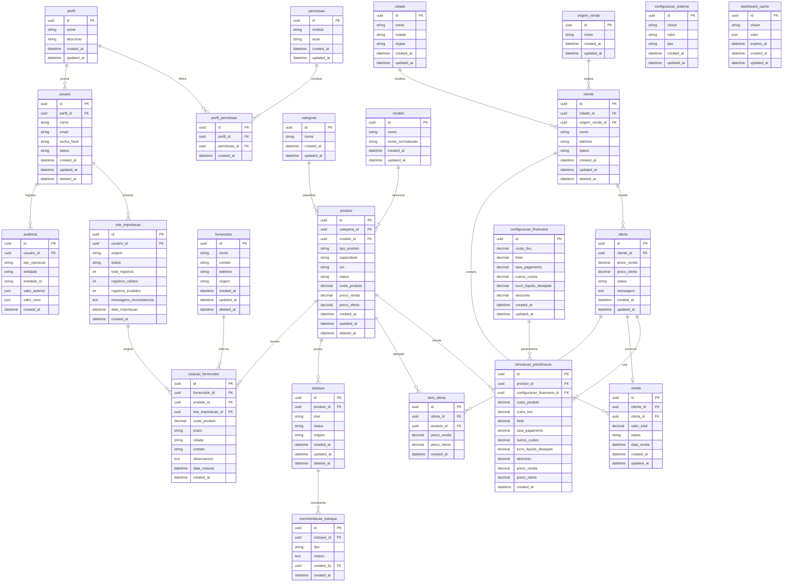

# ERD Inicial - iNest Phone

```mermaid
erDiagram
  perfil ||--o{ usuario : possui
  perfil ||--o{ perfil_permissao : libera
  permissao ||--o{ perfil_permissao : compoe

  usuario ||--o{ auditoria : registra
  usuario ||--o{ lote_importacao : importa

  fornecedor ||--o{ cotacao_fornecedor : informa
  produto ||--o{ cotacao_fornecedor : recebe
  lote_importacao ||--o{ cotacao_fornecedor : origina

  categoria ||--o{ produto : classifica
  modelo ||--o{ produto : descreve
  cidade ||--o{ cliente : localiza
  origem_venda ||--o{ cliente : origina

  cliente ||--o{ venda : compra
  cliente ||--o{ oferta : recebe
  produto ||--o{ estoque : possui
  estoque ||--o{ movimentacao_estoque : movimenta
  produto ||--o{ item_oferta : ofertado
  oferta ||--o{ item_oferta : contem
  oferta ||--o| venda : converte

  configuracao_financeira ||--o{ simulacao_precificacao : parametriza
  produto ||--o{ simulacao_precificacao : simula
  oferta ||--o{ simulacao_precificacao : usa

  usuario {
    uuid id PK
    uuid perfil_id FK
    string nome
    string email
    string senha_hash
    string status
    datetime created_at
    datetime updated_at
    datetime deleted_at
  }

  perfil {
    uuid id PK
    string nome
    string descricao
    datetime created_at
    datetime updated_at
  }

  permissao {
    uuid id PK
    string modulo
    string acao
    datetime created_at
    datetime updated_at
  }

  perfil_permissao {
    uuid id PK
    uuid perfil_id FK
    uuid permissao_id FK
    datetime created_at
  }

  produto {
    uuid id PK
    uuid categoria_id FK
    uuid modelo_id FK
    string tipo_produto
    string capacidade
    string cor
    string status
    decimal custo_produto
    decimal preco_venda
    decimal preco_oferta
    datetime created_at
    datetime updated_at
    datetime deleted_at
  }

  categoria {
    uuid id PK
    string nome
    datetime created_at
    datetime updated_at
  }

  modelo {
    uuid id PK
    string nome
    string nome_normalizado
    datetime created_at
    datetime updated_at
  }

  fornecedor {
    uuid id PK
    string nome
    string contato
    string telefone
    string origem
    datetime created_at
    datetime updated_at
    datetime deleted_at
  }

  cotacao_fornecedor {
    uuid id PK
    uuid fornecedor_id FK
    uuid produto_id FK
    uuid lote_importacao_id FK
    decimal custo_produto
    string prazo
    string cidade
    string contato
    text observacoes
    datetime data_cotacao
    datetime created_at
  }

  cliente {
    uuid id PK
    uuid cidade_id FK
    uuid origem_venda_id FK
    string nome
    string telefone
    string status
    datetime created_at
    datetime updated_at
    datetime deleted_at
  }

  cidade {
    uuid id PK
    string nome
    string estado
    string regiao
    datetime created_at
    datetime updated_at
  }

  origem_venda {
    uuid id PK
    string nome
    datetime created_at
    datetime updated_at
  }

  venda {
    uuid id PK
    uuid cliente_id FK
    uuid oferta_id FK
    decimal valor_total
    string status
    datetime data_venda
    datetime created_at
    datetime updated_at
  }

  oferta {
    uuid id PK
    uuid cliente_id FK
    decimal preco_venda
    decimal preco_oferta
    string status
    text mensagem
    datetime created_at
    datetime updated_at
  }

  item_oferta {
    uuid id PK
    uuid oferta_id FK
    uuid produto_id FK
    decimal preco_venda
    decimal preco_oferta
    datetime created_at
  }

  estoque {
    uuid id PK
    uuid produto_id FK
    string imei
    string status
    string origem
    datetime created_at
    datetime updated_at
    datetime deleted_at
  }

  movimentacao_estoque {
    uuid id PK
    uuid estoque_id FK
    string tipo
    text motivo
    uuid created_by FK
    datetime created_at
  }

  configuracao_financeira {
    uuid id PK
    decimal custo_fixo
    decimal frete
    decimal taxa_pagamento
    decimal outros_custos
    decimal lucro_liquido_desejado
    decimal desconto
    datetime created_at
    datetime updated_at
  }

  configuracao_sistema {
    uuid id PK
    string chave
    string valor
    string tipo
    datetime created_at
    datetime updated_at
  }

  simulacao_precificacao {
    uuid id PK
    uuid produto_id FK
    uuid configuracao_financeira_id FK
    decimal custo_produto
    decimal custo_fixo
    decimal frete
    decimal taxa_pagamento
    decimal outros_custos
    decimal lucro_liquido_desejado
    decimal desconto
    decimal preco_venda
    decimal preco_oferta
    datetime created_at
  }

  lote_importacao {
    uuid id PK
    uuid usuario_id FK
    string origem
    string status
    int total_registros
    int registros_validos
    int registros_invalidos
    text mensagens_inconsistencia
    datetime data_importacao
    datetime created_at
  }

  auditoria {
    uuid id PK
    uuid usuario_id FK
    string tipo_operacao
    string entidade
    string entidade_id
    json valor_anterior
    json valor_novo
    datetime created_at
  }

  dashboard_cache {
    uuid id PK
    string chave
    json valor
    datetime expires_at
    datetime created_at
    datetime updated_at
  }
```
