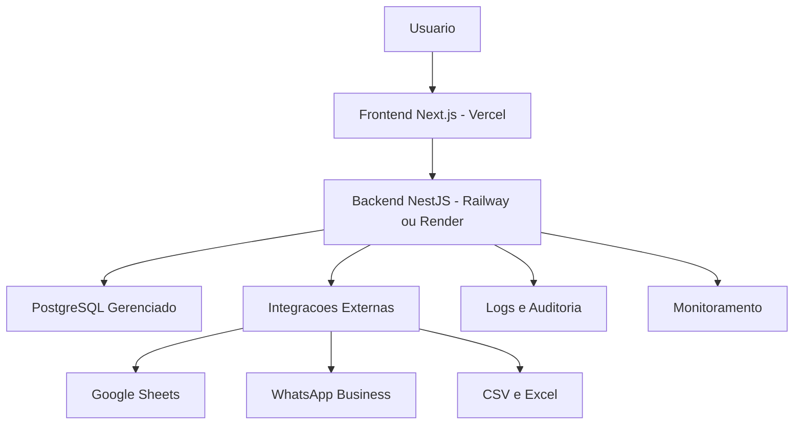
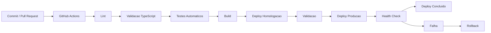

# SAD Consolidado - iNest Phone

## Parte 1 - Visao Geral da Arquitetura

## Objetivo

Este documento define a arquitetura oficial do sistema iNest Phone - Sistema de Gestao Comercial.

Seu objetivo e estabelecer os principios arquiteturais, padroes de desenvolvimento e diretrizes tecnicas que deverao ser seguidos durante todo o ciclo de vida do projeto.

Todas as decisoes futuras deverao respeitar esta arquitetura.

## 1. Principios da arquitetura

O sistema deve ser desenvolvido seguindo os seguintes principios:

- Simplicidade.
- Escalabilidade.
- Modularidade.
- Reutilizacao de componentes.
- Baixo acoplamento.
- Alta coesao.
- Seguranca por padrao.
- Performance por padrao.
- Experiencia do usuario em primeiro lugar.
- Facilidade de manutencao.

Nenhum modulo pode depender diretamente da implementacao interna de outro modulo.

Toda comunicacao deve ocorrer por interfaces bem definidas.

## 2. Estilo arquitetural

O sistema utilizara uma arquitetura em camadas combinada com uma arquitetura modular.

O estilo oficial da primeira versao sera Modular Monolith.

Cada modulo sera independente, porem executara dentro da mesma aplicacao.

Nao utilizar microservicos na primeira versao.

A arquitetura deve permitir futura extracao de modulos para microservicos sem necessidade de reescrever regras de negocio.

## 3. Organizacao geral

O sistema sera dividido em tres grandes blocos.

### 3.1 Camada de apresentacao

Responsavel por:

- Interface do usuario.
- Navegacao.
- Formularios.
- Validacoes de interface.
- Consumo das APIs.
- Feedback visual.
- Estados de carregamento.
- Acessibilidade.

Tecnologias:

- Next.js
- React
- TypeScript
- Tailwind CSS
- Shadcn/UI

### 3.2 Camada de aplicacao

Responsavel por:

- Regras de uso.
- Autenticacao.
- Autorizacao.
- Orquestracao dos modulos.
- Integracao entre servicos.
- Validacoes de negocio.

Tecnologias:

- NestJS
- TypeScript

### 3.3 Camada de persistencia

Responsavel por:

- Acesso ao banco.
- Consultas.
- Gravacoes.
- Transacoes.
- Historico.

Tecnologias:

- PostgreSQL
- Prisma ORM

## 4. Modularizacao

Cada modulo deve ser independente e possuir responsabilidades bem definidas.

Estrutura inicial:

- Autenticacao.
- Usuarios.
- Dashboard.
- Radar de Precos.
- Precificacao.
- Gerador de Ofertas.
- Produtos.
- Fornecedores.
- Clientes.
- Estoque.
- Financeiro.
- Configuracoes.
- Business Intelligence.
- Auditoria.

Nenhum modulo pode acessar diretamente a logica interna de outro modulo.

Toda comunicacao entre modulos deve ocorrer por servicos publicos ou interfaces.

## 5. Fluxo geral da aplicacao

O fluxo principal deve seguir obrigatoriamente a sequencia:

1. Usuario realiza autenticacao.
2. Sistema valida permissoes.
3. Usuario acessa um modulo.
4. Interface solicita dados ao backend.
5. Backend executa regras de negocio.
6. Backend consulta o banco de dados.
7. Dados sao processados.
8. Resposta padronizada e enviada ao frontend.
9. Interface atualiza a visualizacao.
10. Auditoria registra a operacao quando aplicavel.

## 6. Comunicacao entre camadas

A comunicacao deve seguir exclusivamente o fluxo:

```txt
Frontend -> API -> Service -> Repository -> Banco de Dados
```

O caminho inverso deve seguir:

```txt
Banco de Dados -> Repository -> Service -> API -> Frontend
```

E proibido que:

- O frontend acesse diretamente o banco de dados.
- Controllers realizem consultas SQL.
- Componentes React contenham regras de negocio.
- Repositories implementem regras comerciais.

## 7. Responsabilidades

### 7.1 Frontend

Responsavel apenas por:

- Interface.
- Experiencia do usuario.
- Consumo das APIs.
- Validacoes visuais.
- Gerenciamento de estado da interface.

O frontend nao pode conter logica de negocio.

### 7.2 Backend

Responsavel por:

- Autenticacao.
- Autorizacao.
- Validacoes de negocio.
- Calculos.
- Geracao de ofertas.
- Importacoes.
- Auditoria.
- Integracoes externas.

Toda regra comercial deve existir exclusivamente no backend.

### 7.3 Banco de dados

Responsavel apenas pelo armazenamento e recuperacao das informacoes.

O banco nao deve conter logica de negocio complexa em triggers ou stored procedures.

## 8. Principios de desenvolvimento

Todo o projeto deve seguir obrigatoriamente:

- Clean Architecture.
- SOLID.
- DRY.
- KISS.
- Convention over Configuration.
- Composicao em vez de heranca, sempre que possivel.
- Separacao clara de responsabilidades.

## 9. Estrategia de evolucao

A arquitetura deve permitir futuramente:

- Aplicativo mobile.
- Integracao com WhatsApp Business.
- Integracao com Google Sheets.
- Integracao com APIs de fornecedores.
- Filas de processamento.
- Cache distribuido.
- Microservicos.
- Multiplas filiais.
- Multiplas empresas.
- Inteligencia artificial para analise de precos e recomendacoes.

Essas funcionalidades nao fazem parte do MVP, mas a arquitetura deve estar preparada para recebe-las sem reestruturacoes significativas.

## 10. Diretrizes para o Codex

Antes de implementar qualquer funcionalidade, o Codex deve validar se ela respeita os documentos oficiais:

1. PRD - Product Requirements Document.
2. BRD - Business Requirements Document.
3. SAD - Software Architecture Document.

Em caso de conflito:

- O BRD prevalece sobre regras de negocio.
- O SAD prevalece sobre decisoes tecnicas.
- O PRD prevalece sobre escopo e objetivos do produto.

Nenhuma implementacao deve contrariar esses documentos.

Caso uma nova funcionalidade exija alteracoes estruturais, o Codex deve propor a atualizacao da documentacao antes de modificar a arquitetura existente.

---

## Parte 2 - Arquitetura Fisica e Infraestrutura

## Objetivo

Esta parte define a arquitetura fisica do sistema iNest Phone - Sistema de Gestao Comercial.

Seu objetivo e especificar como os componentes da aplicacao serao organizados, comunicados e implantados, preservando integralmente as definicoes estabelecidas no PRD e no BRD.

Este documento nao altera regras de negocio nem requisitos funcionais.

## 1. Visao geral da arquitetura fisica

A aplicacao sera composta por quatro grandes camadas:

```txt
Usuario
  -> Frontend (Next.js)
  -> Backend (NestJS)
  -> PostgreSQL
```

As integracoes externas seguirao o fluxo:

```txt
Google Sheets / WhatsApp Business / CSV / Excel
  -> Backend
  -> Banco de Dados
  -> Frontend
  -> Usuario
```

Todas as integracoes externas devem ocorrer exclusivamente atraves do Backend.

Nenhuma integracao pode acessar diretamente o banco de dados.

## 2. Componentes da arquitetura

### 2.1 Frontend

Responsavel pela experiencia do usuario.

Funcoes:

- Renderizacao das telas.
- Autenticacao visual.
- Navegacao.
- Formularios.
- Validacoes de interface.
- Dashboards.
- Consumo das APIs.
- Gerenciamento de estado da interface.

Tecnologias definidas no PRD:

- Next.js
- React
- TypeScript
- Tailwind CSS
- Shadcn/UI

O Frontend jamais deve conter regras de negocio.

### 2.2 Backend

Responsavel por toda logica da aplicacao.

Funcoes:

- Autenticacao.
- Autorizacao.
- Validacoes.
- Calculos.
- Geracao de ofertas.
- Integracoes.
- Importacoes.
- Auditoria.
- Acesso ao banco.

Tecnologias:

- NestJS
- TypeScript

Nenhuma regra comercial pode existir fora do Backend.

### 2.3 Banco de dados

Responsavel pelo armazenamento persistente.

Tecnologia:

- PostgreSQL

ORM:

- Prisma

Responsabilidades:

- Armazenamento.
- Consultas.
- Indices.
- Transacoes.
- Integridade referencial.

Nao utilizar logica de negocio em Stored Procedures ou Triggers.

## 3. Fluxo oficial de comunicacao

Toda comunicacao deve seguir obrigatoriamente este fluxo:

```txt
Usuario
  -> Frontend
  -> API REST
  -> Controller
  -> Service
  -> Repository
  -> Prisma
  -> PostgreSQL
```

Resposta:

```txt
PostgreSQL
  -> Prisma
  -> Repository
  -> Service
  -> Controller
  -> Frontend
  -> Usuario
```

Nenhum componente pode ignorar esse fluxo.

## 4. Organizacao dos ambientes

O sistema deve possuir tres ambientes independentes.

### 4.1 Desenvolvimento

- Utilizado pelos desenvolvedores.
- Banco exclusivo.
- Dados ficticios.
- Logs completos.

### 4.2 Homologacao

- Ambiente destinado aos testes.
- Banco independente.
- Permite validacao antes da publicacao.

### 4.3 Producao

- Ambiente oficial.
- Banco exclusivo.
- Backups automaticos.
- Logs controlados.
- Monitoramento ativo.

## 5. Hospedagem

Frontend:

- Vercel

Backend:

- Railway ou Render

Banco:

- PostgreSQL gerenciado

Todos os ambientes devem possuir variaveis independentes.

Jamais compartilhar credenciais entre ambientes.

## 6. Variaveis de ambiente

Toda informacao sensivel deve utilizar variaveis de ambiente.

Exemplos:

- JWT Secret.
- Banco.
- SMTP.
- Google.
- WhatsApp.
- APIs.
- Tokens.

E proibido armazenar credenciais diretamente no codigo.

## 7. Estrutura de pastas

### 7.1 Frontend

```txt
src/
  app/
  components/
  features/
  hooks/
  lib/
  services/
  styles/
  types/
  utils/
  providers/
  middleware/
  assets/
```

Cada modulo deve permanecer isolado.

### 7.2 Backend

```txt
src/
  modules/
  common/
  config/
  database/
  auth/
  middlewares/
  guards/
  interceptors/
  filters/
  decorators/
  shared/
  main.ts
```

Cada modulo deve conter:

- Controller.
- Service.
- Repository.
- DTO.
- Entity.
- Interfaces.
- Validators.
- Tests.

## 8. Organizacao dos modulos

Cada modulo deve ser completamente independente.

Exemplo:

```txt
modules/
  dashboard/
  pricing/
  offers/
  products/
  suppliers/
  customers/
  inventory/
  finance/
  users/
  settings/
  analytics/
```

Nao e permitido compartilhar regras de negocio diretamente entre modulos.

Caso uma regra seja utilizada por mais de um modulo, ela deve ser movida para uma camada compartilhada apropriada.

## 9. Camada Shared

Criar uma camada compartilhada apenas para recursos reutilizaveis.

Exemplos:

- Helpers.
- Utilitarios.
- Constantes.
- Tipos.
- Validacoes genericas.
- Tratamento de datas.
- Formatacao monetaria.
- Regras de arredondamento.
- Componentes reutilizaveis.

E proibido mover regras comerciais especificas para esta camada.

## 10. Arquitetura das APIs

Todas as APIs devem seguir o padrao REST.

Metodos:

- GET
- POST
- PUT
- PATCH
- DELETE

As respostas devem possuir estrutura padronizada:

```txt
status
message
data
metadata
timestamp
```

Mensagens de erro tambem devem seguir um padrao unico.

## 11. Estrategia de importacao

Toda importacao deve seguir a mesma arquitetura:

```txt
Origem
  -> Parser
  -> Normalizacao
  -> Validacao
  -> Regras do BRD
  -> Persistencia
  -> Historico
  -> Dashboard
```

Cada origem deve possuir um parser independente.

Exemplos:

- CSV.
- Excel.
- Google Sheets.
- WhatsApp.

No futuro, novas origens poderao ser adicionadas sem alterar os parsers existentes.

## 12. Estrategia de exportacao

Toda exportacao deve utilizar uma camada propria.

Formatos previstos:

- CSV.
- Excel.
- PDF.
- JSON.

As exportacoes jamais devem consultar diretamente o banco.

Sempre devem utilizar os Services responsaveis.

## 13. Gerenciamento de estado

No Frontend, o estado deve ser dividido em estado global e estado local.

Estado global:

- Autenticacao.
- Usuario.
- Tema.
- Configuracoes.

Estado local:

- Formularios.
- Filtros.
- Modais.
- Paginacao.
- Selecao de itens.

Evitar estados globais desnecessarios.

## 14. Estrategia de cache

O sistema deve suportar cache para:

- Dashboard.
- Radar de Precos.
- Configuracoes.
- Produtos.
- Clientes.
- Fornecedores.

O cache nunca pode comprometer a consistencia das regras de negocio.

Sempre que houver alteracao de dados relevantes, o cache correspondente deve ser invalidado.

## 15. Observabilidade

A aplicacao deve registrar:

- Erros.
- Excecoes.
- Autenticacoes.
- Alteracoes criticas.
- Importacoes.
- Exportacoes.
- Operacoes financeiras.

Os logs devem ser estruturados e pesquisaveis.

## 16. Escalabilidade

A arquitetura deve permitir futuramente:

- Multiplas filiais.
- Multiplos bancos.
- Multiplas empresas.
- Microservicos.
- Filas de processamento.
- Processamento assincrono.
- Inteligencia artificial.
- Integracoes externas adicionais.

Essas funcionalidades nao fazem parte do MVP, mas nenhuma decisao arquitetural desta fase pode impedir sua implementacao futura.

## 17. Diretrizes para implementacao

Durante o desenvolvimento:

- Preservar integralmente o PRD.
- Preservar integralmente o BRD.
- Utilizar este SAD exclusivamente como referencia tecnica.
- Nao criar modulos fora da arquitetura definida.
- Nao introduzir dependencias circulares entre modulos.
- Manter baixo acoplamento e alta coesao.
- Documentar decisoes tecnicas relevantes.

---

## Parte 3 - Arquitetura dos Modulos

## Objetivo

Esta parte define a organizacao interna dos modulos do sistema iNest Phone.

Seu objetivo e estabelecer responsabilidades, limites, dependencias e padroes de comunicacao entre os modulos, preservando integralmente todas as definicoes do PRD, do BRD e das Partes 1 e 2 do SAD.

Nenhuma regra de negocio e alterada por este documento.

## 1. Principios da modularizacao

Cada modulo deve possuir responsabilidade unica.

Os modulos devem ser independentes entre si.

Nenhum modulo pode acessar diretamente:

- Tabelas de outro modulo.
- Repositories de outro modulo.
- Controllers de outro modulo.
- Entidades internas de outro modulo.

Toda comunicacao deve ocorrer atraves de Services publicos ou interfaces definidas.

## 2. Lista oficial de modulos

O sistema sera composto pelos seguintes modulos:

- Autenticacao.
- Usuarios.
- Dashboard.
- Radar de Precos.
- Precificacao.
- Gerador de Ofertas.
- Produtos.
- Fornecedores.
- Clientes.
- Estoque.
- Financeiro.
- Configuracoes.
- Business Intelligence.
- Auditoria.

Esta estrutura deve permanecer como referencia oficial da arquitetura.

## 3. Responsabilidade de cada modulo

### 3.1 Autenticacao

Responsavel por:

- Login.
- Logout.
- Emissao de tokens.
- Renovacao de sessao.
- Validacao de identidade.

Nao deve armazenar regras comerciais.

### 3.2 Usuarios

Responsavel por:

- Cadastro.
- Edicao.
- Permissoes.
- Perfis.
- Usuarios ativos.
- Usuarios inativos.

Nao pode controlar autenticacao. Essa responsabilidade pertence exclusivamente ao modulo Autenticacao.

### 3.3 Dashboard

Responsavel por:

- Consolidacao de indicadores.
- KPIs.
- Graficos.
- Resumos.

Jamais deve realizar calculos proprios.

Todo dado deve ser obtido dos modulos responsaveis.

### 3.4 Radar de Precos

Responsavel por:

- Importacao.
- Normalizacao.
- Historico.
- Comparacao.
- Organizacao dos fornecedores.

Jamais deve calcular precos de venda.

### 3.5 Precificacao

Responsavel por:

- Aplicar a formula oficial definida no BRD.
- Calcular preco de venda.
- Calcular preco de oferta.
- Aplicar arredondamentos.
- Realizar simulacoes.

Nenhum outro modulo pode executar calculos comerciais.

### 3.6 Gerador de Ofertas

Responsavel por:

- Aplicar templates.
- Montar mensagens.
- Copiar.
- Compartilhar.
- Gerar pre-visualizacoes.

Jamais deve realizar calculos.

Sempre deve utilizar os valores fornecidos pelo modulo Precificacao.

### 3.7 Produtos

Responsavel por:

- Catalogo.
- Modelos.
- Capacidades.
- Cores.
- Categorias.
- Situacao.
- Especificacoes.

Nao deve controlar estoque.

### 3.8 Fornecedores

Responsavel por:

- Cadastro.
- Contatos.
- Historico.
- Origem.
- Cotacoes.

Nao pode armazenar precos calculados.

### 3.9 Clientes

Responsavel por:

- Cadastro.
- Compras.
- Cidades.
- Origem.
- Historico.

Nao realiza calculos financeiros.

### 3.10 Estoque

Responsavel por:

- Disponibilidade.
- IMEI.
- Movimentacoes.
- Reservas.
- Entradas.
- Saidas.

Nao calcula precos.

### 3.11 Financeiro

Responsavel por:

- Receitas.
- Despesas.
- Fluxo de caixa.
- Lucro.
- Custos.

Nao controla estoque.

### 3.12 Configuracoes

Responsavel por:

- Parametros globais.
- Custos fixos.
- Taxas.
- Lucros padrao.
- Preferencias.

Nenhum outro modulo pode alterar parametros globais diretamente.

### 3.13 Business Intelligence

Responsavel por:

- Analises.
- Rankings.
- Tendencias.
- Comparativos.
- Consolidacoes.

Jamais deve gravar dados operacionais.

Sera um modulo exclusivamente analitico.

### 3.14 Auditoria

Responsavel por:

- Logs.
- Alteracoes.
- Importacoes.
- Exportacoes.
- Acessos.
- Historico.

Nenhum modulo pode registrar logs diretamente no banco.

Todos devem utilizar os servicos da Auditoria.

## 4. Dependencias permitidas

As dependencias entre modulos devem respeitar a seguinte matriz:

| Modulo | Pode consumir |
| --- | --- |
| Dashboard | Todos os modulos de leitura |
| Radar de Precos | Fornecedores, Produtos |
| Precificacao | Produtos, Configuracoes |
| Gerador de Ofertas | Precificacao, Produtos |
| Estoque | Produtos |
| Financeiro | Configuracoes |
| BI | Dashboard, Financeiro, Produtos, Clientes |

E proibido criar dependencias diferentes desta matriz sem atualizacao formal da arquitetura.

## 5. Comunicacao entre modulos

Toda comunicacao deve seguir este padrao:

```txt
Controller
  -> Service
  -> Interface Publica
  -> Service do outro modulo
```

E proibido:

- Acessar repositories externos.
- Acessar entidades externas diretamente.
- Executar consultas SQL em outro modulo.

## 6. Eventos internos

Sempre que uma operacao importante ocorrer, o modulo deve emitir um evento interno.

Exemplos:

- Produto Importado.
- Preco Calculado.
- Oferta Gerada.
- Venda Concluida.
- Cliente Criado.
- Fornecedor Atualizado.

Esses eventos devem permitir futuras integracoes e processamento assincrono, sem alterar a logica principal.

## 7. Estrutura interna dos modulos

Todos os modulos devem seguir exatamente a mesma organizacao.

Exemplo:

```txt
modules/
  pricing/
    controller/
    service/
    repository/
    dto/
    entities/
    interfaces/
    validators/
    mappers/
    tests/
```

Nenhum modulo pode possuir estrutura diferente sem justificativa arquitetural.

## 8. Interfaces publicas

Cada modulo deve expor apenas as operacoes necessarias.

Exemplo:

Precificacao:

- `calcularVenda()`
- `calcularOferta()`
- `simularPreco()`

Gerador de Ofertas:

- `gerarOferta()`
- `gerarPreview()`

Radar de Precos:

- `importarLista()`
- `consultarHistorico()`
- `listarMenoresPrecos()`

As implementacoes internas devem permanecer privadas.

## 9. Reutilizacao de codigo

Toda logica utilizada por mais de um modulo deve ser extraida para componentes compartilhados apropriados.

Exemplos:

- Formatacao de moeda.
- Tratamento de datas.
- Validacoes genericas.
- Arredondamento.
- Normalizacao de texto.
- Tratamento de erros.

E proibido duplicar codigo entre modulos.

## 10. Tratamento de erros

Todos os modulos devem lancar excecoes padronizadas.

Nenhum Service deve retornar mensagens de erro em formato livre.

Os erros devem conter, no minimo:

- Codigo interno.
- Mensagem padronizada.
- Contexto.
- Timestamp.

## 11. Transacoes

Operacoes que alterem multiplas entidades devem ser executadas em transacoes.

Exemplos:

- Importacao de listas.
- Atualizacao em lote.
- Movimentacoes de estoque.
- Geracao de ofertas com persistencia.

Em caso de falha, todas as alteracoes devem ser revertidas.

## 12. Escalabilidade dos modulos

Cada modulo deve ser desenvolvido para permitir futura extracao para um microservico.

Para isso:

- Evitar dependencias diretas.
- Utilizar contratos claros.
- Manter baixo acoplamento.
- Isolar regras de negocio.

Na versao atual, todos permanecerao no mesmo backend como Modular Monolith.

## 13. Versionamento interno

Mudancas incompatíveis em contratos publicos entre modulos devem seguir versionamento interno.

Isso evita quebra de funcionalidades durante evolucoes futuras.

## 14. Criterios de aceitacao

A arquitetura modular sera considerada correta quando:

- Cada modulo possuir responsabilidade unica.
- Nao existirem dependencias circulares.
- Nao houver duplicacao de regras.
- Todas as comunicacoes ocorrerem por interfaces publicas.
- Nenhuma regra de negocio estiver implementada fora do modulo responsavel.
- Os modulos puderem evoluir de forma independente.

---

## Parte 4 - Modelo de Dados (Data Architecture)

## Objetivo

Esta parte define a arquitetura do banco de dados do sistema iNest Phone - Sistema de Gestao Comercial.

Seu objetivo e estabelecer as entidades, relacionamentos, convencoes de modelagem e diretrizes de persistencia, preservando integralmente as definicoes do PRD, do BRD e das Partes 1, 2 e 3 do SAD.

Este documento nao altera regras de negocio nem acrescenta funcionalidades.

## 1. Principios da modelagem de dados

O banco de dados deve seguir os seguintes principios:

- Normalizacao ate, no minimo, a Terceira Forma Normal, salvo justificativa tecnica documentada.
- Integridade referencial obrigatoria.
- Uso de chaves primarias imutaveis.
- Uso de chaves estrangeiras para relacionamentos.
- Evitar duplicacao de dados.
- Separacao entre dados operacionais e dados analiticos.

## 2. Convencoes de nomenclatura

Todas as tabelas devem utilizar nomes no singular.

Exemplos:

- `usuario`
- `produto`
- `fornecedor`
- `cliente`
- `venda`
- `oferta`

Todos os campos devem utilizar snake_case.

Exemplos:

- `created_at`
- `updated_at`
- `deleted_at`
- `preco_venda`
- `preco_oferta`
- `custo_produto`

As chaves primarias devem utilizar o padrao:

- `id`

As chaves estrangeiras devem utilizar o padrao:

- `produto_id`
- `cliente_id`
- `fornecedor_id`

## 3. Campos padrao

Toda entidade persistente deve possuir, quando aplicavel:

- `id`
- `created_at`
- `updated_at`
- `deleted_at`
- `created_by`
- `updated_by`

A adocao de exclusao logica deve respeitar a natureza da entidade e as regras definidas no BRD.

## 4. Entidades principais

O modelo de dados deve contemplar, no minimo, as seguintes entidades:

- Usuario.
- Perfil.
- Permissao.
- Produto.
- Categoria.
- Modelo.
- Fornecedor.
- CotacaoFornecedor.
- Cliente.
- Venda.
- Oferta.
- Estoque.
- MovimentacaoEstoque.
- ConfiguracaoFinanceira.
- ConfiguracaoSistema.
- Auditoria.
- DashboardCache, quando necessario para otimizacao.
- OrigemVenda.
- Cidade.

Essas entidades representam a base estrutural do sistema e poderao ser expandidas futuramente sem comprometer o modelo existente.

## 5. Relacionamentos

Os relacionamentos devem utilizar integridade referencial.

Exemplos conceituais:

- Um fornecedor pode possuir varias cotacoes.
- Um produto pode possuir varias cotacoes.
- Um cliente pode possuir varias vendas.
- Uma venda pode estar associada a um cliente.
- Uma oferta pode ser derivada de um ou mais produtos, conforme as regras do BRD.
- Um produto pode possuir registros de estoque e movimentacoes.

A cardinalidade detalhada deve ser definida no diagrama ERD.

## 6. Integridade referencial

Toda chave estrangeira deve possuir restricoes apropriadas.

As acoes de atualizacao e exclusao devem ser definidas conforme a natureza do relacionamento.

Exemplos:

- Impedir exclusao de registros utilizados por operacoes historicas.
- Preservar historico de auditoria.
- Evitar registros orfaos.

## 7. Indices

Os indices devem ser criados com base nos principais cenarios de consulta.

Exemplos:

- Modelo.
- Capacidade.
- Cor.
- Fornecedor.
- Cidade.
- Data da cotacao.
- IMEI.
- Status.
- Data de venda.

Evitar criacao de indices redundantes.

Todos os indices devem possuir justificativa tecnica.

## 8. Dados financeiros

Todos os valores monetarios devem utilizar tipo numerico com precisao fixa, evitando tipos de ponto flutuante.

Os calculos continuam sendo executados exclusivamente pela camada de servicos, conforme definido nas partes anteriores do SAD.

O banco de dados armazena apenas os valores persistidos e os metadados necessarios.

## 9. Datas e horarios

Todos os registros de data e hora devem utilizar um padrao unico.

A aplicacao deve tratar o fuso horario de forma consistente entre frontend, backend e banco de dados.

As regras de apresentacao ao usuario permanecem na camada de interface.

## 10. Historico

Entidades que possuam historico operacional devem armazenar versoes ou registros de alteracoes conforme definido pelo modulo de Auditoria.

O historico deve permitir rastreabilidade sem sobrescrever informacoes relevantes.

## 11. Configuracoes

As configuracoes do sistema devem ser persistidas em tabelas proprias.

Exemplos:

- Parametros financeiros.
- Preferencias do sistema.
- Configuracoes de importacao.
- Templates de mensagens.
- Integracoes futuras.

Essas configuracoes nao devem ficar codificadas diretamente na aplicacao.

## 12. Importacoes

As importacoes devem preservar:

- Origem.
- Data da importacao.
- Usuario responsavel, quando aplicavel.
- Quantidade de registros.
- Status da importacao.
- Mensagens de inconsistencia.

Os dados importados devem permanecer rastreaveis.

## 13. Auditoria

A auditoria deve registrar informacoes suficientes para reconstruir eventos relevantes do sistema.

Os registros devem possuir vinculo com o usuario responsavel, data, hora, tipo da operacao e entidade afetada.

A politica de retencao desses registros pode ser definida futuramente nas configuracoes administrativas.

## 14. Consistencia dos dados

A aplicacao deve impedir gravacoes que violem:

- Integridade referencial.
- Unicidade de identificadores.
- Regras obrigatorias definidas no BRD.
- Consistencia dos relacionamentos.

Validacoes de negocio continuam sendo responsabilidade da camada de servicos.

## 15. Estrategia de evolucao

O modelo deve permitir futura expansao para:

- Novas categorias de produtos.
- Multiplas filiais.
- Multiplas empresas.
- Integracoes externas.
- Novas origens de importacao.
- Novos modulos analiticos.

As futuras extensoes devem preservar compatibilidade com os dados existentes.

## 16. Migracoes

Todas as alteracoes estruturais do banco devem ser realizadas por meio de migracoes versionadas.

E proibida a alteracao manual do schema em ambientes controlados.

Cada migracao deve:

- Possuir identificacao unica.
- Ser reversivel quando tecnicamente viavel.
- Ser registrada no controle de versao do projeto.

## 17. Criterios de aceitacao

A arquitetura de dados sera considerada concluida quando:

- Todas as entidades estiverem modeladas.
- Todos os relacionamentos estiverem documentados.
- A integridade referencial estiver definida.
- Os padroes de nomenclatura forem respeitados.
- As migracoes estiverem versionadas.
- O modelo suportar integralmente os requisitos definidos no PRD e no BRD.

---

## Parte 5 - Arquitetura das APIs

## Objetivo

Esta parte define os padroes arquiteturais para todas as APIs do sistema iNest Phone - Sistema de Gestao Comercial.

Seu objetivo e padronizar a comunicacao entre frontend e backend, garantindo consistencia, seguranca, escalabilidade e facilidade de manutencao.

Este documento nao altera funcionalidades, regras de negocio ou requisitos definidos anteriormente.

## 1. Principios gerais

Todas as APIs devem seguir os seguintes principios:

- Arquitetura REST.
- Comunicacao stateless.
- Versionamento.
- Respostas padronizadas.
- Validacao de entrada.
- Tratamento uniforme de erros.
- Autenticacao obrigatoria, exceto quando explicitamente permitido.
- Documentacao automatica.

## 2. Versionamento

Todas as APIs devem possuir versao.

Padrao:

```txt
/api/v1/
```

Exemplos:

```txt
/api/v1/auth
/api/v1/products
/api/v1/pricing
/api/v1/offers
```

Novas versoes devem coexistir com versoes anteriores quando houver alteracoes incompatíveis.

## 3. Organizacao dos endpoints

Cada modulo deve possuir sua propria area de endpoints.

Exemplo conceitual:

```txt
/auth
/users
/dashboard
/products
/suppliers
/pricing
/offers
/inventory
/customers
/finance
/settings
/analytics
/audit
```

Os nomes devem ser consistentes com os modulos definidos na arquitetura.

## 4. Metodos HTTP

Os metodos devem respeitar sua finalidade.

GET:

- Consultas.

POST:

- Criacao.

PUT:

- Atualizacao completa.

PATCH:

- Atualizacao parcial.

DELETE:

- Remocao conforme politica do sistema.

Nao utilizar metodos diferentes para finalidades incompatíveis.

## 5. Estrutura das requisicoes

Toda entrada deve passar por validacao.

Os dados recebidos devem ser convertidos para DTOs antes da execucao das regras de negocio.

Nenhuma regra comercial pode utilizar dados recebidos diretamente da requisicao sem validacao.

## 6. Estrutura das respostas

Todas as respostas devem seguir um formato padronizado.

Estrutura conceitual:

```json
{
  "success": true,
  "message": "Operacao realizada com sucesso.",
  "data": {},
  "metadata": {},
  "timestamp": "ISO-8601"
}
```

Em operacoes que nao retornem conteudo, manter o mesmo padrao estrutural sempre que aplicavel.

## 7. Paginacao

Endpoints que retornem listas devem suportar paginacao.

Requisitos:

- Numero da pagina.
- Quantidade de registros por pagina.
- Total de registros.
- Total de paginas.

A implementacao deve ser consistente em todos os modulos.

## 8. Ordenacao

Sempre que aplicavel, os endpoints devem permitir ordenacao.

A ordenacao deve ser realizada no backend.

Evitar processamento desnecessario no frontend.

## 9. Filtros

Os filtros devem ser opcionais e combinaveis.

Exemplos compativeis com os modulos existentes:

- Modelo.
- Categoria.
- Fornecedor.
- Cidade.
- Periodo.
- Status.
- Capacidade.
- Cor.

A disponibilidade de cada filtro depende do modulo correspondente.

## 10. Pesquisa

Sempre que aplicavel, os endpoints devem oferecer pesquisa textual.

A pesquisa deve utilizar criterios consistentes e desempenho adequado ao volume de dados.

## 11. Validacao

Todas as entradas devem ser validadas antes da execucao da logica da aplicacao.

As validacoes devem contemplar:

- Tipos.
- Formatos.
- Obrigatoriedade.
- Limites.
- Consistencia.

Regras de negocio continuam sendo responsabilidade da camada de servicos.

## 12. Tratamento de erros

Todas as APIs devem retornar erros padronizados.

Cada resposta de erro deve conter informacoes suficientes para identificacao do problema, sem expor detalhes internos da aplicacao.

As mensagens destinadas ao usuario devem ser claras e objetivas.

Informacoes tecnicas detalhadas devem permanecer registradas apenas nos logs.

## 13. Autenticacao

Todos os endpoints protegidos devem exigir autenticacao.

A validacao ocorre antes da execucao da regra de negocio.

O mecanismo de autenticacao deve seguir a estrategia definida nas fases anteriores.

## 14. Autorizacao

Apos autenticar o usuario, o sistema deve verificar as permissoes correspondentes ao perfil.

Nenhum endpoint pode executar operacoes para as quais o usuario nao possua autorizacao.

## 15. Auditoria

Operacoes relevantes devem ser registradas pelo modulo de Auditoria.

Exemplos:

- Criacao.
- Atualizacao.
- Exclusao.
- Importacao.
- Exportacao.
- Alteracao de configuracoes.

O registro deve ocorrer de forma transparente para os modulos consumidores.

## 16. Importacoes

As APIs responsaveis por importacoes devem seguir um fluxo uniforme:

```txt
Recepcao
  -> Validacao
  -> Normalizacao
  -> Aplicacao das regras do BRD
  -> Persistencia
  -> Registro na Auditoria
  -> Resposta ao cliente
```

Cada origem de importacao deve utilizar seu respectivo parser, conforme definido anteriormente.

## 17. Exportacoes

As APIs responsaveis por exportacao devem utilizar apenas dados obtidos pelos servicos oficiais dos modulos.

E proibido consultar diretamente o banco de dados a partir da camada de exportacao.

## 18. Idempotencia

Operacoes que possam ser repetidas por falhas de comunicacao devem ser projetadas para evitar duplicidade de processamento sempre que aplicavel.

Essa diretriz e especialmente importante para importacoes e operacoes de persistencia.

## 19. Performance

As APIs devem priorizar:

- Consultas otimizadas.
- Paginacao.
- Filtros eficientes.
- Reducao de carga desnecessaria.
- Tempo de resposta consistente.

A otimizacao nao pode comprometer a integridade das regras de negocio.

## 20. Documentacao

Todas as APIs devem ser documentadas automaticamente.

A documentacao deve conter:

- Descricao do endpoint.
- Parametros.
- Formatos aceitos.
- Respostas possiveis.
- Codigos de status.
- Requisitos de autenticacao.

A documentacao deve permanecer sincronizada com a implementacao.

## 21. Compatibilidade

Sempre que possivel, alteracoes devem preservar compatibilidade com clientes existentes.

Quando houver necessidade de alteracoes incompatíveis, utilizar novo versionamento de API.

## 22. Criterios de aceitacao

A arquitetura das APIs sera considerada concluida quando:

- Todos os modulos possuirem contratos bem definidos.
- Os padroes de requisicao e resposta forem consistentes.
- Autenticacao e autorizacao estiverem integradas.
- Paginacao, filtros e ordenacao estiverem padronizados.
- Erros forem tratados de forma uniforme.
- A documentacao estiver disponivel e atualizada.

## 23. Diretrizes para implementacao

Durante o desenvolvimento:

- Respeitar integralmente o PRD.
- Respeitar integralmente o BRD.
- Respeitar todas as partes anteriores do SAD.
- Evitar acoplamento entre modulos por meio de endpoints.
- Manter contratos estaveis e bem documentados.
- Centralizar validacoes e tratamento de erros conforme a arquitetura definida.

---

## Parte 6 - Fluxos Operacionais e Casos de Uso

## Objetivo

Esta parte define os fluxos operacionais do sistema iNest Phone - Sistema de Gestao Comercial.

Seu objetivo e documentar a sequencia logica das principais operacoes executadas pelos usuarios e pelos modulos internos, garantindo uma implementacao consistente e alinhada com o PRD, o BRD e as partes anteriores do SAD.

Este documento nao altera regras de negocio, calculos ou arquitetura.

## 1. Principios dos fluxos

Todo fluxo operacional deve:

- Iniciar por uma acao do usuario ou por um processo interno autorizado.
- Validar autenticacao e permissoes quando aplicavel.
- Respeitar integralmente as regras definidas no BRD.
- Registrar auditoria nas operacoes relevantes.
- Retornar feedback consistente ao usuario.

Nenhum fluxo pode executar regras fora da ordem definida anteriormente.

## 2. Fluxo de autenticacao

Objetivo:

Permitir acesso seguro ao sistema.

Fluxo:

```txt
Usuario
  -> Tela de Login
  -> Validacao das Credenciais
  -> Autenticacao
  -> Validacao das Permissoes
  -> Dashboard Inicial
```

Caso a autenticacao falhe:

- Informar o erro ao usuario.
- Registrar tentativa de acesso conforme politica de auditoria.
- Nao iniciar sessao.

## 3. Fluxo de cadastro

Aplica-se aos modulos de:

- Clientes.
- Produtos.
- Fornecedores.
- Usuarios.
- Configuracoes.

Fluxo:

```txt
Usuario
  -> Preenchimento dos Dados
  -> Validacao
  -> Persistencia
  -> Auditoria
  -> Confirmacao
```

Caso existam inconsistencias, a operacao deve ser interrompida antes da persistencia.

## 4. Fluxo de importacao de cotacoes

Este fluxo deve seguir exatamente a sequencia:

```txt
Selecionar Origem
  -> Receber Arquivo ou Dados
  -> Parser
  -> Normalizacao
  -> Validacao
  -> Aplicacao das Regras do BRD
  -> Persistencia
  -> Auditoria
  -> Atualizacao do Radar de Precos
```

Nenhum calculo comercial deve ocorrer durante a importacao.

## 5. Fluxo do radar de precos

Fluxo:

```txt
Usuario
  -> Seleciona Filtros
  -> Consulta ao Backend
  -> Aplicacao dos Filtros
  -> Ordenacao
  -> Retorno dos Resultados
  -> Exibicao na Interface
```

O Radar de Precos deve atuar apenas como consulta e organizacao das informacoes.

## 6. Fluxo de precificacao

Este fluxo deve respeitar integralmente a sequencia definida no BRD.

Fluxo:

```txt
Selecionar Produto
  -> Carregar Configuracoes
  -> Aplicar Regras Comerciais
  -> Calcular Preco de Venda
  -> Aplicar Arredondamento
  -> Calcular Preco de Oferta
  -> Aplicar Arredondamento
  -> Registrar Historico
  -> Exibir Resultado
```

As formulas e criterios permanecem exclusivamente definidos no BRD.

## 7. Fluxo do gerador de ofertas

Fluxo:

```txt
Selecionar Produto
  -> Obter Preco Calculado
  -> Selecionar Template
  -> Substituir Variaveis
  -> Gerar Pre-visualizacao
  -> Copiar ou Compartilhar
```

O Gerador de Ofertas nunca deve recalcular valores.

## 8. Fluxo de consulta de produtos

Fluxo:

```txt
Usuario
  -> Pesquisa
  -> Filtros
  -> Consulta
  -> Paginacao
  -> Exibicao
```

A pesquisa deve utilizar apenas informacoes persistidas.

## 9. Fluxo de estoque

Fluxo:

```txt
Selecionar Produto
  -> Registrar Movimentacao
  -> Atualizar Disponibilidade
  -> Persistir Alteracoes
  -> Registrar Auditoria
  -> Atualizar Interface
```

As movimentacoes devem preservar o historico.

## 10. Fluxo financeiro

Fluxo:

```txt
Selecionar Operacao
  -> Validacao
  -> Persistencia
  -> Atualizacao dos Indicadores
  -> Auditoria
  -> Confirmacao
```

Os indicadores financeiros devem refletir apenas operacoes validas conforme definido no BRD.

## 11. Fluxo do dashboard

Fluxo:

```txt
Usuario
  -> Abrir Dashboard
  -> Consultar Dados Consolidados
  -> Montar Indicadores
  -> Atualizar Graficos
  -> Exibir Interface
```

O Dashboard jamais deve recalcular regras comerciais.

## 12. Fluxo de Business Intelligence

Fluxo:

```txt
Selecionar Periodo
  -> Consultar Dados
  -> Consolidar Informacoes
  -> Gerar Indicadores
  -> Exibir Paineis
```

O modulo de BI deve operar sobre dados ja consolidados.

## 13. Fluxo de configuracoes

Fluxo:

```txt
Usuario Autorizado
  -> Editar Configuracoes
  -> Validar Dados
  -> Persistir Alteracoes
  -> Registrar Auditoria
  -> Atualizar Configuracao Ativa
```

As novas configuracoes devem ser utilizadas apenas nas operacoes futuras, salvo regra especifica definida no BRD.

## 14. Fluxo de auditoria

Toda operacao relevante deve seguir o fluxo:

```txt
Operacao
  -> Captura dos Metadados
  -> Registro
  -> Persistencia
  -> Disponibilizacao para Consulta
```

O registro da auditoria nao deve interromper a operacao principal, salvo falha critica definida pela arquitetura.

## 15. Fluxo de erros

Fluxo padrao:

```txt
Erro
  -> Captura
  -> Classificacao
  -> Registro
  -> Resposta Padronizada
  -> Feedback ao Usuario
```

O sistema deve evitar exposicao de informacoes internas em mensagens destinadas ao usuario.

## 16. Fluxo de exportacao

Fluxo:

```txt
Selecionar Dados
  -> Aplicar Permissoes
  -> Consultar Servicos
  -> Gerar Arquivo
  -> Disponibilizar Download
```

As exportacoes devem utilizar exclusivamente os servicos oficiais dos modulos.

## 17. Fluxo de encerramento de sessao

Fluxo:

```txt
Usuario
  -> Solicita Logout
  -> Encerrar Sessao
  -> Invalidar Credenciais
  -> Registrar Auditoria
  -> Retornar para Login
```

## 18. Estados dos fluxos

Todos os fluxos devem prever os seguintes estados quando aplicavel:

- Iniciado.
- Em processamento.
- Concluido com sucesso.
- Concluido com alertas.
- Falhou.

A representacao visual desses estados deve ser consistente em toda a interface.

## 19. Tratamento de interrupcoes

Caso um fluxo seja interrompido:

- Preservar a integridade dos dados.
- Evitar persistencias parciais.
- Registrar a ocorrencia quando aplicavel.
- Permitir nova execucao sem inconsistencias.

## 20. Criterios de aceitacao

Os fluxos operacionais serao considerados implementados corretamente quando:

- Seguirem a sequencia documentada.
- Respeitarem as permissoes do usuario.
- Utilizarem os modulos responsaveis por cada operacao.
- Registrarem auditoria quando necessario.
- Preservarem a integridade dos dados.
- Nao duplicarem regras de negocio ja definidas no BRD.

## 21. Diretrizes para implementacao

Durante a implementacao:

- Utilizar estes fluxos como referencia para desenvolvimento.
- Utiliza-los como base para testes de integracao.
- Nao modificar regras de negocio por meio dos fluxos.
- Manter a separacao entre orquestracao e logica de negocio.

---

## Parte 7 - Arquitetura de Business Intelligence

## Objetivo

Esta parte define a arquitetura de Business Intelligence do sistema iNest Phone - Sistema de Gestao Comercial.

Seu objetivo e permitir que informacoes operacionais sejam transformadas em indicadores estrategicos para tomada de decisao.

A arquitetura de BI deve ser preparada para crescimento futuro, mantendo bom desempenho mesmo com aumento significativo no volume de dados.

Esta parte complementa o SAD e nao altera regras de negocio, arquitetura existente, tecnologias definidas ou decisoes anteriores.

## 1. Arquitetura analitica

A camada de Business Intelligence deve operar sobre dados gerados pelos modulos operacionais, respeitando os limites arquiteturais definidos nas partes anteriores do SAD.

O modulo de BI nao deve gravar dados operacionais.

O modulo de BI deve consumir dados por meio de services oficiais, views analiticas, agregacoes persistidas ou caches autorizados pela arquitetura.

Fluxo analitico:

```txt
Modulos Operacionais
  -> Services Oficiais
  -> Agregacao Analitica
  -> Persistencia Analitica ou Cache
  -> APIs de BI
  -> Dashboards
  -> Usuario
```

### 1.1 Origem dos dados

As origens iniciais de dados analiticos sao:

- Vendas concluidas.
- Ofertas geradas.
- Produtos.
- Clientes.
- Fornecedores.
- Cotacoes.
- Estoque.
- Configuracoes.
- Auditoria.
- Origem das vendas.

Os indicadores devem respeitar as regras do BRD, especialmente a regra de considerar apenas vendas concluidas quando aplicavel.

### 1.2 Processamento

O processamento analitico deve ocorrer no backend.

O frontend nao deve calcular indicadores estrategicos.

O processamento pode utilizar:

- Consultas otimizadas.
- Agregacoes em services.
- Jobs internos futuros.
- Cache analitico.
- Atualizacao incremental quando aplicavel.

### 1.3 Agregacao

As agregacoes devem transformar dados operacionais em metricas de leitura.

Exemplos:

- Receita por periodo.
- Lucro por categoria.
- Vendas por origem.
- Ranking de clientes.
- Giro de estoque.
- Conversao de ofertas.

Agregacoes reutilizadas por mais de um dashboard devem ser centralizadas no modulo de BI ou em services analiticos apropriados.

### 1.4 Persistencia analitica

Quando necessario para performance, o sistema pode persistir dados analiticos em tabelas ou caches especificos.

Esses dados devem ser derivados dos dados operacionais.

Dados analiticos persistidos nao substituem os registros operacionais originais.

### 1.5 Consumo pelos dashboards

Dashboards devem consumir APIs oficiais do modulo de BI.

Dashboards nao devem consultar diretamente o banco de dados.

Dashboards nao devem duplicar regras de calculo.

## 2. KPIs estrategicos

Os KPIs devem ser calculados pelo backend e expostos por contratos consistentes.

### 2.1 Financeiro

- Receita Bruta.
- Receita Liquida.
- Lucro Liquido.
- Margem.
- Ticket Medio.
- Crescimento Mensal.
- Crescimento Anual.

### 2.2 Produtos

- Produto mais vendido.
- Produto mais lucrativo.
- Giro de estoque.
- Tempo medio em estoque.
- Margem por categoria.
- Margem por fornecedor.

### 2.3 Clientes

- Ticket medio.
- Frequencia de compra.
- Lifetime Value.
- Total comprado.
- Ranking de clientes.

### 2.4 Marketing

- Origem das vendas.
- Conversao por canal.
- Receita por canal.
- Lucro por canal.

### 2.5 Operacional

- Tempo medio de venda.
- Tempo medio de entrega.
- Quantidade de ofertas geradas.
- Taxa de conversao das ofertas.

## 3. Dashboards

Cada dashboard deve possuir objetivo, publico, KPIs, graficos, filtros e possibilidades de aprofundamento.

### 3.1 Dashboard Executivo

Objetivo:

- Apresentar uma visao consolidada da empresa.

Publico:

- Administrador.
- Gestor.

KPIs exibidos:

- Receita Bruta.
- Receita Liquida.
- Lucro Liquido.
- Margem.
- Crescimento Mensal.
- Crescimento Anual.
- Ticket Medio.

Graficos:

- Receita por periodo.
- Lucro por periodo.
- Comparativo mensal.
- Distribuicao por categoria.

Filtros:

- Periodo.
- Categoria.
- Canal.
- Cidade.

Drill-down:

- Periodo para vendas.
- Categoria para produtos.
- Canal para origem das vendas.

Drill-through:

- Acessar relatorios financeiros e comerciais detalhados.

### 3.2 Dashboard Comercial

Objetivo:

- Acompanhar vendas, ofertas e conversao comercial.

Publico:

- Gestor.
- Operador autorizado.

KPIs exibidos:

- Quantidade de ofertas geradas.
- Taxa de conversao das ofertas.
- Tempo medio de venda.
- Ticket medio.
- Produtos mais vendidos.

Graficos:

- Funil de ofertas.
- Conversao por periodo.
- Vendas por produto.
- Vendas por origem.

Filtros:

- Periodo.
- Produto.
- Origem.
- Status.

Drill-down:

- Oferta para produto.
- Produto para cliente.
- Origem para vendas.

Drill-through:

- Acessar ofertas, clientes e vendas relacionadas.

### 3.3 Dashboard Financeiro

Objetivo:

- Acompanhar receitas, lucros, margens e desempenho financeiro.

Publico:

- Administrador.
- Gestor.

KPIs exibidos:

- Receita Bruta.
- Receita Liquida.
- Lucro Liquido.
- Margem.
- Ticket Medio.
- Crescimento Mensal.

Graficos:

- Receita por periodo.
- Lucro por periodo.
- Margem por categoria.
- Receita por canal.

Filtros:

- Periodo.
- Categoria.
- Fornecedor.
- Canal.

Drill-down:

- Mes para dia.
- Categoria para produto.
- Canal para venda.

Drill-through:

- Acessar relatorios financeiros detalhados.

### 3.4 Dashboard de Estoque

Objetivo:

- Monitorar disponibilidade, giro e permanencia de produtos.

Publico:

- Administrador.
- Gestor.

KPIs exibidos:

- Giro de estoque.
- Tempo medio em estoque.
- Produtos disponiveis.
- Produtos reservados.
- Produtos vendidos.

Graficos:

- Estoque por categoria.
- Tempo em estoque por produto.
- Movimentacoes por periodo.
- Status dos itens.

Filtros:

- Categoria.
- Modelo.
- Status.
- Periodo.

Drill-down:

- Categoria para produto.
- Produto para item.

Drill-through:

- Acessar detalhes de produto e movimentacoes.

### 3.5 Dashboard de Clientes

Objetivo:

- Analisar comportamento, recorrencia e valor dos clientes.

Publico:

- Administrador.
- Gestor.

KPIs exibidos:

- Ticket medio.
- Frequencia de compra.
- Lifetime Value.
- Total comprado.
- Ranking de clientes.

Graficos:

- Clientes por origem.
- Clientes por cidade.
- Ranking por faturamento.
- Recorrencia por periodo.

Filtros:

- Periodo.
- Cidade.
- Origem.
- Faixa de valor.

Drill-down:

- Cidade para cliente.
- Origem para cliente.
- Cliente para historico.

Drill-through:

- Acessar cadastro e historico do cliente.

### 3.6 Dashboard de Marketing

Objetivo:

- Avaliar desempenho dos canais de aquisicao.

Publico:

- Administrador.
- Gestor.

KPIs exibidos:

- Origem das vendas.
- Conversao por canal.
- Receita por canal.
- Lucro por canal.

Graficos:

- Receita por origem.
- Conversao por origem.
- Lucro por canal.
- Evolucao por periodo.

Filtros:

- Periodo.
- Canal.
- Produto.
- Cidade.

Drill-down:

- Canal para vendas.
- Origem para clientes.

Drill-through:

- Acessar relatorios de marketing e vendas relacionadas.

### 3.7 Dashboard de Fornecedores

Objetivo:

- Avaliar precos, prazos e desempenho dos fornecedores.

Publico:

- Administrador.
- Gestor.

KPIs exibidos:

- Margem por fornecedor.
- Preco medio por fornecedor.
- Quantidade de cotacoes.
- Tempo medio de entrega.
- Produtos mais lucrativos por fornecedor.

Graficos:

- Cotacoes por fornecedor.
- Preco medio por periodo.
- Comparativo de margem.
- Prazos por fornecedor.

Filtros:

- Fornecedor.
- Produto.
- Categoria.
- Periodo.

Drill-down:

- Fornecedor para cotacoes.
- Categoria para produtos.

Drill-through:

- Acessar cadastro do fornecedor e historico de cotacoes.

## 4. Modelagem analitica

A modelagem analitica deve organizar dados para leitura eficiente, sem substituir a modelagem operacional.

### 4.1 Agregacoes

Agregacoes devem ser utilizadas para indicadores recorrentes e dashboards de alto acesso.

Exemplos:

- Receita diaria.
- Lucro mensal.
- Vendas por produto.
- Ofertas por status.
- Conversao por canal.

### 4.2 Historicos

Historicos devem preservar a evolucao dos indicadores ao longo do tempo.

Dados historicos devem permitir comparacoes por periodo, produto, cliente, fornecedor e canal.

### 4.3 Series temporais

Series temporais devem apoiar analises por dia, semana, mes, trimestre e ano.

As series devem ser consistentes com a estrategia de datas definida no SAD.

### 4.4 Comparativos

Comparativos devem permitir analise entre:

- Periodos.
- Categorias.
- Produtos.
- Fornecedores.
- Canais.
- Cidades.

### 4.5 Rankings

Rankings devem ser calculados no backend.

Exemplos:

- Produtos mais vendidos.
- Produtos mais lucrativos.
- Clientes de maior faturamento.
- Fornecedores com melhor desempenho.

### 4.6 Tendencias

Tendencias devem ser calculadas a partir de series temporais e historicos.

Inicialmente, tendencias podem ser descritivas.

No futuro, poderao apoiar previsoes e recomendacoes.

## 5. Relatorios

Relatorios devem utilizar dados obtidos pelos services oficiais.

Nenhum relatorio pode consultar diretamente o banco fora das camadas definidas.

### 5.1 Relatorio financeiro

Conteudo:

- Receitas.
- Lucros.
- Margens.
- Ticket medio.
- Crescimento.

Filtros:

- Periodo.
- Categoria.
- Canal.
- Fornecedor.

Ordenacao:

- Data.
- Receita.
- Lucro.
- Margem.

### 5.2 Relatorio de produtos

Conteudo:

- Produtos vendidos.
- Produtos lucrativos.
- Giro.
- Tempo em estoque.
- Margem por categoria.

Filtros:

- Categoria.
- Modelo.
- Status.
- Periodo.

Ordenacao:

- Quantidade vendida.
- Lucro.
- Tempo em estoque.

### 5.3 Relatorio de clientes

Conteudo:

- Total comprado.
- Ticket medio.
- Frequencia.
- Lifetime Value.
- Ranking.

Filtros:

- Periodo.
- Cidade.
- Origem.
- Status.

Ordenacao:

- Total comprado.
- Ticket medio.
- Frequencia.

### 5.4 Relatorio de estoque

Conteudo:

- Disponibilidade.
- Reservas.
- Vendas.
- Movimentacoes.
- Tempo em estoque.

Filtros:

- Produto.
- Categoria.
- Status.
- Periodo.

Ordenacao:

- Tempo em estoque.
- Status.
- Data de movimentacao.

### 5.5 Relatorio de fornecedores

Conteudo:

- Cotacoes.
- Precos medios.
- Prazos.
- Margens.
- Produtos relacionados.

Filtros:

- Fornecedor.
- Produto.
- Categoria.
- Periodo.

Ordenacao:

- Preco.
- Prazo.
- Margem.

### 5.6 Relatorio de vendas

Conteudo:

- Vendas concluidas.
- Produtos vendidos.
- Clientes.
- Origem.
- Valores.

Filtros:

- Periodo.
- Produto.
- Cliente.
- Origem.
- Cidade.

Ordenacao:

- Data.
- Valor.
- Produto.

### 5.7 Relatorio de marketing

Conteudo:

- Origem das vendas.
- Conversao por canal.
- Receita por canal.
- Lucro por canal.

Filtros:

- Periodo.
- Canal.
- Produto.
- Cidade.

Ordenacao:

- Receita.
- Lucro.
- Conversao.

### 5.8 Requisitos comuns de relatorios

Todos os relatorios devem suportar:

- Filtros.
- Ordenacao.
- Paginacao.
- Exportacao.

## 6. Exportacoes

As exportacoes analiticas devem respeitar a estrategia de exportacao definida no SAD.

Formatos previstos:

- Excel.
- CSV.
- PDF.

A arquitetura deve estar preparada para futuras integracoes via API.

Exportacoes devem utilizar services oficiais e nao consultar diretamente o banco de dados.

## 7. Performance analitica

A arquitetura de BI deve manter alta performance atraves de:

- Paginacao.
- Consultas otimizadas.
- Indices adequados.
- Cache quando aplicavel.
- Atualizacao incremental.
- Reducao de consultas desnecessarias.

Otimizações analiticas nao podem comprometer a consistencia das regras do BRD.

## 8. Evolucao futura

A arquitetura de BI deve preparar o sistema para:

- Inteligencia Artificial.
- Dashboards preditivos.
- Projecao de vendas.
- Projecao de estoque.
- Recomendacao automatica de precos.
- Alertas inteligentes.
- Deteccao de tendencias.

Essas capacidades devem ser adicionadas futuramente sem alterar as regras operacionais existentes.

## 9. Criterios de aceitacao

A arquitetura de Business Intelligence sera considerada concluida quando:

- Os KPIs estrategicos estiverem documentados.
- Os dashboards estiverem definidos.
- Os relatorios estiverem documentados.
- A modelagem analitica estiver descrita.
- A estrategia de exportacao estiver prevista.
- A performance analitica possuir diretrizes claras.
- A evolucao futura estiver contemplada.
- O BI respeitar integralmente PRD, BRD e SAD.

## 10. Diretrizes para implementacao

Durante a implementacao:

- Utilizar o modulo de BI apenas para leitura e analise.
- Nao gravar dados operacionais pelo BI.
- Nao duplicar regras de negocio.
- Utilizar services oficiais para obter dados.
- Respeitar permissoes de acesso aos indicadores.
- Centralizar agregacoes reutilizaveis.
- Documentar novas metricas antes de implementa-las.

---

## Parte 8 - Performance e Escalabilidade

## Objetivo

Esta parte define a estrategia de performance, escalabilidade e otimizacao do sistema iNest Phone - Sistema de Gestao Comercial.

Seu objetivo e garantir que a aplicacao suporte crescimento gradual, mantendo bom desempenho, estabilidade e facilidade de manutencao.

Todas as decisoes devem considerar o cenario atual da iNest Phone e preparar a aplicacao para milhares de registros, multiplos usuarios e futuras integracoes.

Esta parte complementa o SAD e nao altera regras de negocio, tecnologias definidas, padroes existentes ou decisoes arquiteturais anteriores.

## 1. Estrategia geral de performance

A estrategia geral de performance deve priorizar respostas consistentes, uso eficiente de recursos e previsibilidade operacional.

Objetivos:

- Manter baixo tempo de resposta nas principais operacoes.
- Evitar carregamentos desnecessarios.
- Reduzir processamento repetido.
- Preservar a consistencia das regras de negocio.
- Preparar a aplicacao para crescimento progressivo.

Metas iniciais de tempo de resposta:

- Telas operacionais principais: resposta perceptivel ao usuario em ate 2 segundos quando os dados estiverem disponiveis.
- Consultas paginadas: retorno inicial em ate 2 segundos em condicoes normais.
- Dashboards: carregamento inicial otimizado com indicadores prioritarios primeiro.
- Importacoes e relatorios pesados: processamento assíncrono quando aplicavel.

Boas praticas adotadas:

- Paginacao em listas.
- Filtros executados no backend.
- Consultas otimizadas.
- Componentes reutilizaveis.
- Cache quando aplicavel.
- Separacao clara entre leitura, escrita e processamento.
- Monitoramento continuo de gargalos.

Gargalos previstos:

- Importacao de listas grandes.
- Consultas analiticas em dashboards.
- Relatorios extensos.
- Buscas com filtros combinados.
- Integracoes externas lentas.
- Crescimento do historico de cotacoes e vendas.

Estrategias de mitigacao:

- Processamento em lotes.
- Atualizacao incremental.
- Cache de dados de leitura.
- Indices adequados.
- Filas futuras para tarefas pesadas.
- Limites de consulta.
- Observabilidade para detectar degradacao.

## 2. Otimizacao do Frontend

O Frontend deve ser otimizado para carregar rapidamente, renderizar apenas o necessario e oferecer feedback visual consistente.

### 2.1 Lazy Loading

Telas, componentes pesados e recursos secundarios devem ser carregados sob demanda.

Modulos menos acessados nao devem impactar o carregamento inicial da aplicacao.

### 2.2 Code Splitting

O codigo deve ser dividido por rotas, modulos e componentes relevantes.

Cada area funcional deve carregar somente o necessario para sua execucao.

### 2.3 Dynamic Imports

Componentes pesados, graficos, editores, visualizadores e bibliotecas de exportacao devem utilizar importacao dinamica quando aplicavel.

### 2.4 Server Components

Server Components do Next.js devem ser utilizados para reduzir JavaScript no cliente quando a tela nao exigir interatividade local intensa.

### 2.5 Client Components

Client Components devem ser usados apenas quando houver necessidade de estado local, interacao, eventos do usuario ou APIs do navegador.

### 2.6 Memoizacao

Memoizacao deve ser usada em componentes, seletores e calculos de interface quando houver custo real de re-renderizacao.

Evitar memoizacao prematura sem beneficio mensuravel.

### 2.7 Otimizacao de renderizacao

Componentes devem receber dados ja preparados pelas APIs.

Regras de negocio nao devem ser recalculadas no Frontend.

Listas extensas devem usar paginacao e, quando necessario, virtualizacao.

### 2.8 Suspense

Suspense pode ser utilizado para melhorar experiencia de carregamento e organizar dependencias assíncronas.

### 2.9 Loading States

Todas as operacoes assíncronas devem possuir estados visuais claros.

Estados de carregamento devem evitar telas travadas ou sem retorno ao usuario.

### 2.10 Skeleton Loading

Skeleton Loading deve ser utilizado em dashboards, tabelas e areas de dados com carregamento perceptivel.

### 2.11 Compressao de assets

Assets devem ser comprimidos e otimizados.

Imagens devem usar formatos adequados e dimensoes compatíveis com o uso real.

## 3. Otimizacao do Backend

O Backend deve concentrar regras de negocio e processamento, mantendo services coesos e consultas eficientes.

### 3.1 Reducao de consultas desnecessarias

Services devem evitar chamadas repetidas ao banco e buscar apenas os dados necessarios para cada operacao.

### 3.2 Services reutilizaveis

Operacoes compartilhadas devem ser centralizadas em services apropriados, respeitando os limites dos modulos.

Reutilizacao nao pode criar acoplamento indevido entre modulos.

### 3.3 Paginacao

Endpoints que retornem listas devem suportar paginacao.

Listas sem paginacao devem ser evitadas em dados com crescimento previsto.

### 3.4 Filtros eficientes

Filtros devem ser aplicados no backend e refletidos em consultas otimizadas.

Filtros combinados devem ser planejados considerando indices e volume de dados.

### 3.5 Processamento assíncrono

Operacoes demoradas devem ser preparadas para processamento assíncrono quando aplicavel.

Exemplos:

- Importacoes grandes.
- Relatorios extensos.
- Atualizacao de dashboards.
- Integracoes externas.

### 3.6 Reutilizacao de conexoes

O acesso ao banco deve utilizar o gerenciamento de conexoes do Prisma e da infraestrutura definida.

Evitar criacao desnecessaria de conexoes por requisicao.

### 3.7 Estrategias para evitar gargalos

- Separar operacoes de leitura e escrita quando necessario.
- Evitar processamento pesado dentro de controllers.
- Utilizar transacoes apenas quando necessario.
- Definir limites para payloads.
- Registrar metricas de desempenho.

## 4. Estrategia de banco de dados

O banco de dados deve ser modelado e consultado com foco em integridade, desempenho e crescimento.

### 4.1 Indexacao

Indices devem ser criados com base em consultas reais e cenarios de uso frequentes.

Campos candidatos:

- Status.
- Datas.
- Produto.
- Fornecedor.
- Cliente.
- Cidade.
- Modelo.
- IMEI.

### 4.2 Indices compostos

Indices compostos devem ser considerados para filtros combinados frequentes.

Exemplos:

- Produto e periodo.
- Fornecedor e data da cotacao.
- Cliente e data da venda.
- Status e data.

### 4.3 Indices unicos

Indices unicos devem proteger identificadores que nao podem ser duplicados.

Exemplos:

- Email de usuario.
- IMEI, quando aplicavel.
- Chaves externas de integracao, quando existirem.

### 4.4 Otimizacao de consultas

Consultas devem buscar somente campos necessarios.

Evitar carregamento excessivo de relacionamentos.

Consultas analiticas pesadas devem ser avaliadas para cache, agregacao ou processamento incremental.

### 4.5 Paginacao

Consultas de listas devem possuir limites definidos.

A paginacao deve ser consistente com a arquitetura das APIs.

### 4.6 Limites de consultas

Endpoints devem definir limites maximos de registros por requisicao.

Consultas sem limite devem ser evitadas.

### 4.7 Estrategia de crescimento

O modelo deve suportar crescimento de:

- Produtos.
- Cotacoes.
- Clientes.
- Vendas.
- Ofertas.
- Auditoria.
- Dados analiticos.

### 4.8 Planejamento para grandes volumes

Com o aumento do volume, a arquitetura deve permitir:

- Otimizacao de indices.
- Particionamento futuro quando necessario.
- Agregacoes analiticas.
- Cache.
- Arquivamento de dados historicos conforme politica futura.

## 5. Estrategia de cache

O cache deve ser utilizado para reduzir carga desnecessaria e melhorar a experiencia do usuario, sem comprometer a consistencia das regras de negocio.

### 5.1 Quando utilizar cache

Cache pode ser usado em dados de leitura frequente e baixa volatilidade.

Exemplos:

- Configuracoes.
- Dashboards.
- Consultas analiticas.
- Listas auxiliares.
- Dados de fornecedores e produtos quando aplicavel.

### 5.2 O que podera ser armazenado

- Indicadores agregados.
- Resumos de dashboards.
- Configuracoes carregadas com frequencia.
- Resultados de consultas pesadas.
- Metadados de filtros.

### 5.3 Politica de invalidacao

O cache deve ser invalidado quando dados relevantes forem alterados.

Exemplos:

- Nova venda concluida.
- Nova importacao.
- Alteracao de configuracao financeira.
- Atualizacao de produto.
- Alteracao de fornecedor.

### 5.4 Cache em memoria

Cache em memoria pode ser utilizado inicialmente para dados simples e de baixo risco.

Esse cache deve respeitar limites de tempo de vida e invalidacao.

### 5.5 Preparacao para Redis

A arquitetura deve permitir futura adocao de Redis para cache distribuido.

A introducao de Redis nao deve exigir reescrita das regras de negocio.

### 5.6 Cache de consultas

Consultas repetidas e custosas podem utilizar cache quando a consistencia permitir.

O tempo de vida deve ser definido conforme criticidade dos dados.

### 5.7 Cache de dashboards

Dashboards podem utilizar cache para indicadores agregados.

Indicadores sensíveis a alteracoes operacionais devem possuir invalidacao adequada.

## 6. Escalabilidade

A arquitetura deve suportar crescimento gradual sem reestruturacoes significativas.

### 6.1 Crescimento da base de clientes

Consultas de clientes devem usar filtros, paginacao e indices adequados.

Historicos devem ser carregados sob demanda.

### 6.2 Crescimento do volume de produtos

Produtos devem ser pesquisaveis por categoria, modelo, capacidade, cor e status.

Listas extensas devem ser paginadas.

### 6.3 Crescimento das vendas

Vendas devem ser persistidas com historico e permitir agregacoes por periodo.

Indicadores devem evitar recalculo completo quando houver alternativas incrementais.

### 6.4 Crescimento dos fornecedores

Cotacoes e fornecedores devem ser consultados com filtros e historico paginado.

Radar de Precos deve ser otimizado para comparacoes frequentes.

### 6.5 Crescimento das integracoes

Cada integracao deve permanecer isolada por modulo, parser ou adapter apropriado.

Falhas em integracoes externas nao devem indisponibilizar toda a aplicacao.

### 6.6 Escalabilidade vertical

A aplicacao deve permitir aumento de recursos da infraestrutura, como CPU, memoria e capacidade do banco.

### 6.7 Escalabilidade horizontal

A arquitetura deve estar preparada para multiplas instancias do backend no futuro.

Estados de sessao e cache devem considerar essa evolucao.

## 7. Processamento assíncrono

A arquitetura deve estar preparada para mover operacoes demoradas para processamento assíncrono sem impactar os modulos existentes.

### 7.1 Filas de processamento

Filas devem ser consideradas para tarefas longas, repetitivas ou sensiveis a falhas externas.

Exemplos:

- Importacoes.
- Exportacoes.
- Relatorios.
- Integracoes.
- Atualizacoes analiticas.

### 7.2 Jobs agendados

Jobs podem ser utilizados para tarefas recorrentes.

Exemplos:

- Atualizacao de dashboards.
- Limpeza de caches expirados.
- Sincronizacoes futuras.
- Consolidacao analitica.

### 7.3 Importacoes em segundo plano

Importacoes grandes devem ser processadas em segundo plano quando necessario.

O usuario deve receber status do processamento.

### 7.4 Geracao de relatorios

Relatorios extensos podem ser gerados assincronamente.

O resultado deve ficar disponivel para download quando concluido.

### 7.5 Atualizacao de dashboards

Dashboards podem utilizar atualizacao incremental ou jobs de agregacao.

### 7.6 Processamento de integracoes

Integracoes externas devem ser isoladas para evitar que lentidao ou falha externa impacte fluxos principais.

### 7.7 Evolucao sem impacto nos modulos

Services devem expor contratos claros para permitir que uma operacao seja executada de forma síncrona ou assíncrona sem alterar consumidores.

## 8. Monitoramento de performance

A aplicacao deve possuir indicadores tecnicos para acompanhar desempenho e detectar degradacao.

Indicadores:

- Tempo medio de resposta.
- Tempo das consultas SQL.
- Consumo de memoria.
- Consumo de CPU.
- Tempo de carregamento das paginas.
- Uso do banco de dados.
- Tempo de geracao de relatorios.
- Taxa de erros.
- Tempo de processamento de importacoes.
- Tempo de resposta de integracoes externas.

Essas metricas devem apoiar decisoes de otimizacao e escalabilidade.

## 9. Estrategia de crescimento

A arquitetura deve suportar futuras evolucoes sem abandonar os principios definidos no SAD.

Evolucoes previstas:

- Novos modulos.
- Aplicativo Mobile.
- APIs publicas.
- Inteligencia Artificial.
- Multiempresa.
- Marketplace.
- Novas integracoes.

Cada nova evolucao deve respeitar modularidade, contratos publicos, baixo acoplamento e regras documentadas.

## 10. Boas praticas

As seguintes diretrizes devem ser seguidas durante o desenvolvimento:

- Manter codigo limpo e legivel.
- Evitar duplicacao.
- Reutilizar componentes e services quando apropriado.
- Respeitar limites entre modulos.
- Evitar dependencias circulares.
- Aplicar paginacao em listas.
- Evitar consultas sem filtros ou limites.
- Medir antes de otimizar profundamente.
- Manter baixo acoplamento.
- Manter alta coesao.
- Priorizar simplicidade.
- Documentar decisoes relevantes de performance.
- Garantir que otimizacoes nao violem regras do BRD.

## 11. Criterios de aceitacao

A estrategia de performance e escalabilidade sera considerada concluida quando:

- Os objetivos de performance estiverem documentados.
- As estrategias de Frontend estiverem definidas.
- As estrategias de Backend estiverem definidas.
- A estrategia de banco de dados estiver documentada.
- A estrategia de cache estiver descrita.
- As diretrizes de escalabilidade estiverem definidas.
- O processamento assíncrono estiver previsto.
- Os indicadores de monitoramento estiverem definidos.
- A estrategia de crescimento estiver documentada.
- As boas praticas estiverem consolidadas.

## 12. Diretrizes para implementacao

Durante a implementacao:

- Respeitar PRD, BRD e todas as partes anteriores do SAD.
- Nao introduzir otimizacoes que quebrem contratos publicos.
- Nao mover regras de negocio para o Frontend.
- Nao consultar banco fora dos repositories.
- Nao criar cache sem politica de invalidacao.
- Nao executar operacoes pesadas sem avaliar processamento assíncrono.
- Registrar gargalos relevantes identificados durante o desenvolvimento.

---

## Parte 9 - DevOps e Infraestrutura

## Objetivo

Esta parte define a infraestrutura e a estrategia de DevOps do sistema iNest Phone - Sistema de Gestao Comercial.

Seu objetivo e garantir uma arquitetura segura, escalavel, automatizada e preparada para ambientes de Desenvolvimento, Homologacao e Producao.

Todo o ambiente deve permitir deploys rapidos, rollback seguro, monitoramento continuo e manutencao simples.

Esta parte complementa o SAD e nao altera tecnologias, decisoes arquiteturais ou padroes definidos anteriormente.

## 1. Arquitetura da infraestrutura

A infraestrutura deve seguir as tecnologias definidas nas fases anteriores.

Componentes:

- Frontend: Next.js hospedado na Vercel.
- Backend: NestJS hospedado na Railway ou Render.
- Banco de Dados: PostgreSQL gerenciado.
- Armazenamento: servicos gerenciados conforme necessidade futura.
- Deploy: automatizado por pipeline CI/CD.
- Comunicacao: Frontend consumindo Backend por API REST versionada.

Todas as integracoes externas devem se comunicar exclusivamente com o Backend.



## 2. Ambientes

O sistema deve possuir tres ambientes isolados.

### 2.1 Desenvolvimento

Finalidade:

- Desenvolvimento local.
- Testes manuais iniciais.
- Uso de dados ficticios.

Politica de atualizacao:

- Atualizado continuamente pelos desenvolvedores.
- Pode conter instabilidade controlada.

Configuracoes:

- Banco exclusivo.
- Variaveis proprias.
- Logs completos.

### 2.2 Homologacao

Finalidade:

- Validacao antes da publicacao.
- Testes funcionais.
- Validacao de regras e fluxos.

Politica de atualizacao:

- Atualizado por merge em branch de homologacao ou pipeline configurado.
- Deve refletir a proxima versao candidata a producao.

Configuracoes:

- Banco independente.
- Variaveis proprias.
- Dados controlados.

### 2.3 Producao

Finalidade:

- Ambiente oficial de uso da iNest Phone.

Politica de atualizacao:

- Atualizacao apenas apos validacao.
- Deploy controlado.
- Rollback planejado.

Configuracoes:

- Banco exclusivo.
- Backups automaticos.
- Logs controlados.
- Monitoramento ativo.

### 2.4 Promocao entre ambientes

Fluxo recomendado:

```txt
Desenvolvimento
  -> Pull Request
  -> Homologacao
  -> Validacao
  -> Producao
```

Credenciais e configuracoes jamais devem ser compartilhadas entre ambientes.

## 3. Docker

Docker deve ser utilizado para padronizar o ambiente local e facilitar reproducibilidade.

### 3.1 Docker para Frontend

O container do Frontend deve executar a aplicacao Next.js em ambiente local.

Responsabilidades:

- Instalar dependencias.
- Executar servidor de desenvolvimento.
- Validar build quando necessario.

### 3.2 Docker para Backend

O container do Backend deve executar a aplicacao NestJS.

Responsabilidades:

- Instalar dependencias.
- Executar migrations quando permitido pelo fluxo.
- Executar API local.
- Conectar ao PostgreSQL local.

### 3.3 Docker Compose

Docker Compose deve orquestrar o ambiente local.

Containers previstos:

- Frontend.
- Backend.
- PostgreSQL.

Servicos futuros podem ser adicionados sem alterar a arquitetura principal.

### 3.4 Persistencia de dados

O PostgreSQL local deve utilizar volume Docker para preservar dados entre execucoes.

Dados locais devem ser ficticios.

### 3.5 Redes Docker

Os containers devem utilizar rede interna do Docker Compose para comunicacao local.

Expor apenas as portas necessarias ao desenvolvimento.

## 4. Pipeline CI/CD

A estrategia de CI/CD deve automatizar validacoes, builds e deploys.

Ferramenta prevista:

- GitHub Actions.

Etapas recomendadas:

- Instalar dependencias.
- Executar lint.
- Validar TypeScript.
- Executar testes.
- Gerar build.
- Executar validacoes de seguranca quando aplicavel.
- Fazer deploy no ambiente correspondente.
- Acionar rollback em caso de falha critica.



## 5. Controle de codigo

### 5.1 Estrategia Git Flow

O projeto deve utilizar uma estrategia simples e controlada de branches.

Branches recomendadas:

- `main`: producao.
- `develop`: desenvolvimento integrado.
- `feature/*`: novas funcionalidades.
- `fix/*`: correcoes.
- `hotfix/*`: correcoes urgentes de producao.

### 5.2 Convencao de commits

Commits devem ser claros e descrever a intencao da mudanca.

Recomendacao:

- `feat`: nova funcionalidade.
- `fix`: correcao.
- `docs`: documentacao.
- `refactor`: refatoracao.
- `test`: testes.
- `chore`: tarefas auxiliares.

### 5.3 Versionamento semantico

O sistema deve seguir versionamento semantico quando houver releases formais.

Formato:

```txt
MAJOR.MINOR.PATCH
```

### 5.4 Pull Request

Toda alteracao relevante deve passar por Pull Request.

O Pull Request deve conter:

- Objetivo.
- Escopo.
- Evidencias de teste.
- Riscos.
- Impactos conhecidos.

### 5.5 Code Review

Code Review deve avaliar:

- Aderencia ao PRD, BRD e SAD.
- Segurança.
- Performance.
- Clareza.
- Testes.
- Baixo acoplamento.
- Ausencia de regras duplicadas.

## 6. Configuracao de ambientes

Toda configuracao sensivel deve ser armazenada fora do codigo.

### 6.1 Variaveis de ambiente

Exemplos:

- `DATABASE_URL`
- `JWT_SECRET`
- `JWT_REFRESH_SECRET`
- `SMTP_HOST`
- `GOOGLE_CLIENT_ID`
- `GOOGLE_CLIENT_SECRET`
- `WHATSAPP_TOKEN`
- `API_KEYS`

### 6.2 Arquivos .env

Arquivos `.env` locais podem ser utilizados apenas em desenvolvimento.

Arquivos `.env` reais nao devem ser versionados.

### 6.3 Segredos da aplicacao

Segredos devem ser armazenados nos gerenciadores de variaveis das plataformas utilizadas, como Vercel, Railway, Render ou GitHub Actions.

### 6.4 Chaves JWT

Chaves JWT devem ser fortes, especificas por ambiente e rotacionaveis.

### 6.5 Configuracao do banco

Cada ambiente deve possuir banco e credenciais independentes.

### 6.6 Boas praticas

- Nunca versionar credenciais.
- Nunca compartilhar secrets entre ambientes.
- Rotacionar secrets quando houver suspeita de exposicao.
- Limitar acesso aos secrets.
- Documentar variaveis obrigatorias sem expor valores.

## 7. Backup e recuperacao

A estrategia de backup deve proteger dados operacionais e permitir recuperacao em caso de falha.

### 7.1 Backup automatico

O banco de producao deve possuir backups automaticos.

### 7.2 Frequencia

A frequencia inicial recomendada e diaria, podendo ser ajustada conforme criticidade e volume.

### 7.3 Retencao

A politica de retencao deve considerar capacidade, custo e requisitos operacionais.

### 7.4 Recuperacao

Procedimentos de recuperacao devem ser documentados e testados periodicamente.

### 7.5 Disaster Recovery

O plano de Disaster Recovery deve definir:

- Tempo maximo aceitavel de indisponibilidade.
- Ponto maximo aceitavel de perda de dados.
- Responsaveis pela execucao.
- Procedimento de restauracao.

### 7.6 Plano de contingencia

Em caso de falha critica, o sistema deve priorizar preservacao dos dados, comunicacao interna e restauracao segura.

## 8. Logs

A estrategia de logs deve apoiar auditoria, suporte, monitoramento e investigacao de incidentes.

Tipos de logs:

- Logs da aplicacao.
- Logs de autenticacao.
- Logs de erros.
- Logs de auditoria.
- Logs de integracao.
- Logs de importacao e exportacao.

Logs devem ser estruturados e pesquisaveis.

Logs nao devem expor dados sensiveis ou secrets.

### 8.1 Politica de retencao

A politica de retencao deve ser definida conforme ambiente, criticidade e custo.

Logs de auditoria devem possuir retencao mais conservadora que logs tecnicos temporarios.

## 9. Monitoramento

A arquitetura deve permitir observabilidade continua da aplicacao.

### 9.1 Monitoramento da aplicacao

Monitorar:

- Disponibilidade.
- Tempo de resposta.
- Taxa de erros.
- Falhas em endpoints.
- Uso de recursos.

### 9.2 Monitoramento do banco

Monitorar:

- Conexoes.
- Tempo de consultas.
- Uso de CPU.
- Uso de memoria.
- Armazenamento.
- Locks e gargalos.

### 9.3 Monitoramento de APIs

Monitorar:

- Tempo medio por endpoint.
- Codigos de status.
- Erros por modulo.
- Volume de requisicoes.

### 9.4 Alertas automaticos

Alertas devem ser configurados para:

- Indisponibilidade.
- Aumento de erros.
- Lentidao critica.
- Falhas de deploy.
- Falhas em integracoes.
- Uso elevado de banco.

### 9.5 Health Checks

Backend deve possuir endpoints de saude para validacao de disponibilidade.

Health Checks devem validar, quando aplicavel:

- API ativa.
- Conexao com banco.
- Dependencias criticas.

### 9.6 Ferramentas futuras

A arquitetura deve estar preparada para integracao futura com:

- Grafana.
- Prometheus.
- Ferramentas similares.

Essa preparacao nao altera a stack atual.

## 10. Seguranca operacional

Boas praticas obrigatorias:

- HTTPS obrigatorio.
- Certificados SSL validos.
- Protecao de segredos.
- Controle de acesso aos servidores e plataformas.
- Firewall quando aplicavel.
- Rate Limiting.
- Auditoria de operacoes sensiveis.
- Atualizacoes de seguranca.
- Principio do menor privilegio.

## 11. Estrategia de deploy

O deploy deve ser controlado, rastreavel e reversivel.

### 11.1 Deploy do Frontend

Frontend deve ser publicado na Vercel.

O deploy deve ser acionado por pipeline ou integracao com repositorio.

### 11.2 Deploy do Backend

Backend deve ser publicado na Railway ou Render, conforme definido na arquitetura.

### 11.3 Banco PostgreSQL

O banco deve ser gerenciado e isolado por ambiente.

Migrations devem ser executadas de forma controlada.

### 11.4 Sequencia de deploy

Sequencia recomendada:

```txt
Validacoes CI
  -> Build
  -> Migrations controladas
  -> Deploy Backend
  -> Health Check Backend
  -> Deploy Frontend
  -> Validacoes pos-deploy
```

### 11.5 Rollback

Rollback deve ser possivel quando uma versao apresentar falha critica.

Rollback deve considerar:

- Versao anterior da aplicacao.
- Compatibilidade com migrations.
- Estado do banco.
- Impacto nos usuarios.

### 11.6 Validacoes pos-deploy

Validacoes pos-deploy devem incluir:

- Health Check.
- Login.
- Acesso ao dashboard.
- Consulta basica ao banco.
- Verificacao de logs.
- Verificacao de erros recentes.

## 12. Escalabilidade da infraestrutura

A infraestrutura deve estar preparada para crescimento futuro.

Cenarios previstos:

- Aumento de usuarios.
- Aumento de acessos simultaneos.
- Crescimento da base de dados.
- Novas integracoes.
- Novos modulos.
- Aplicativo mobile.
- APIs publicas.

Estrategias:

- Escalar recursos do backend.
- Otimizar banco antes de escalar horizontalmente.
- Adotar cache distribuido quando necessario.
- Usar filas para tarefas pesadas.
- Separar cargas analiticas quando o volume justificar.
- Evoluir modulos para servicos independentes apenas quando houver necessidade real.

## 13. Criterios de aceitacao

A arquitetura de DevOps e Infraestrutura sera considerada concluida quando:

- A infraestrutura estiver documentada.
- Os ambientes estiverem definidos.
- A estrategia de Docker estiver descrita.
- O pipeline CI/CD estiver projetado.
- A estrategia de controle de codigo estiver definida.
- As configuracoes por ambiente estiverem documentadas.
- Backup e recuperacao estiverem previstos.
- Logs e monitoramento estiverem definidos.
- Segurança operacional estiver documentada.
- A estrategia de deploy e rollback estiver definida.
- A escalabilidade da infraestrutura estiver contemplada.

## 14. Diretrizes para implementacao

Durante a implementacao:

- Respeitar PRD, BRD e todas as partes anteriores do SAD.
- Nao versionar credenciais.
- Nao compartilhar secrets entre ambientes.
- Nao executar deploy sem validacoes minimas.
- Nao alterar schema manualmente em ambientes controlados.
- Nao ignorar falhas de Health Check.
- Documentar decisoes operacionais relevantes.

---

## Parte 10 - Roadmap Tecnico e Evolucao da Plataforma

## Objetivo

Esta parte define o roadmap tecnico oficial do sistema iNest Phone - Sistema de Gestao Comercial.

Seu objetivo e consolidar a estrategia de evolucao da plataforma para os proximos anos, estabelecendo prioridades, futuras funcionalidades e diretrizes para expansao da arquitetura.

Toda evolucao deve preservar compatibilidade com o PRD, o BRD e todas as partes anteriores do SAD.

Esta parte complementa o SAD e nao altera tecnologias, decisoes arquiteturais, regras de negocio ou padroes definidos anteriormente.

## 1. Visao de longo prazo

A visao tecnologica do iNest Phone e evoluir de um sistema de gestao comercial interno para uma plataforma operacional e analitica completa, capaz de apoiar vendas, precificacao, fornecedores, estoque, clientes, financeiro e inteligencia de negocio.

A arquitetura deve permitir crescimento continuo sem grandes refatoracoes por meio de:

- Modular Monolith bem definido.
- Baixo acoplamento entre modulos.
- Interfaces publicas entre dominios.
- Regras de negocio centralizadas no backend.
- APIs versionadas.
- Persistencia consistente.
- Documentacao evolutiva.
- Preparacao para integracoes e processamento assíncrono.

Principios para evolucao:

- Evoluir de forma incremental.
- Priorizar estabilidade operacional.
- Preservar contratos publicos.
- Evitar duplicacao de regras.
- Medir impacto antes de otimizar profundamente.
- Documentar decisoes tecnicas relevantes.
- Respeitar PRD, BRD e SAD antes de implementar novas funcionalidades.

## 2. Roadmap por versoes

O roadmap tecnico deve orientar a evolucao sem impedir ajustes futuros baseados em prioridades reais da operacao.

### 2.1 MVP

Funcionalidades minimas para colocar o sistema em producao:

- Autenticacao.
- Dashboard inicial.
- Radar de Precos.
- Importacao via CSV e Excel.
- Cadastro de fornecedores.
- Cadastro de produtos.
- Precificacao conforme BRD.
- Gerador de ofertas com templates.
- Configuracoes financeiras.
- Auditoria basica.
- APIs REST versionadas.
- Banco PostgreSQL com migrations.
- Deploy em ambiente controlado.

### 2.2 Versao 1.0

Primeira versao oficial:

- Autenticacao completa com perfis e permissoes.
- Fluxo completo de importacao, normalizacao e validacao.
- Radar de Precos com historico e comparativos.
- Precificacao com simulacoes.
- Gerador de ofertas com templates persistidos.
- Produtos e fornecedores consolidados.
- Configuracoes financeiras administraveis.
- Dashboard operacional inicial.
- Auditoria de operacoes relevantes.
- Relatorios basicos.
- Observabilidade inicial.

### 2.3 Versao 1.5

Melhorias incrementais:

- Clientes.
- Estoque inicial.
- Financeiro inicial.
- Relatorios aprimorados.
- Exportacoes em CSV, Excel e PDF.
- Cache em dashboards e consultas recorrentes.
- Melhorias de filtros, pesquisa e ordenacao.
- Jobs internos para tarefas pesadas quando necessario.
- Monitoramento operacional mais detalhado.

### 2.4 Versao 2.0

Novas funcionalidades de maior impacto:

- Integracao com Google Sheets.
- Integracao com WhatsApp Business.
- Controle de estoque por IMEI.
- Financeiro completo.
- Dashboard avancado.
- Business Intelligence consolidado.
- Automacoes.
- Processamento assíncrono com filas quando necessario.
- APIs de integracao externas controladas.

### 2.5 Versoes futuras

Possiveis evolucoes:

- Aplicativo mobile.
- Inteligencia Artificial.
- Dashboards preditivos.
- Multiempresa.
- Multiplas filiais.
- Marketplace de fornecedores.
- APIs publicas.
- Recomendacoes automaticas.
- Expansao internacional.

## 3. Priorizacao dos modulos

A priorizacao deve considerar impacto operacional, dependencia tecnica e valor imediato para a iNest Phone.

### 3.1 Alta prioridade

- Autenticacao.
- Dashboard.
- Radar de Precos.
- Precificacao.
- Gerador de Ofertas.
- Produtos.
- Fornecedores.
- Configuracoes financeiras.
- Auditoria.

Justificativa:

- Esses modulos sustentam o fluxo principal da operacao comercial.
- Sao necessarios para importar custos, validar produtos, calcular precos, gerar ofertas e controlar acesso.

### 3.2 Media prioridade

- Clientes.
- Estoque.
- Financeiro.
- Relatorios.
- Exportacoes.

Justificativa:

- Esses modulos aumentam controle operacional e visibilidade gerencial.
- Dependem de dados consolidados pelos modulos de maior prioridade.

### 3.3 Baixa prioridade inicial

- Business Intelligence avancado.
- Inteligencia Artificial.
- Marketplace.
- APIs publicas.
- Multiempresa.
- Aplicativo mobile.

Justificativa:

- Esses modulos possuem alto potencial estrategico, mas exigem base operacional, dados historicos e maturidade tecnica.

## 4. Evolucao da arquitetura

A arquitetura deve evoluir sem quebrar compatibilidade.

Diretrizes:

- Novos modulos devem seguir a estrutura definida no SAD.
- Novos services devem expor contratos claros.
- Novas APIs devem respeitar versionamento.
- Novos dashboards devem consumir APIs oficiais.
- Novas integracoes devem ocorrer exclusivamente pelo backend.
- Regras de negocio devem permanecer centralizadas no modulo responsavel.
- Alteracoes incompatíveis devem ser versionadas.

A evolucao deve permitir:

- Novos modulos.
- Novos servicos.
- Novas APIs.
- Novos dashboards.
- Novas integracoes.

## 5. Inteligencia Artificial

A arquitetura deve estar preparada para futuras funcionalidades com IA sem impactar os modulos existentes.

Possibilidades:

- Recomendacao automatica de precos.
- Analise de fornecedores.
- Previsao de margem.
- Previsao de estoque.
- Geracao automatica de ofertas.
- Assistente operacional.
- Geracao automatica de relatorios.
- Sugestoes inteligentes para tomada de decisao.

Diretrizes:

- IA deve consumir dados por services oficiais.
- IA nao deve alterar dados operacionais sem validacao explicita.
- Recomendacoes devem ser rastreaveis.
- Decisoes automatizadas devem respeitar o BRD.
- Modelos e prompts devem ser versionados quando aplicavel.
- Logs de uso devem ser considerados para auditoria.

## 6. Aplicativo Mobile

Um aplicativo mobile futuro deve reutilizar a API existente.

Estrategia:

- Consumir APIs REST versionadas.
- Utilizar a mesma autenticacao definida para a plataforma.
- Respeitar permissoes por perfil.
- Sincronizar dados via backend.
- Utilizar notificacoes quando houver suporte arquitetural.
- Evitar duplicacao de regras no aplicativo.

Arquitetura recomendada:

- Aplicativo mobile como novo cliente da API.
- Backend permanecendo como fonte unica de regras.
- Reutilizacao de contratos sempre que possivel.

## 7. APIs publicas

A disponibilizacao futura de APIs publicas deve ocorrer de forma controlada.

Diretrizes:

- Autenticacao obrigatoria.
- Versionamento independente quando necessario.
- Documentacao publica.
- Limites de uso.
- Rate Limiting.
- Gerenciamento de chaves de acesso.
- Monitoramento de consumo.
- Auditoria de operacoes sensiveis.

APIs publicas nao devem expor dados internos, custos, regras sensiveis ou informacoes protegidas pelo BRD.

## 8. Multiempresa

A arquitetura deve permitir suporte futuro a multiplas empresas.

Diretrizes:

- Isolamento logico de dados.
- Usuarios vinculados a empresa.
- Permissoes por empresa.
- Configuracoes independentes.
- Auditoria com contexto da empresa.
- Escalabilidade planejada para crescimento da base.

A estrategia multiempresa deve ser documentada antes da implementacao.

Nenhuma alteracao para multiempresa deve quebrar dados existentes.

## 9. Marketplace de fornecedores

A arquitetura deve permitir futuro marketplace de fornecedores em um unico ambiente.

Capacidades previstas:

- Cadastro de fornecedores.
- Sincronizacao de catalogos.
- Atualizacao automatica de cotacoes.
- Comparacao de precos.
- Consulta de disponibilidade.
- Historico de fornecedores.

Diretrizes:

- Integracoes devem ser isoladas por fornecedor ou adapter.
- Dados recebidos devem passar por normalizacao e validacao.
- Regras do BRD devem continuar sendo aplicadas antes de calculos e ofertas.
- Falhas de fornecedores externos nao devem afetar toda a plataforma.

## 10. Expansao internacional

A arquitetura deve estar preparada para futuras operacoes em outros paises.

Aspectos a considerar:

- Moedas.
- Idiomas.
- Fusos horarios.
- Impostos.
- Localizacao.

Diretrizes:

- Evitar textos fixos em regras internas.
- Centralizar formatacao de moeda e datas.
- Preservar valores monetarios com precisao fixa.
- Documentar regras fiscais antes de qualquer implementacao internacional.

## 11. Governanca tecnica

Futuras evolucoes devem seguir governanca tecnica clara.

Diretrizes:

- Seguir padroes de desenvolvimento definidos no SAD.
- Manter versionamento semantico quando aplicavel.
- Utilizar Pull Requests para alteracoes relevantes.
- Realizar Code Review.
- Atualizar documentacao obrigatoria antes de mudancas estruturais.
- Manter testes automatizados para regras criticas.
- Preservar compatibilidade entre versoes sempre que possivel.
- Registrar decisoes arquiteturais relevantes.

## 12. Encerramento do SAD

O Software Architecture Document do iNest Phone consolida a arquitetura oficial da plataforma.

Fases desenvolvidas:

- Parte 1: Visao Geral da Arquitetura.
- Parte 2: Arquitetura Fisica e Infraestrutura.
- Parte 3: Arquitetura dos Modulos.
- Parte 4: Modelo de Dados.
- Parte 5: Arquitetura das APIs.
- Parte 6: Fluxos Operacionais e Casos de Uso.
- Parte 7: Arquitetura de Business Intelligence.
- Parte 8: Performance e Escalabilidade.
- Parte 9: DevOps e Infraestrutura.
- Parte 10: Roadmap Tecnico e Evolucao da Plataforma.

Principios reforcados:

- Simplicidade.
- Modularidade.
- Baixo acoplamento.
- Alta coesao.
- Segurança por padrao.
- Performance por padrao.
- Clean Architecture.
- SOLID.
- DRY.
- KISS.

A arquitetura esta preparada para evolucao futura por meio de modulos independentes, contratos bem definidos, APIs versionadas, persistencia consistente, observabilidade e estrategia incremental de crescimento.

Novas funcionalidades devem respeitar integralmente:

- PRD.
- BRD.
- SAD.

Em caso de conflito:

- O PRD prevalece sobre escopo e objetivos do produto.
- O BRD prevalece sobre regras de negocio.
- O SAD prevalece sobre decisoes tecnicas.

Qualquer nova funcionalidade que exija alteracao estrutural deve propor atualizacao documental antes de modificar a arquitetura existente.

Com esta parte, o SAD do projeto iNest Phone e considerado oficialmente concluido e consistente com a documentacao produzida para o projeto.
