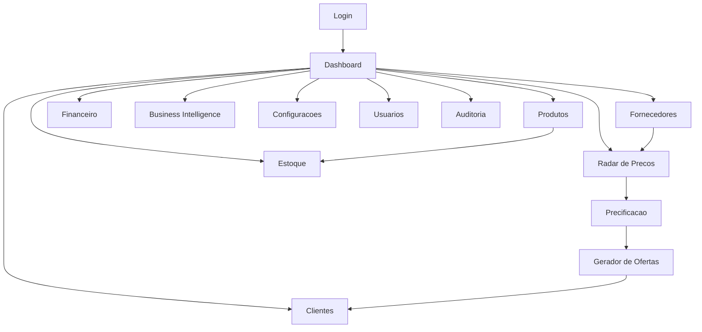

# UXS Consolidado - iNest Phone

## Fase 1 - Arquitetura da Experiencia do Usuario

## Objetivo

Este documento define a experiencia do usuario da plataforma iNest Phone - Sistema de Gestao Comercial.

Seu objetivo e orientar como os usuarios navegam pelo sistema, executam fluxos operacionais e interagem com as telas.

A experiencia deve seguir o posicionamento premium da iNest Phone, com simplicidade, clareza e consistencia inspiradas no ecossistema Apple.

Esta especificacao e complementar ao PRD, BRD e SAD. Ela nao altera requisitos funcionais, regras de negocio, arquitetura ou tecnologias ja definidas.

## 1. Principios de UX

Toda experiencia do sistema deve seguir os principios abaixo.

### 1.1 Simplicidade

As telas devem apresentar apenas o necessario para a tarefa atual.

Evitar excesso de elementos, textos longos e caminhos redundantes.

### 1.2 Clareza

Rotulos, estados e mensagens devem ser objetivos.

O usuario deve entender rapidamente onde esta, o que pode fazer e qual sera o resultado de cada acao.

### 1.3 Rapidez

Fluxos recorrentes devem exigir poucos passos.

A interface deve priorizar busca, atalhos e acoes diretas.

### 1.4 Consistencia

Componentes, padroes de navegacao, estados e mensagens devem se repetir de forma previsivel entre os modulos.

### 1.5 Feedback imediato

Toda acao relevante deve gerar retorno visual.

Exemplos:

- Carregando.
- Salvando.
- Concluido.
- Alerta.
- Erro.
- Pendente de revisao.

### 1.6 Baixa curva de aprendizado

Usuarios novos devem conseguir executar tarefas basicas com minimo treinamento.

A interface deve evitar termos tecnicos desnecessarios e manter hierarquia visual clara.

### 1.7 Reducao de cliques

Fluxos comerciais importantes devem ser curtos.

Acoes frequentes devem estar proximas do contexto de uso.

### 1.8 Alta produtividade

O sistema deve favorecer operacao diaria rapida, com busca eficiente, filtros claros, atalhos e reaproveitamento de dados.

## 2. Objetivos da experiencia

A experiencia do usuario deve permitir:

- Gerar ofertas em poucos segundos.
- Localizar qualquer produto rapidamente.
- Comparar precos de fornecedores com clareza.
- Simular precos sem ambiguidade.
- Reduzir erros operacionais.
- Facilitar analises gerenciais.
- Minimizar treinamento de novos usuarios.
- Dar visibilidade a pendencias, alertas e oportunidades.
- Manter consistencia visual em todos os modulos.

## 3. Perfis de usuario

### 3.1 Administrador

Objetivos:

- Controlar o sistema completo.
- Gerenciar usuarios e permissoes.
- Ajustar configuracoes financeiras.
- Acompanhar indicadores gerais.

Necessidades:

- Visao ampla da operacao.
- Controle de seguranca.
- Acesso a configuracoes.
- Auditoria e rastreabilidade.

Permissoes:

- Acesso total, conforme BRD.

Principais fluxos:

- Login.
- Consultar Dashboard.
- Configurar parametros financeiros.
- Gerenciar usuarios.
- Consultar auditoria.
- Analisar indicadores.

### 3.2 Gestor

Objetivos:

- Acompanhar desempenho comercial.
- Consultar produtos, fornecedores e resultados.
- Apoiar decisoes de venda e compra.

Necessidades:

- Indicadores claros.
- Relatorios.
- Comparativos.
- Visao de produtos e margens autorizadas.

Permissoes:

- Financeiro.
- Produtos.
- Dashboard.
- Demais acessos conforme configuracao definida.

Principais fluxos:

- Login.
- Consultar Dashboard.
- Consultar Radar de Precos.
- Acompanhar produtos.
- Consultar indicadores.
- Analisar relatorios.

### 3.3 Operador

Objetivos:

- Pesquisar precos.
- Simular precificacao.
- Gerar ofertas.
- Executar atividades comerciais diarias.

Necessidades:

- Fluxos rapidos.
- Interface objetiva.
- Baixa friccao.
- Feedback claro sobre pendencias.

Permissoes:

- Radar.
- Precificacao.
- Ofertas.
- Sem acesso a configuracoes, conforme BRD.

Principais fluxos:

- Login.
- Pesquisar precos.
- Selecionar produto.
- Simular preco.
- Gerar oferta.
- Copiar ou compartilhar mensagem.

## 4. Arquitetura da navegacao

A navegacao deve ser previsivel, modular e consistente com a arquitetura do sistema.

### 4.1 Sidebar

A Sidebar deve ser o principal elemento de navegacao entre modulos.

Comportamento esperado:

- Fixa em desktop.
- Colapsavel em tablet quando necessario.
- Acessivel por botao de menu em mobile.
- Destacar o modulo ativo.
- Exibir apenas modulos permitidos ao perfil do usuario.

### 4.2 Navbar

A Navbar deve apoiar a operacao da tela atual.

Elementos previstos:

- Titulo da tela.
- Pesquisa global.
- Acoes rapidas.
- Notificacoes.
- Perfil do usuario.

### 4.3 Area principal

A area principal deve concentrar o conteudo do modulo ativo.

Deve apresentar hierarquia visual clara:

- Cabecalho da tela.
- Filtros e acoes.
- Conteudo principal.
- Estados de feedback.

### 4.4 Breadcrumb

Breadcrumb deve ser utilizado quando houver profundidade de navegacao.

Exemplos:

- Produtos > Detalhe do Produto.
- Clientes > Historico do Cliente.
- Fornecedores > Cotacoes.

### 4.5 Pesquisa global

A pesquisa global deve permitir localizar rapidamente:

- Produtos.
- Clientes.
- Fornecedores.
- Ofertas.
- Cotacoes.

Resultados devem respeitar permissoes do usuario.

### 4.6 Atalhos rapidos

Atalhos devem priorizar fluxos frequentes:

- Nova oferta.
- Importar lista.
- Novo produto.
- Novo cliente.
- Nova simulacao.

### 4.7 Notificacoes

Notificacoes devem informar eventos relevantes:

- Importacao concluida.
- Produto pendente de revisao.
- Oferta gerada.
- Erro operacional.
- Alerta de configuracao.

### 4.8 Perfil do usuario

O perfil deve permitir:

- Visualizar usuario logado.
- Encerrar sessao.
- Acessar configuracoes pessoais quando existirem.

## 5. Mapa de navegacao

Fluxo geral de navegacao:

## 6. Fluxos principais

### 6.1 Login

Inicio:

- Usuario acessa a tela de login.

Etapas:

1. Informar credenciais.
2. Validar campos obrigatorios.
3. Enviar dados ao backend.
4. Receber resposta de autenticacao.
5. Direcionar para Dashboard quando autorizado.

Decisoes:

- Credenciais validas.
- Usuario ativo.
- Perfil autorizado.

Validacoes:

- Email obrigatorio.
- Senha obrigatoria.
- Formato de email.

Conclusao:

- Sessao iniciada ou erro informado ao usuario.

### 6.2 Pesquisar precos

Inicio:

- Usuario acessa Radar de Precos.

Etapas:

1. Informar termo de busca ou filtro.
2. Selecionar criterios.
3. Consultar backend.
4. Exibir resultados.
5. Permitir comparacao.

Decisoes:

- Produto aprovado.
- Produto pendente.
- Produto ocultado por regra do BRD.

Validacoes:

- Filtros validos.
- Permissao de acesso.

Conclusao:

- Lista de cotacoes exibida com dados permitidos.

### 6.3 Cadastrar produto

Inicio:

- Usuario autorizado acessa Produtos.

Etapas:

1. Acionar novo produto.
2. Preencher dados.
3. Validar obrigatorios.
4. Persistir cadastro.
5. Registrar auditoria.
6. Exibir confirmacao.

Decisoes:

- Produto completo.
- Produto pendente de revisao.

Validacoes:

- Modelo.
- Categoria.
- Capacidade.
- Cor.
- Status.

Conclusao:

- Produto cadastrado ou pendencia informada.

### 6.4 Gerar oferta

Inicio:

- Usuario seleciona produto elegivel.

Etapas:

1. Obter preco calculado.
2. Selecionar template.
3. Substituir variaveis.
4. Gerar pre-visualizacao.
5. Copiar ou compartilhar.
6. Registrar auditoria quando aplicavel.

Decisoes:

- Produto apto.
- Produto pendente ou rejeitado.
- Template disponivel.

Validacoes:

- Preco calculado.
- Prazo definido.
- Template ativo.

Conclusao:

- Oferta pronta para uso comercial.

### 6.5 Cadastrar cliente

Inicio:

- Usuario autorizado acessa Clientes.

Etapas:

1. Acionar novo cliente.
2. Preencher dados.
3. Validar dados.
4. Persistir cadastro.
5. Registrar auditoria.
6. Exibir confirmacao.

Decisoes:

- Cliente novo.
- Possivel duplicidade.

Validacoes:

- Nome.
- Contato.
- Cidade quando aplicavel.
- Origem quando aplicavel.

Conclusao:

- Cliente cadastrado ou inconsistencias apresentadas.

### 6.6 Registrar venda

Inicio:

- Usuario autorizado confirma venda.

Etapas:

1. Selecionar oferta ou produto.
2. Validar dados obrigatorios.
3. Confirmar venda.
4. Persistir operacao.
5. Atualizar modulos relacionados.
6. Registrar auditoria.
7. Exibir confirmacao.

Decisoes:

- Produto disponivel.
- Cliente informado.
- Valor valido.

Validacoes:

- Permissao.
- Status do produto.
- Integridade da operacao.

Conclusao:

- Venda registrada e refletida nos indicadores conforme BRD.

### 6.7 Consultar indicadores

Inicio:

- Usuario acessa Dashboard ou BI.

Etapas:

1. Selecionar periodo ou filtros.
2. Consultar dados consolidados.
3. Exibir KPIs.
4. Permitir drill-down quando disponivel.

Decisoes:

- Dados disponiveis.
- Filtros aplicaveis.
- Permissao de visualizacao.

Validacoes:

- Perfil autorizado.
- Periodo valido.

Conclusao:

- Indicadores exibidos com feedback visual adequado.

### 6.8 Alterar configuracoes

Inicio:

- Usuario autorizado acessa Configuracoes.

Etapas:

1. Selecionar configuracao.
2. Editar valores.
3. Validar campos.
4. Persistir alteracao.
5. Registrar auditoria.
6. Atualizar configuracao ativa.

Decisoes:

- Usuario autorizado.
- Configuracao valida.

Validacoes:

- Valores obrigatorios.
- Tipos corretos.
- Limites definidos.

Conclusao:

- Configuracao salva para operacoes futuras.

## 7. Padroes de navegacao

### 7.1 Sidebar

- Deve manter o modulo atual destacado.
- Deve respeitar permissoes do usuario.
- Deve permitir troca rapida de modulo.
- Em telas menores, deve abrir e fechar sem cobrir a tarefa de forma permanente.

### 7.2 Menus

- Menus devem ser curtos.
- Acoes destrutivas devem exigir confirmacao.
- Acoes indisponiveis devem possuir estado desabilitado e motivo claro quando necessario.

### 7.3 Retorno as telas anteriores

- Telas de detalhe devem permitir retorno ao contexto anterior.
- Filtros aplicados devem ser preservados quando possivel.

### 7.4 Navegacao entre modulos

- Modulos relacionados podem possuir links contextuais.
- A navegacao contextual deve respeitar permissoes.

### 7.5 Atalhos

- Atalhos devem priorizar tarefas frequentes.
- Atalhos nao devem substituir fluxos de validacao obrigatorios.

## 8. Responsividade

### 8.1 Desktop

Layout recomendado:

- Sidebar fixa.
- Navbar completa.
- Tabelas com filtros visiveis.
- Dashboards em multiplas colunas.
- Acoes principais no topo da tela.

### 8.2 Tablet

Layout recomendado:

- Sidebar colapsavel.
- Conteudo em uma ou duas colunas.
- Filtros agrupados.
- Tabelas com rolagem horizontal quando necessario.

### 8.3 Mobile

Layout recomendado:

- Menu lateral acionado por botao.
- Conteudo em coluna unica.
- Cards substituindo tabelas extensas quando adequado.
- Acoes principais fixas ou facilmente acessiveis.
- Formularios divididos em blocos claros.

Todas as telas devem manter legibilidade, toque confortavel e ausencia de sobreposicoes.

## 9. Acessibilidade

A interface deve seguir boas praticas de acessibilidade.

### 9.1 Contraste

Textos e elementos interativos devem possuir contraste suficiente em temas claro e escuro.

### 9.2 Tamanho minimo de fontes

Textos devem manter legibilidade em desktop, tablet e mobile.

Evitar fontes pequenas em tabelas, formularios e mensagens importantes.

### 9.3 Estados de foco

Elementos interativos devem possuir estado de foco visivel.

Isso inclui:

- Botoes.
- Inputs.
- Selects.
- Links.
- Itens de menu.

### 9.4 Navegacao por teclado

Fluxos principais devem ser navegaveis por teclado.

A ordem de foco deve seguir a sequencia visual e operacional da tela.

### 9.5 Leitura clara

Mensagens devem ser objetivas.

Evitar ambiguidade em erros, alertas e confirmacoes.

## 10. Criterios gerais

Toda experiencia deve seguir:

- Visual minimalista.
- Poucos cliques.
- Alta velocidade.
- Feedback constante.
- Consistencia entre modulos.
- Aparencia premium inspirada na Apple.
- Compatibilidade com PRD, BRD e SAD.
- Separacao entre experiencia de usuario e regras de negocio.

## 11. Diretrizes para implementacao

Durante o desenvolvimento das telas:

- Utilizar esta especificacao como referencia oficial de UX.
- Nao alterar regras de negocio por decisoes de interface.
- Respeitar permissoes por perfil.
- Manter consistencia visual entre modulos.
- Priorizar clareza, rapidez e previsibilidade.
- Validar responsividade em desktop, tablet e mobile.
- Garantir feedback visual para operacoes assíncronas.
